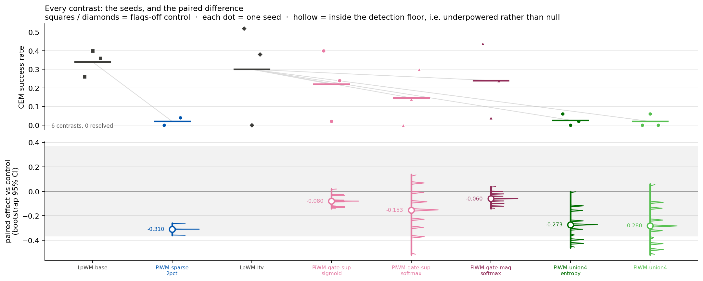
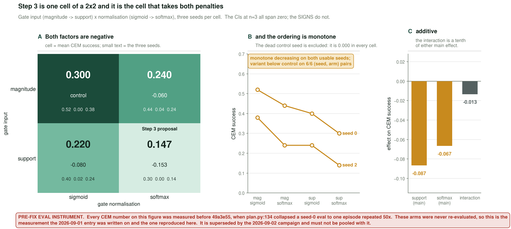
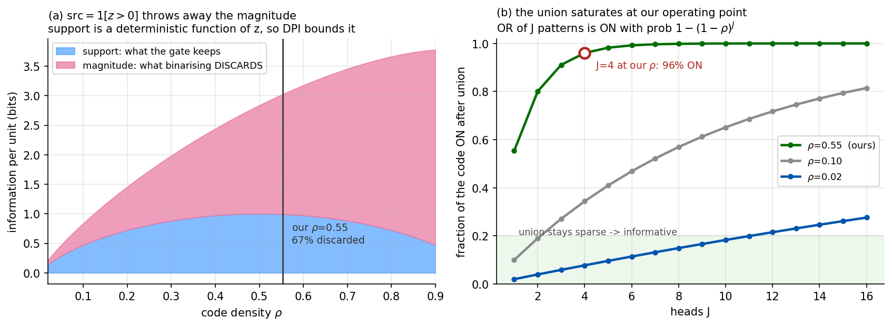
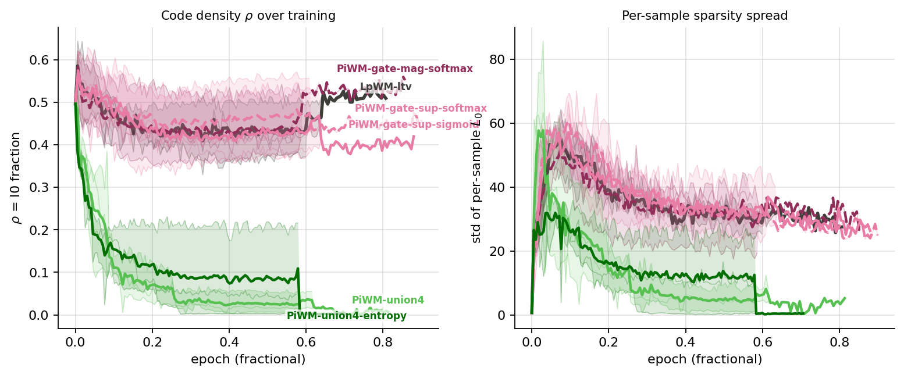
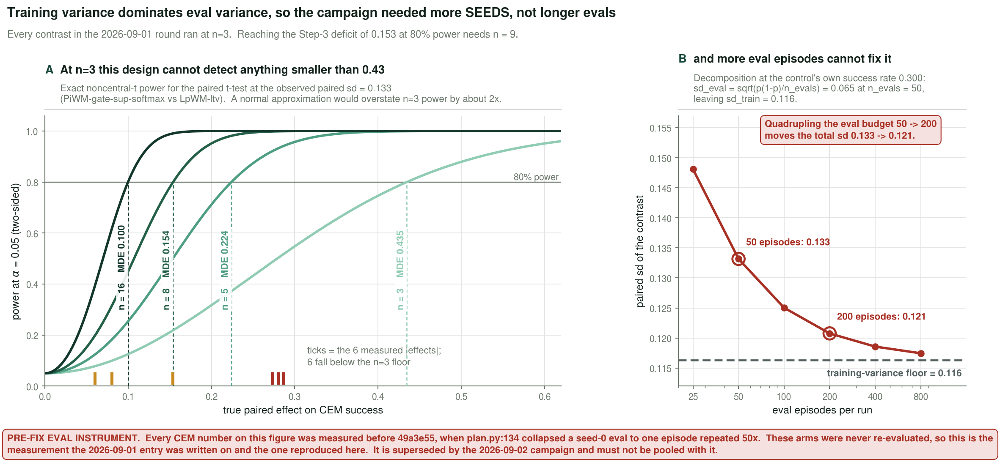
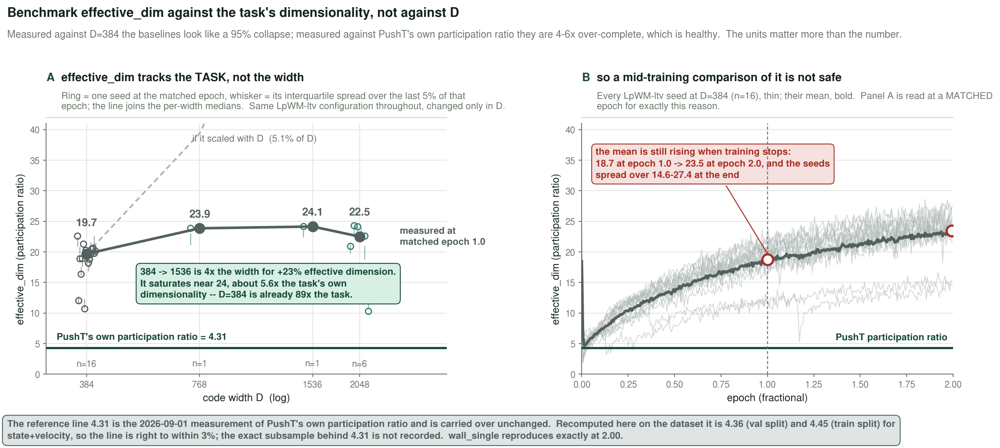

# 2026-09-01 — PiWM campaign: results, root cause, and the overnight round

First full campaign on `PiWM-pushT`: **36 runs, 8 arms, 3 seeds each, 2 epochs**, evaluated
by CEM planning success on PushT. Every PiWM arm underperformed the LpWM baseline. This
entry records what was measured, *why* it happened, and what is running tonight.

> **Read `README.md` first** if you have not. It defines every metric used here, what good and
> bad look like for each, and how a contrast in this project is read.

> ### Instrument warning — every number in this entry is on the pre-fix eval instrument
>
> `plan.py:134` built the eval episode list as `[seed*n + 1 for n in range(n_evals)]`, which
> degenerates at seed 0 to `[1]*50` — fifty copies of one episode — and gave *different* episode
> sets to different seeds, so eval noise did not cancel in a paired difference. This was not
> discovered until the following day; see `2026-09-02.md` §0. **These arms were never
> re-evaluated**, so the numbers below cannot be corrected, only quarantined: they are
> internally consistent with each other and are not comparable to anything from `2026-09-02.md`
> onward. Every figure in this entry is regenerated on `collect_evals(scheme="buggy")`, which
> reproduces the tables below exactly, and carries a banner saying so.
>
> The entry is kept as written because its *reasoning* survives the instrument change: the
> union-head and k-WTA mechanisms diagnosed here were re-measured on the repaired instrument
> the next day and came back the same, and the information-theoretic argument in §3 does not
> depend on the eval at all.

---

## 1. The round at a glance



*Every arm's three seeds (top) and the paired difference from its control (bottom). A
**hollow** dot means the effect sits inside the detection floor — underpowered, not null.*

Δ is the **paired** difference against the matched control at shared seeds (seeds present in
only one arm are dropped, never imputed — `analysis/figures.py:344`).

| arm | seeds | mean | paired Δ vs `LpWM-ltv` |
|---|---|---|---|
| `LpWM-base` (mlp_var baseline) | 0.260 / 0.400 / 0.360 | **0.340** | — |
| `LpWM-ltv` (LTV baseline, control) | 0.520 / 0.000 / 0.380 | 0.300 | — |
| `PiWM-gate-mag-softmax` | 0.440 / 0.040 / 0.240 | 0.240 | −0.060 |
| `PiWM-gate-sup-sigmoid` | 0.400 / 0.020 / 0.240 | 0.220 | −0.080 |
| `PiWM-gate-sup-softmax` ← **Step 3 proposal** | 0.300 / 0.000 / 0.140 | 0.147 | −0.153 |
| `PiWM-sparse-2pct` (k-WTA @ 2%) | 0.000 / 0.040 | 0.020 | −0.170 |
| `PiWM-union4` | 0.000 / 0.000 / 0.060 | 0.020 | −0.280 |
| `PiWM-union4-entropy` ← **Step 4 proposal** | 0.000 / 0.060 / 0.020 | 0.027 | −0.273 |

> **What has moved since this was written** *(re-derived 2026-09-04 on the same pre-fix
> instrument, so it stays comparable to the table above).* Seven of the eight rows reproduce
> exactly. **`PiWM-sparse-2pct` has since finished a third seed** (s0 = 0.000): its seeds are
> now 0.000 / 0.000 / 0.040, mean **0.013**, paired Δ **−0.287 at n = 3**. The direction and
> the conclusion are unchanged — it got *more* negative, and §2.3's mechanism (`rel_mse`
> = 1.93, worse than predicting zero) is what actually closes it. `LpWM-ltv`'s sd reads 0.267
> above; the three seeds give **0.269**.

### Two results ARE resolved — against the right control

The campaign looked uniformly underpowered until `LpWM-base` finished evaluating. It has a
**tight** seed spread (sd 0.072) where `LpWM-ltv` has a **dead seed** (0.000, sd 0.267).
Contrasts anchored on the stable baseline resolve at n=3:

| contrast | Δ | t | **p** | |
|---|---|---|---|---|
| `PiWM-union4` vs `LpWM-base` | −0.320 | −7.69 | **0.0165** | **resolved** |
| `PiWM-union4-entropy` vs `LpWM-base` | −0.313 | −11.75 | **0.0072** | **resolved** |
| `PiWM-gate-sup-softmax` vs `LpWM-ltv` | −0.153 | −1.99 | 0.184 | not resolved |

**Step 4 is a resolved negative result.** The union head is significantly worse than the
LpWM baseline. Step 3 is not resolved — that is what tonight's round is for.

> The campaign was never underpowered *in general*; it was underpowered *against a control
> with an unstable seed*. `LpWM-ltv` s1 = 0.000 destroyed the power of every contrast
> anchored on it. Worth remembering: **choose the control by its variance, not only by its
> configuration match.**

---

## 2. The proposals

Each is written as **motivation → what was built → what it measured**. Where the round's own
notes do not record something, that is said rather than reconstructed.

### 2.1 Step 3 · `PiWM-gate-sup-softmax` — gate the predictor from the code's *support*

**Motivation.** The LTV predictor already contains a gate: a small network that reads the
current code and produces per-unit multipliers modulating how the predictor's state matrix
acts. The Thousand-Brains-Theory-derived hypothesis under test was that *which units are on*
is the meaningful part of a sparse code, and the magnitudes are noise. If so, feeding the gate
only the binary **support** `1[z > 0]` should be a useful inductive bias: it removes a nuisance
variable and forces the gate to key on the code's combinatorial structure rather than its
scale. The **softmax** variant is the same argument applied to the gate's output — a normalised
competition among units rather than independent sigmoids.

**What was built.** Two orthogonal switches on the existing gate, giving a clean 2×2:

* `gate_input` ∈ {`magnitude`, `support`} — `models/infojepa_modules.py:665` does
  `src = (x > 0).to(x.dtype) if self.gate_input == "support" else x`. That is the whole change:
  one line, and the gate's fan-in and parameter count are identical either way.
* gate normalisation ∈ {`sigmoid`, `softmax`} — softmax is scaled by `r` so that `gate_mean`
  stays ≈ 1.0, which is the sanity check that the `r` factor was not lost.

The proposal is the cell that takes **both** switches. The control is the cell that takes
neither, which is `LpWM-ltv` itself.

**Results.**



*Gate **input** (magnitude → support) × **normalisation** (sigmoid → softmax). Cell values
are CEM success; small text is the per-seed triple. The control is the top-left cell.*

- main effect **support**: **−0.087**
- main effect **softmax**: **−0.067**
- interaction: −0.013 → **additive**, and the proposal is the cell that takes both

The CIs all span zero, but the **signs do not**. On both seeds where the control works the
four-cell ordering is monotone decreasing:

```
seed 0:  0.520 → 0.440 → 0.400 → 0.300
seed 2:  0.380 → 0.240 → 0.240 → 0.140
```

Variant worse than control on **6/6** usable (seed, arm) pairs. The headline contrast
(−0.153) does not resolve at n=3 — see §4 — so the honest verdict is *both factors hurt, both
unresolved, and the proposal takes both*.

### 2.2 Step 4 · `PiWM-union4` / `-entropy` — J readouts and a `min` loss

**Motivation.** Sparse Distributed Representation theory says the bitwise **union** (OR) of
several sparse codes is itself a usable sparse code: you can store several patterns in one
vector and still test membership, as long as the union stays sparse. Transplanted here, the
idea was that a predictor with J parallel readouts could cover a *set* of plausible futures
rather than being forced to average them — the loss takes the best-matching head, so the heads
are free to specialise on different modes instead of collapsing to the mean.

**What was built.** J = 4 parallel output matrices on the shared predictor trunk
(`models/infojepa_modules.py:557`, `W_heads`), with

```
loss = mean_{b,t} min_j L_j(b, t)
```

(`models/visual_world_model.py:1370`). `PiWM-union4-entropy` adds a head-usage entropy bonus,
maximising the entropy of which head wins — because `min_j` alone is winner-take-all and would
collapse onto one head, which would make J=4 numerically identical to J=1 and rig the arm to
produce its own falsifying result. `PiWM-union2` is the same at J=2.

**Results.** Both arms are at the floor: 0.020 and 0.027 against a 0.300 control, and both
resolve as **negatives against `LpWM-base`** (−0.320, p = 0.0165; −0.313, p = 0.0072). The
mechanism is §3(b): the code is dead, not merely worse.

### 2.3 · `PiWM-sparse-2pct` and `PiWM-sparse-matched` — k-WTA on the code

**Motivation.** *The entry does not record a separate motivation for these arms* beyond the
programme they belong to: SDR theory operates at 0.05–2 % density, the LpWM code sits near
50 %, and k-WTA is the standard operator for forcing the former. `sparse-2pct` targets the SDR
band directly; `sparse-matched` is a density-matched companion whose role is only inferable
from its numbers — the entry does not state its design intent.

**What was built.** k-Winners-Take-All inside the shared link
(`models/infojepa_modules.py:729`): keep the k largest coordinates, zero the rest, with a
straight-through backward so losing coordinates still receive gradient. It lives in the *one
shared* `Link` instance, so `z` and `ẑ` are both exactly k-sparse and the tied-threshold
invariant between encoder and predictor holds.

**Results.** `PiWM-sparse-2pct` measures `rel_mse` **1.93** — worse than predicting zero — and
CEM 0.020 against `LpWM-base`'s 0.340, a Δ of **−0.360**. Realised densities are exact:
`sparse-2pct` 0.0208, `sparse-matched` 0.2943. This is the round's evidence that **PushT is
representation-sensitive**: a task that could not be damaged by the representation would not
have produced this.

### 2.4 · `PiWM-union4-kwta8` — the union's own falsifier

**Motivation.** The union head collapsed. The obvious defence is "the union works, you just
have to pin the sparsity" — so pin it, with k-WTA, and see.

**What was built.** `PiWM-union4` plus k-WTA at k = 8 (target density 8/384 = 0.0208), i.e.
the union objective with its density held externally.

**Results — the defence is refuted.** k-WTA holds density *exactly* in non-union arms
(`sparse-2pct` 0.0208, `sparse-matched` 0.2943) but breaches its own floor **only** under the
union head: 0.0038 / 0.0000 / 0.0132 against a k=8 target of 0.0208. The union drives pre-link
activations negative, so top-k selects units holding zeros. **The union failure is the
objective, not the operating point.**

### 2.5 · The two controls, and which one to trust

**Motivation.** `LpWM-ltv` (the LTV predictor) is the configuration-matched control for
everything above — the Step 3/4 machinery is built on it. `LpWM-base` (`mlp_var`) is the
paper's other predictor and was included as a second reference point.

**Results.** `LpWM-base` **beats** `LpWM-ltv`, 0.340 vs 0.300, and is far more stable
(sd 0.072 vs 0.267). **The LTV predictor — the substrate for all our Step 3/4 work — is the
unstable one.** That is why the two union contrasts resolve against `LpWM-base` and nothing
resolves against `LpWM-ltv`.

---

## 3. Root cause



### (a) Step 3 is information-theoretically bounded above by the baseline

`models/infojepa_modules.py:665` does `src = (x > 0) if gate_input=="support" else x`, so the
support is a **deterministic function** of the code. By the data-processing inequality
`I(s;Y) ≤ I(z;Y)` for every target — **support gating cannot beat magnitude gating on
information**; it can only win as an inductive bias. Measured on trained codes
(389 frames × 384 units):

| run | ρ | support bits/unit | magnitude bits\|active | discarded | I(sₜ;sₜ₊₁) | I(zₜ;zₜ₊₁) | retained |
|---|---|---|---|---|---|---|---|
| `LpWM-ltv` | 0.554 | 0.636 | 3.676 | **76.2%** | 0.614 | 0.979 | **62.8%** |
| `PiWM-gate-sup-softmax` | 0.610 | 0.519 | 3.271 | **79.4%** | 0.652 | 1.136 | **57.4%** |

The gate is handed ~40% less predictive information in exchange for a regulariser that has
nothing to regularise at 2 epochs on a task whose own participation ratio is 4.31.

### (b) Step 4's union saturates

The SDR union property holds only while the union stays sparse. At ρ = 0.55 the OR of 4
readouts is **96% ON** — it carries almost nothing.



*Code density over training. Every non-union arm holds ~0.5; the union arms crash in the first
quarter-epoch and stay there. `PiWM-union4` finishes at **ρ = 0.0000, effective_dim 0.0,
S_model 1.0000** — the code is dead.*

`min_j L_j` is trivially minimised by a dead code: if every head predicts zero and the target
is zero, the minimum over heads is zero. Nothing in the objective forbids it, and RDMReg
charges only 0.51 for a dead code — payable. **Union collapse scales with J**: J=2 → ρ 0.084,
J=4 → ρ 0.000.

### (c) The deeper error

We transplanted SDR *operations* onto a non-SDR *substrate*. In a real Numenta SDR (binary,
0.05–2% sparse, n = 2048–10000) magnitudes do not exist, so discarding them is free. Here they
carry the other 37%.

The TBT premise is partly **validated** — the support does carry **63%** of the predictive
information from **24%** of the bits. The transplant was the mistake, not the premise.

---

## 4. Power: why most contrasts did not resolve



*MDE vs true effect at the observed seed sd; ticks are our measured effects.*

For `gate-sup-softmax vs LpWM-ltv` the paired sd is **0.133**:

| n | MDE (80% power) | resolves −0.153? |
|---|---|---|
| 3 | 0.437 | no |
| 8 | 0.154 | no |
| **16** | **0.099** | **yes** |

Training variance dominates eval variance (sd_train 0.116 vs binomial sd_eval 0.065 at
`n_evals=50`), so **more seeds is the fix, not more eval episodes** — raising `n_evals`
50→200 would move the total sd only 0.133→0.121.

> **How this resolved** *(2026-09-05; full write-up [2026-09-05 §8](2026-09-05.md)).*
>
> **The prescription holds, and the unit is the checkpoint.** `PiWM-solo{m}` replays one
> *unchanged* baseline checkpoint *m* on episode block *b*. That matrix decomposes as:
>
> | source | share of variance | sd |
> |---|---|---|
> | **checkpoint (training seed)** | **82 %** | 0.128 |
> | episode block | 5 % | 0.030 |
> | residual | 13 % | — |
>
> One checkpoint spans only 0.04–0.24 across blocks; the ten checkpoints span **0.165–0.585**.
> More eval episodes were never the lever, and a success spread of that size is training-seed
> variance, not episode noise ([2026-09-05 §8.2](2026-09-05.md)).
>
> **The second error is not a power problem.** §6's push powered the *control*: on the repaired
> instrument `LpWM-ltv`, `gate-sup-softmax` and `gate-mag-softmax` all carry seeds 3–15, and
> this entry's own Δs are paired at shared seeds (§1), so nothing here is affected. Later arms
> stopped at seeds 3–10 — 60 of the archive's 113 arms hold exactly those eight — and on those
> eight the baseline averages **0.3925** against the **0.3569** it
> registers over 3–15. Ranking an 8-seed arm against that registered mean hands it a free
> **+0.036** before it does anything; correcting it cut the arms "beating baseline" from 35 to
> 16 ([2026-09-05 §8.1](2026-09-05.md)). Powering a control by adding seeds to it alone fixes
> its power and breaks its comparability.

---

## 5. Findings worth keeping



- **`effective_dim` tracks the TASK, not D.** At matched epoch 1.0: D=384 → 20.9,
  D=768 → 23.9, D=1536 → 24.1. **Quadrupling D buys +15%**; it saturates near 24 ≈ 5.6×
  PushT's own participation ratio of **4.31**. D=384 is already ~90× the task. *(This is the
  efficiency result, measured.)*
- **`LpWM-base` (mlp_var) beats `LpWM-ltv` (LTV): 0.340 vs 0.300**, and is far more stable
  (sd 0.072 vs 0.267). The LTV predictor — the substrate for all our Step 3/4 work — is the
  unstable one.
- **Union collapse scales with J**: J=2 → ρ 0.084, J=4 → ρ 0.000.
- **PushT *is* representation-sensitive** — k-WTA at 2% gave `rel_mse` **1.93**, worse than
  predicting zero, and CEM 0.020 vs 0.340 (Δ −0.360 vs `LpWM-base`). The Step 3 null is not
  a saturated task.
- **`wall_single` is not a harder fallback** — 2-D state, participation ratio **2.00**, one
  fixed wall/door config. *Simpler* than PushT. Downloaded anyway.

> **Pointer, 2026-09-05.** The whole campaign is re-ranked on matched seed sets in
> [2026-09-05 §8](2026-09-05.md), and two of the bullets above are settled there.
> `LpWM-base` was never re-run on the repaired instrument, so its 0.340-vs-0.300 lead stands at
> n = 3 on the quarantined one — under a third of the **0.128** checkpoint sd that §4 now puts
> beneath it, so it is not a ranking. The *stability* half of that bullet is the half that
> survives, generalised: training seed is 82 % of all success variance.
> **PushT's representation sensitivity survives as the campaign's one within-arm axis** —
> demeaned within arm over 174 runs in the 19 non-degenerate arms, one-step latent prediction
> (`val/z_loss`, `mse_t1`, `rel_mse`) gives ρ = **−0.680** where compounding growth `h8/h1` gives
> **−0.001** ([2026-09-05 §8.5](2026-09-05.md)).

### Corrections logged, so they are not repeated

1. **Benchmark `effective_dim` against the task's participation ratio, not against D.** At
   15–28 vs a task ratio of 4.31 the baselines are 4–6× over-complete (healthy); measured
   against D=384 it looks like a 4% collapse, and it is not.
2. **CEM MDE cannot be carried over from training-loss spread.** The 0.019 quoted early came
   from training loss; the real CEM MDE at n=3 is 0.437.
3. **`reg_weight=1.0` is the paper's swept value** (`reproduce_pusht.sh`,
   `HP[sparse:ltv:384]`), not a misconfiguration — the `100.0` config default is unused here.
4. **A median sd across all contrasts is the wrong statistic for one contrast.** Pooling the
   union arms (sd 0.26–0.30) inflates it to 0.240; the target contrast's own sd is 0.133.
5. **`effective_dim` is still rising at 100% of training** (18.2 → 28.7), so mid-training
   cross-arm comparisons of it are not trustworthy.

Interactive version of the diagnosis: [`assets/2026-09-01/diagnosis.html`](assets/2026-09-01/diagnosis.html)
(drag ρ and J).

---

## 6. Running tonight

One round is all that fits (2-epoch run ≈ 7.5 h, eval ≈ 40 min). Spent on **power over
breadth**, because another unresolvable table is a wasted night.

**42 runs, 3 arms at n=16:**

| arm | seeds | why |
|---|---|---|
| `LpWM-ltv` | +13 (→16) | the matched control; its dead seed is what needs averaging down |
| `PiWM-gate-sup-softmax` | +13 (→16) | resolve the −0.153 Step 3 deficit (MDE 0.099 at n=16) |
| **`PiWM-gate-both`** (new) | 16 | **the direct repair of root cause (a)** |

### The one new proposal · `PiWM-gate-both`

**Motivation.** §3(a) says support gating loses to magnitude gating *by construction*, because
the support is a coarsening of the code and the data-processing inequality applies. If that
information loss is what the −0.153 deficit is made of, then removing the loss — without
removing the support — should close it.

**What is built.** The gate is fed `[z ; 1[z>0]]` — support **and** magnitude — so its input
is a strict *superset* rather than a coarsening. The DPI bound no longer applies and the 37%
information loss is removed. The only structural consequence is the gate's fan-in doubling to
2D (`models/infojepa_modules.py:497`).

**Prediction and falsifier, declared before launch.**

- **Prediction**: if the Step 3 deficit *is* the information loss, `gate-both` ≈ control.
- **Falsifier**: if `gate-both` is still ~0.15 below control, the deficit is **not**
  information loss and root cause (a) is wrong as an explanation of the CEM result.

**Pre-flight, passed before launch** — because a gate with the wrong init or LR would produce a
result about the initialisation rather than about the idea: gate fan-in 768 at D=384, muP init
std `(2D)^-0.5` = 0.0361 (the gate had to leave the shared init loop, which hardcodes `D^-0.5`
and would have started it √2 too large), muP **LR** also correctly `5e-4 × 384/768 = 2.5e-4`,
`gate_mean` = 1.000, finite loss, and `magnitude`/`support` byte-identical to before.

**Result: see `2026-09-02.md` §1.** On the repaired instrument at n=13, `gate: both` is
**−0.012 [−0.135, +0.110], p = 0.831** — a clean null, and so are the other two gate variants.
The falsifier fired in the weakest possible way: the deficit it was built to repair was not
there to repair on the corrected measurement.

**Deferred deliberately**: the union objective fix (`min` → consensus) — now the *only* live
union hypothesis, which is exactly why it deserves a designed test rather than a midnight
one-liner. Also deferred: `lamb_cov > 0` decorrelation.
