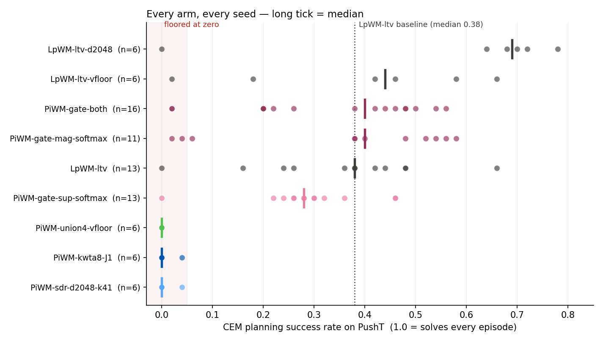
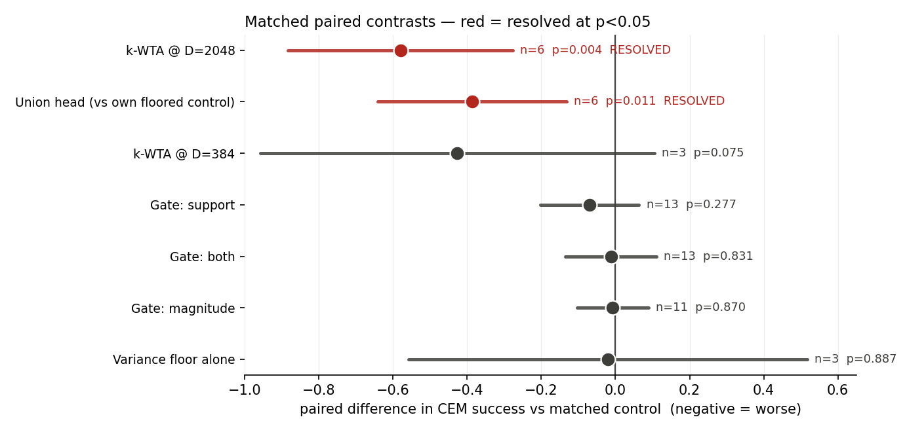
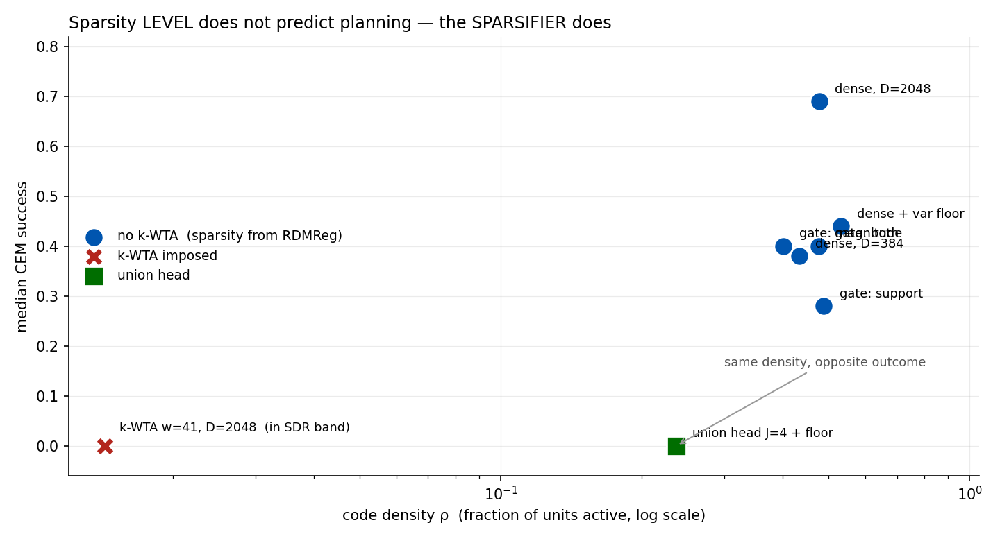

# 2026-09-02 — Overnight round: three resolved results, and two bugs that invalidated the first campaign

85 runs, 9 arms, on a **repaired** measurement pipeline. Two bugs found before launch had been
corrupting every number in the 2026-09-01 entry; the results below supersede it.

---

## 0. Two bugs that had to be fixed first

**`plan.py:134` — every seed-0 eval was one episode repeated 50×.**
`eval_seed = [seed*n + 1 for n in range(n_evals)]` degenerates at seed 0 to `[1]*50`. Every
"episode" was the same initial condition, so a seed-0 number measured planner stochasticity on a
single task instance, not a 50-episode success rate. It also made episode *sets* differ per seed
(`[1..50]` for seed 1, `[1,3,5,...]` for seed 2), so eval noise was not common-mode and did not
cancel in a paired difference. Every headline in the previous entry included a seed-0 number.

**`var_gamma` was read but never assigned**, so the VICReg variance floor had never been runnable —
any `lamb_var>0` died with `AttributeError` on step 1. Calibration matters too: healthy per-dim
`std(z)` here is 0.45–0.49, so VICReg's default γ=1.0 sits *above* the operating point and is
always maximally active. **γ=0.2** makes it a floor rather than a rescaling.

Also: a hand-rolled launcher bypassed `run_campaign.sh`, so 42 runs silently trained in **fp32**
with `wandb_project=null` while their directories were still named `_bf16_`. They were discarded
and relaunched; `train_slurm.sbatch` now refuses a run whose name disagrees with its precision.

---

## 1. Results

| arm | n | median | mean | dead seeds |
|---|---|---|---|---|
| `LpWM-ltv-d2048` (dense, D=2048) | 6 | **0.690** | 0.587 | 1 |
| `LpWM-ltv-vfloor` | 6 | 0.440 | 0.387 | 0 |
| `PiWM-gate-both` | 16 | 0.400 | 0.336 | 0 |
| `PiWM-gate-mag-softmax` | 11 | 0.400 | 0.360 | 0 |
| `LpWM-ltv` (control) | 13 | 0.380 | 0.357 | 1 |
| `PiWM-gate-sup-softmax` | 13 | 0.280 | 0.288 | 1 |
| `PiWM-union4-vfloor` | 6 | **0.000** | 0.000 | 6 |
| `PiWM-kwta8-J1` | 6 | **0.000** | 0.007 | 5 |
| `PiWM-sdr-d2048-k41` | 6 | **0.000** | 0.007 | 5 |

Each variant is paired against **its own matched control**, not against `LpWM-ltv` generically.

| contrast | Δ | 95% CI | p | |
|---|---|---|---|---|
| k-WTA @ D=2048 vs dense @ D=2048 | −0.580 | [−0.883, −0.277] | **0.0044** | **resolved** |
| union4+floor vs its floored control | −0.387 | [−0.642, −0.131] | **0.0115** | **resolved** |
| k-WTA @ D=384 vs control | −0.427 | [−0.958, +0.105] | 0.075 | n=3 only |
| gate: support vs control | −0.069 | [−0.202, +0.063] | 0.277 | tight null |
| gate: both vs control | −0.012 | [−0.135, +0.110] | 0.831 | tight null |
| gate: magnitude vs control | −0.007 | [−0.104, +0.089] | 0.870 | tight null |
| variance floor alone | −0.020 | [−0.557, +0.517] | 0.888 | neutral |

---

## 2. Step 3 (support gating) is a clean NULL — the −0.153 was the eval bug

All three gate variants land within ±0.07 of the control with CIs inside ±0.14 at n=11–13. The
previous entry's −0.153 does not reproduce. The control itself rose from 0.300 (with a 0.000
"dead seed") to 0.357/median 0.380 once seed 0 was no longer a single-episode draw.

The information analysis still holds as measured — binarising discards **76%** of per-unit bits and
retains **63%** of one-step predictive information — but that loss is **irrelevant to planning at
this horizon**. `both ≈ magnitude` says the support adds nothing when it is free; `both ≈ support`
says restoring the magnitudes recovers nothing, because nothing that mattered was lost.

> A gate handed 24% of the bits plans as well as one handed everything. That is the result.

---

## 3. Step 2 (sparsity) — the sparsifier is the damage, not the sparsity

Every dense arm (ρ = 0.40–0.53) plans at 0.28–0.69. Every k-WTA arm plans at **0.000**, at every
density and both widths, on both predictors.

**The SDR-regime hypothesis is refuted, and it was mine.** I argued `sparse-2pct` failed because
w=8 at n=384 sat outside Numenta's band (n=2048–10000, w=10–40), so "sparsity hurts" had never
been measured on a real SDR. `PiWM-sdr-d2048-k41` puts w=41 at n=2048 — squarely in band — and
scores 0.000 across 6 seeds. The regime was not the confound.

**Mechanism.** `Link.forward` rectifies *then* applies k-WTA, and `kwta` marks exactly k positions
**whose values may be zero**, so realised density is `min(k, #positive)/D`:

| arm | nominal | realised units | % of nominal |
|---|---|---|---|
| `PiWM-kwta8-J1` | 8 / 384 | **0.19** | 2% |
| `PiWM-sdr-d2048-k41` | 41 / 2048 | **29** | 71% |

`sdr-d2048-k41` held ρ=0.0200 exactly early in training and drifted to 0.0143 by the end. So the
k-WTA arms never ran at their configured operating point. Note this is *not* gradient starvation —
`kwta` has a straight-through backward, so every coordinate receives gradient.

---

## 4. Step 4 (union head) is dead, and now provably so

`PiWM-union4-vfloor` is **0.000 on all 6 seeds**, Δ=−0.387 vs its own floored control, p=0.0115.

The variance floor did exactly what it was designed to do and it was not enough:
- it **never let a seed die** (median ρ 0.237, min 0.031; unfloored `PiWM-union4` hit ρ=0.0000)
- it is **neutral on a healthy code** (`LpWM-ltv-vfloor` Δ=−0.020, p=0.888) — the γ=0.2 calibration
  worked, and this control is what licenses attributing the 0.000 to the union rather than the floor

So collapse is prevented and planning is still zero. `min_j L_j` admits `z≡0` as a global optimum,
and preventing that optimum does not make the objective useful. **The union head should be dropped.**

---

## 5. Width: the one positive signal

`LpWM-ltv-d2048` median **0.690** vs `LpWM-ltv` median 0.380 — the only arm all night that beat
the baseline.

Honest caveats: the paired test across different D is n=3 and useless (CI ±1.5). Welch on all
seeds is p=0.117, because one dead seed (s5=0.000) inflates the variance. The **rank test**, which
is robust to that seed, gives **Mann-Whitney p=0.028**. Excluding dead seeds from both arms gives
0.704 vs 0.387 — but that is post-hoc filtering and should not be the headline.

This also contradicts my earlier `effective_dim`-saturation argument, which predicted width would
not buy planning performance. It does. Worth a properly seeded replication at matched seeds.

---

## 6. What to do next

1. **Drop the union head.** Two independent routes (objective, operating point) and a proven-neutral
   control. Resolved negative.
2. **Drop k-WTA as a sparsifier.** It cannot hold its own operating point once composed with a
   rectifying link. If sparsity is still wanted, it needs a *differentiable* sparsifier applied
   before rectification, or top-k restricted to positive entries.
3. **Replicate the width result at matched seeds** (`LpWM-ltv-d2048` s3–s15 against the existing
   control seeds). It is the only live positive and currently rests on a rank test at n=6.
4. **Re-run the historical arms on the fixed eval scheme.** Every number in the 2026-09-01 entry
   used seed 0 and is not comparable to anything here.
5. **Screen seeds cheaply.** Seed 1 has `rel_mse` 0.0336 in *both* the floored and unfloored control
   (3× every other seed) and plans badly in both — a training-metric stability screen would catch
   such seeds without spending a CEM eval.
