# 2026-09-02 — Two rounds, one positive: consensus voting works, everything else does not

Two campaigns on a **repaired** measurement pipeline (≈170 runs). Every number in the
2026-09-01 entry was corrupted by an eval bug and is superseded. One intervention out of
nine produced a positive planning result; the rest are well-measured negatives and nulls,
several sharp enough to be worth reporting as such.

> **Read `README.md` first** if you have not. It defines every metric used here, what good and
> bad look like for each, the vocabulary (JEPA, the link function, RDMReg, k-WTA, SDR/union,
> CEM, muP), and how a contrast in this project is read.

**How this entry is organised.** §0 is the instrument. §1 is the result table. §2 takes each of
the eleven things tried in turn as **motivation → what was built → what it measured**, with its
architecture diagram. §3–§9 are the cross-cutting findings that do not belong to a single
arm, §10 is the plan that follows from them, and §11 is the round's conclusion, which closes
rounds 1–2 and hands forward.

---

## 0. Two bugs that invalidated the first campaign

**`plan.py:134` — every seed-0 eval was one episode repeated 50×.**
`eval_seed = [seed*n + 1 for n in range(n_evals)]` degenerates at seed 0 to `[1]*50`, so a
seed-0 number measured planner stochasticity on a single task instance. It also gave
*different* episode sets per seed, so eval noise was not common-mode and did not cancel in a
paired difference. Fixed to disjoint blocks. `analysis/collect_evals.py` now refuses to pool
the two instruments (`--scheme fixed`, the default).

**`var_gamma` was read but never assigned**, so the VICReg variance floor had never been
runnable. Calibrated: healthy per-dim `std(z)` here is 0.45–0.49, so VICReg's default γ=1.0
sits *above* the operating point and rescales the code instead of flooring it. **γ=0.2**.

Also fixed since: a hand-rolled launcher silently trained 42 runs in **fp32** with
`wandb_project=null` while naming them `_bf16_` (`train_slurm.sbatch` now refuses a run whose
name disagrees with its precision), and the **muP input-weight rule** documented at
`models/mup.py:12-16` was never implemented at `:81-83` — `proprio_encoder.patch_embed`
(fan_in=4) trained at **96×** `base_lr`, `action_encoder.patch_embed` at 38×, `predictor.Ulag`
at 24×.

All four were found by reading code, none by looking at a result.

---

## 1. Results

Each variant is paired against **its own matched control**, never against `LpWM-ltv`
generically. CIs are t-based; a normal approximation badly understates width at n=3.

| contrast | n | Δ | 95% CI | p | |
|---|---|---|---|---|---|
| **consensus M=5** | 10 | **+0.228** | [+0.130, +0.326] | **0.0005** | **positive** |
| **consensus M=3** | 12 | **+0.165** | [+0.052, +0.278] | **0.0083** | **positive** |
| gate: magnitude | 13 | +0.015 | [−0.071, +0.101] | 0.704 | null |
| gate: both | 13 | −0.012 | [−0.135, +0.110] | 0.831 | null |
| variance floor alone | 3 | −0.020 | [−0.557, +0.517] | 0.888 | neutral |
| gate: support | 13 | −0.069 | [−0.202, +0.063] | 0.277 | null |
| refframe (pose) vs its own control | 13 | −0.063 | [−0.158, +0.031] | 0.169 | **null** |
| muP input-LR fix | 10 | −0.136 | [−0.304, +0.032] | 0.100 | unresolved |
| union4 + floor | 6 | −0.387 | [−0.642, −0.131] | **0.0115** | **negative** |
| Gaussian target | 3 | −0.407 | [−1.006, +0.192] | 0.100 | unresolved |
| k-WTA @ D=384 | 3 | −0.427 | [−0.958, +0.105] | 0.075 | unresolved |
| **k-WTA @ D=2048** | 6 | **−0.580** | [−0.883, −0.277] | **0.0044** | **negative** |

Still training, no matched pairs yet: `columns` (P=256), `block-causal`, `SIGReg`, `drop95`.

> **What has moved since this was written** *(re-derived 2026-09-04 on the same repaired
> instrument; the table above is left exactly as published — this note is the correction).*
> Three of the twelve rows have changed, the other nine reproduce to three decimals.
>
> * **`refframe (pose)` — the verdict changes.** −0.063 / p = 0.169 → **−0.083 / p = 0.085**
>   at the *same* n = 13. It was re-evaluated after the pose-rollout fix (`1f96d2f`), which
>   rolls learned dynamics instead of freezing pose. It is no longer a **null**; it is
>   **unresolved**, and it now leans negative.
> * **`muP input-LR fix`** — n 10 → 13, −0.136 → **−0.126**. Still unresolved.
> * **`Gaussian target`** — n 3 → 8, −0.407 → **−0.338**, p = **0.0013**. This one is now a
>   **resolved negative**, not an unresolved lean. See `2026-09-03` §7 for the mechanism.
>
> `contrasts.png` plots the current estimate as a solid mark with the published estimate
> beside it as a hollow diamond, so both are visible on the same axes.

---

## 2. The eleven things tried

Every diagram reuses the LpWM schematic from the paper's Figure 1(a) unchanged and adds
**only** the proposed part, in its family accent colour with a dashed callout.

### 2.0 The baseline it is all measured against

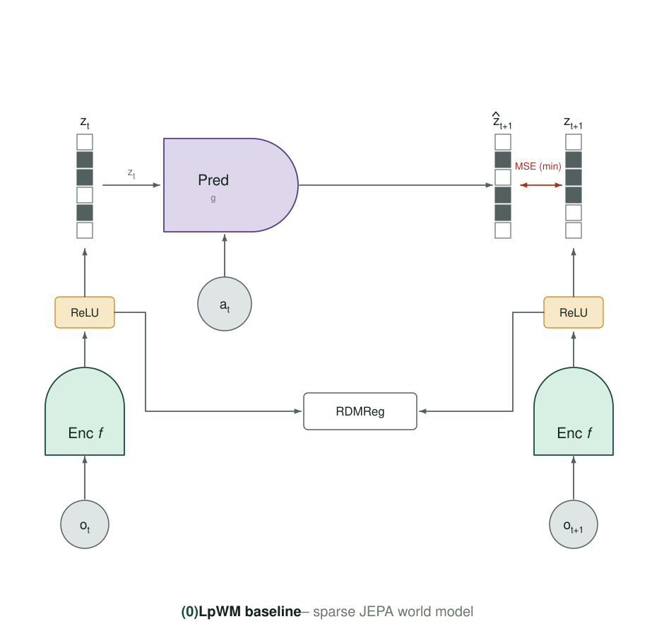

Encoder `f` maps `o_t` to a non-negative sparse latent through a terminal (Rep)ReLU;
predictor `g` takes `z_t` and `a_t` to predict `ẑ_{t+1}`, matched by MSE against the encoded
target; RDMReg matches the code's marginals to a rectified generalised Gaussian.

In plain words: the encoder squashes a frame down to 384 numbers, most of which are exactly
zero because the last operation is a ReLU. The predictor guesses those 384 numbers one step
ahead given the action. RDMReg's job is to stop the encoder cheating by making its own output
trivially predictable — it compares the distribution of the code against a reference
distribution along many random 1-D directions and penalises the difference.

`LpWM-ltv` is the control for everything below: **0.357** at n = 13.

---

### 2.1 (1) `PiWM-sparse` — k-WTA on the code · **refuted**

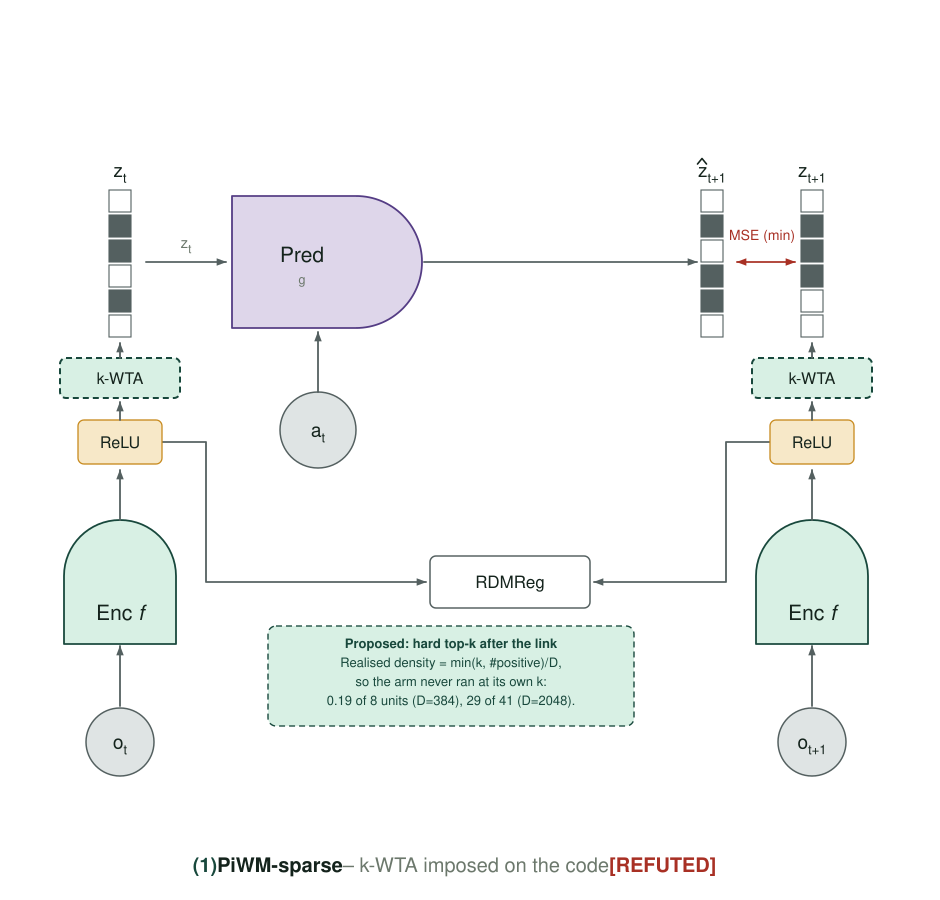

**Motivation.** SDR theory operates at 0.05–2 % density; the LpWM code sits near 50 %. If the
project's sparse-coding premise is right, pushing the code into the real SDR regime should
help, and at D = 2048 the arm sits squarely inside Numenta's stated band (w = 41 at n = 2048).
This was **my** hypothesis and the round was built to test it.

**What was built.** k-Winners-Take-All in the shared `Link`
(`models/infojepa_modules.py:729`, `:822`): keep the k largest coordinates, zero the rest,
straight-through backward. Two widths (D = 384 and D = 2048) and several k, so density and
width are separable.

**Results — refuted, and the mechanism is an implementation detail, not the idea's merit.**

**k-WTA is the damaging operator, not sparsity.** Every dense arm (ρ 0.28–0.53) plans at
0.28–0.69; every k-WTA arm plans at 0.000, at every density and both widths, on both
predictors. `LpWM-base` (ρ=0.277, no k-WTA) scores 0.340 while `PiWM-sparse-matched`
(ρ=0.294, k-WTA) scores 0.007 — same density, 50× the difference. At D=2048 the contrast is
**−0.580 [−0.883, −0.277], p = 0.0044**.

*Mechanism.* `Link.forward` rectifies **then** applies k-WTA, and `kwta` marks exactly k
positions **whose values may be zero**, so realised density is `min(k, #positive)/D`: 0.19 of
8 units at D=384, 29 of 41 at D=2048. The arms never ran at their configured operating point.
Not gradient starvation — `kwta` has a straight-through backward.

*The SDR-regime hypothesis was mine, and it is refuted.* w=41 at n=2048 is squarely inside
Numenta's band and still scores 0.000 across 6 seeds.

### 2.2 (2) `PiWM-gate` — gate driven by the support · **null**

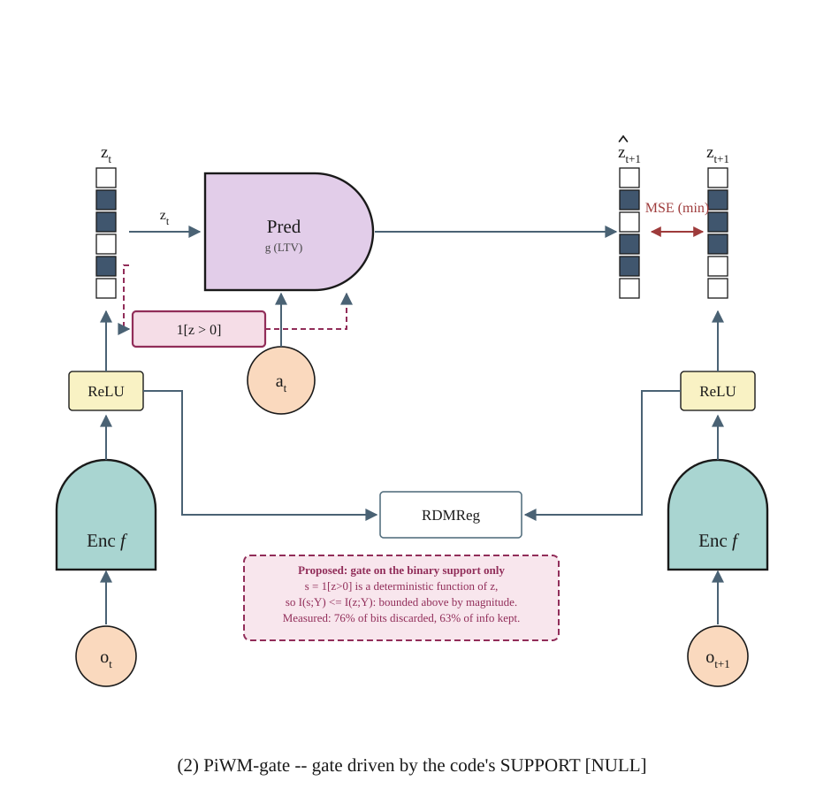

**Motivation.** Carried over from 2026-09-01 §2.1: the hypothesis that *which units are on*
carries the meaning of a sparse code and the magnitudes are nuisance. Plus `gate-both`, which
2026-09-01 §6 designed as the direct repair of that entry's information-loss diagnosis — feed
the gate `[z ; 1[z>0]]`, a strict superset rather than a coarsening, so the data-processing
bound no longer applies.

**What was built.** `gate_input` ∈ {`magnitude`, `support`, `both`}
(`models/infojepa_modules.py:449`, `:665`); `both` doubles the gate's fan-in to 2D (`:497`).
All three at n = 13 against the same control.

**Results — a clean null, all three.** +0.015, −0.012, −0.069, every CI inside ±0.14 at n=13.

The information analysis from 2026-09-01 §3(a) holds as measured — binarising discards 76% of
per-unit bits and retains 63% of one-step predictive information — but **that loss is
irrelevant to planning at this horizon**. *A gate handed 24% of the bits plans as well as one
handed everything.* And `gate-both`, built to restore the missing bits, does not move either:
the deficit it was designed to repair was an artifact of the broken instrument.

### 2.3 (3) `PiWM-union` — J readouts, `loss = min_j` · **dead**

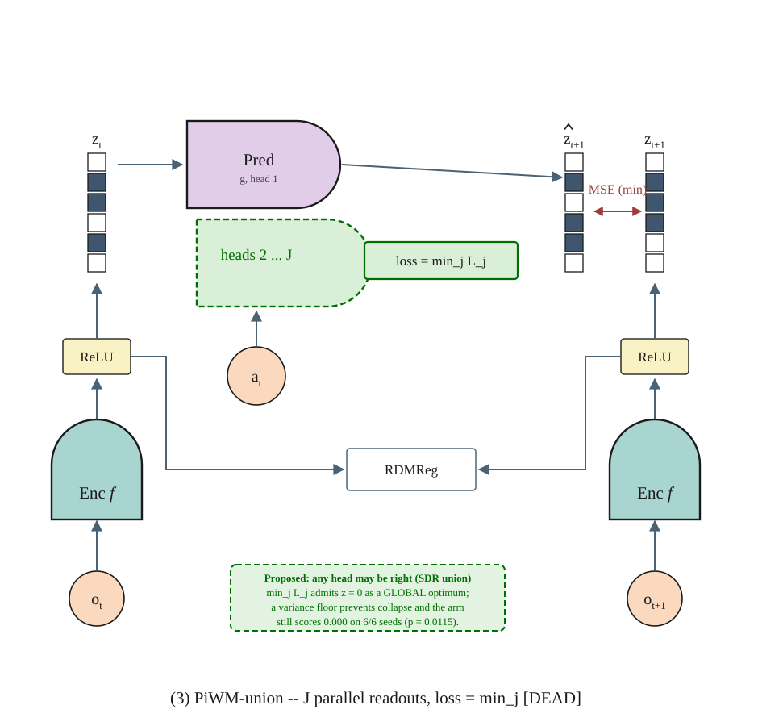

**Motivation.** As 2026-09-01 §2.2: the SDR union property, plus the hope that J heads under a
`min` loss would cover a set of plausible futures rather than averaging them. The one live
hypothesis left after 2026-09-01 was that the collapse was an *operating point* problem — that
the union would work if the code could not die. `var_gamma` (§0) made that testable for the
first time.

**What was built.** J = 4 parallel readouts on the shared trunk
(`models/infojepa_modules.py:557`), `loss = mean_{b,t} min_j L_j`
(`models/visual_world_model.py:1370`), now **with the repaired VICReg variance floor** at
γ = 0.2 — and paired against its **own floored control**, so the floor is held fixed across
the contrast and only the union head varies.

**Results — dead, and provably so.** 0.000 on 6/6 seeds, Δ=−0.387 (p=0.0115) against its own
floored control. The variance floor did its job — never let a seed die (median ρ 0.237 vs
unfloored 0.0000) and is neutral on a healthy code (Δ=−0.020, p=0.888) — and the union is
still zero.

Two proofs close the family rather than one more experiment:

* `min_j L_j` admits `z ≡ 0` as a global optimum; **removing that optimum does not make the
  objective useful.**
* A loss-side ensemble of these heads is *provably vacuous*: they share a trunk and differ by
  a final Linear, so for linear readouts
  `mean_j ||W_j c − t||² = ||W̄c − t||² + mean_j ||(W_j − W̄)c||²` — "min → mean" is one head
  plus a shrinkage penalty. Whatever an ensemble buys, it is not available *inside* the loss.

That second identity is what motivated moving the ensemble to plan time, which is §2.4.

### 2.4 (4) `PiWM-vote` — plan-time consensus · **the one positive**

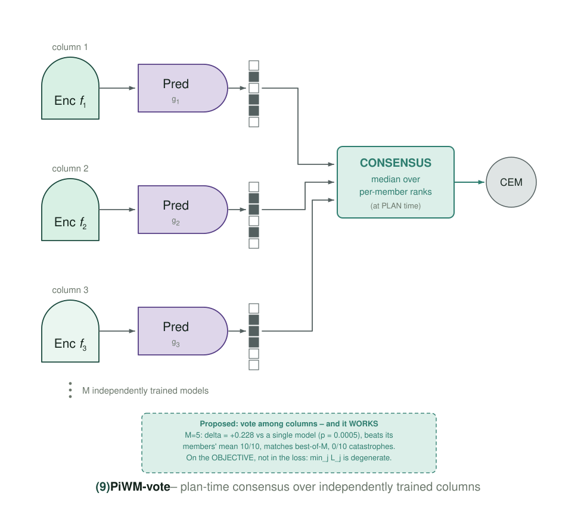

**Motivation.** Two things pointed the same way. First, the algebra above: an ensemble inside
the loss is one head plus shrinkage, so if ensembling is worth anything it has to happen
*outside* the model. Second, the variance decomposition (below): the campaign's variance is
owned by the seed, not by the architecture, and no representation change addresses that.

**What was built.** No new loss term, no new module, no new hyperparameter, no retraining. M
independently trained checkpoints of the *same* arm each roll the *same* candidate action
sequences through their own predictor; their per-candidate scores are combined by a rank rule
(Borda, median, CVaR, max) into a single ordering, and CEM proceeds on that. It is a change to
the **planner's objective**, at `planning/objectives.py` / `planning/ensemble.py`.

**Results — the campaign's only positive, and it scales.**

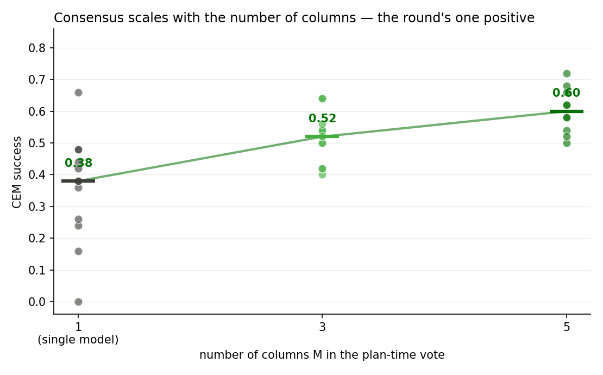

| | control | M=3 | M=5 |
|---|---|---|---|
| n | 13 | 12 | 10 |
| mean | 0.357 | 0.517 | **0.602** |
| vs single model | — | +0.165 (p=0.008) | **+0.228 (p=0.0005)** |
| vs members' **mean** | — | +0.165, **12/12** | +0.228, **10/10** |
| vs members' **best** | — | +0.002 (p=0.96) | +0.032 (p=0.43) |
| catastrophes | 1/13 | **0/12** | **0/10** |

Four properties make this a result rather than a lucky arm:

1. **It scales.** 0.357 → 0.517 → 0.602 as columns go 1 → 3 → 5. Noise-averaging saturates;
   a vote keeps improving as independent models are added.
2. **It beat its group's mean in 22/22 evaluations**, without a single exception.
3. **It tracks a rising bar.** Statistically indistinguishable from the *best* member at both
   M — and best-of-5 is a strictly harder target than best-of-3. Consensus delivers
   best-of-M **without being told which column is best**.
4. **Catastrophic failure disappears** (0/12, 0/10 against 1/13).

Why this is the intervention that worked, when eight others did not: a variance decomposition
over four D=384 arms × 11 shared seeds gives **arm 3.8% / seed 51.5% / arm×seed 44.7%**. Seed
instability, not representation design, owns the variance — and consensus is the only thing
tried that attacks it. It is also the only idea implemented on the **objective** rather than
inside the loss, after `min_j L_j` proved provably degenerate.

Honest limit: it does not exceed the best column, and it spends M× rollout compute at plan
time. What it buys is *reliability*.

### 2.5 (5) `PiWM-refframe` — allocentric pose bound to the action

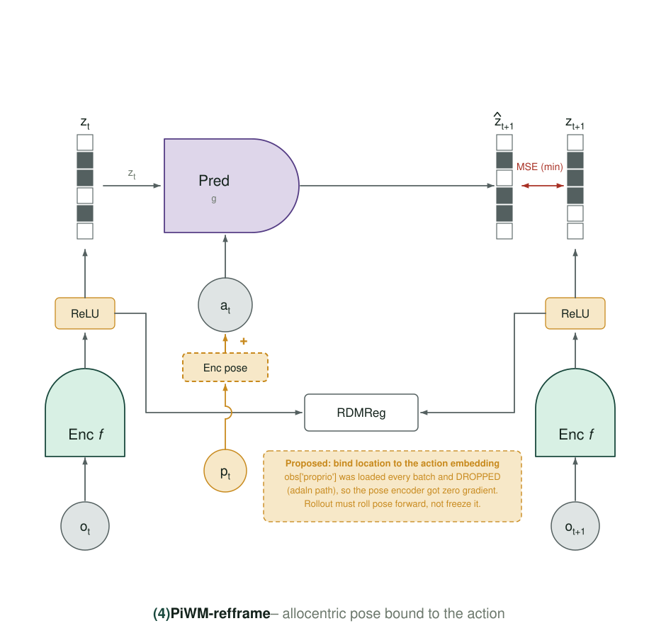

**Motivation.** Thousand-Brains-style reference frames: a cortical column is supposed to
represent *what* in the context of *where*. The predictor here gets only the code and the
action; giving it an explicit allocentric pose, bound to the action, is the minimal version of
that idea.

**What was built.** `use_pose` — the proprioceptive pose is encoded and concatenated into the
predictor's conditioning alongside the action.

**Results — a null (−0.063 [−0.158, +0.031], n=13), but only after a rollout bug was fixed.**
This one nearly became a false negative, and the story is §6.1.

### 2.6 (6) `PiWM-columns` — P=256 patch tokens instead of one CLS

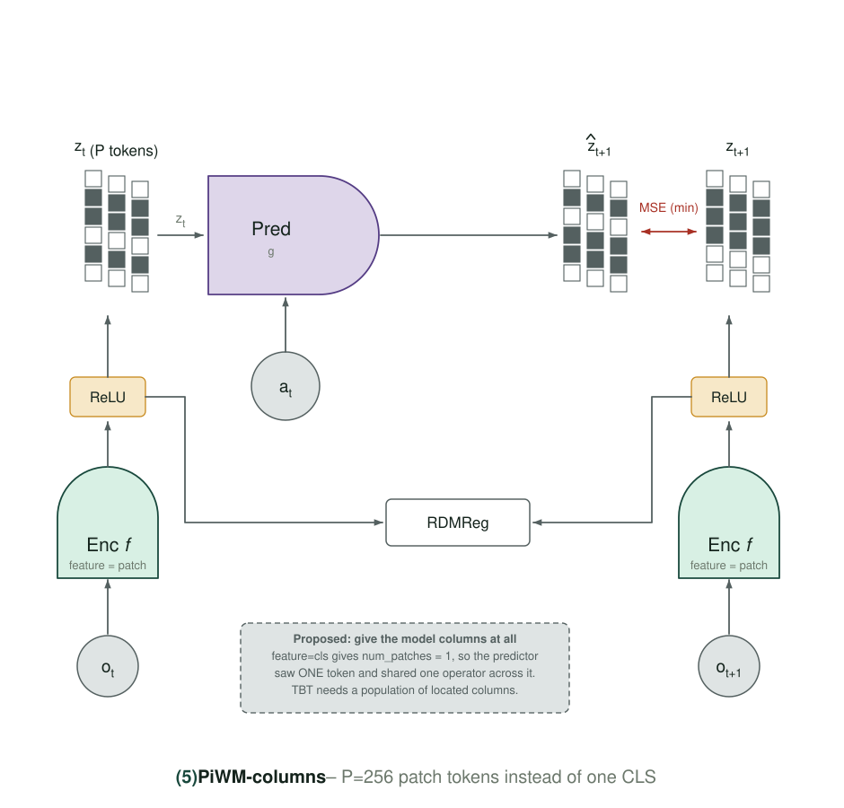

**Motivation.** The baseline compresses the whole frame into one CLS token. A cortical-column
reading says the representation should be many local, spatially-anchored units instead. P=256
patch tokens is that, at the smallest possible change.

**What was built.** The code is the 256 patch tokens rather than the CLS token; the predictor
is one operator broadcast over all of them.

**Results.** Still training at the time of writing; no matched pair yet. *(Landed later as a
null, +0.072 [−0.064, +0.207] at n=12 — see `2026-09-03.md` §1. The reason is recorded there:
it adds spatial *capacity* with no objective demanding spatial *content*.)*

### 2.7 (7) `PiWM-sigreg` — LeJEPA's isotropic-Gaussian target

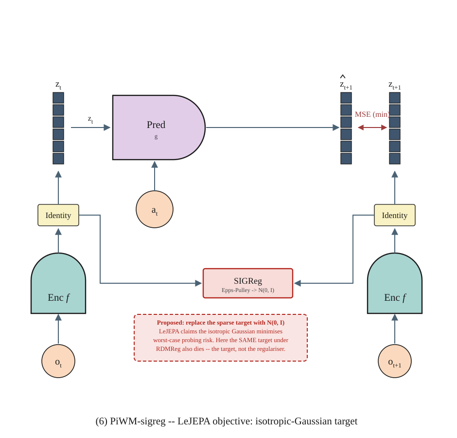

**Motivation.** See §5 for the full argument. In short: LeVJEPA (arXiv 2608.27395) trains a
single encoder with an invariance loss + **SIGReg**, which constrains embeddings to an
**isotropic Gaussian** with a provable collapse guarantee. We already matched two of its three
removals (no EMA target, no stop-gradient). The one thing we never matched is the *target
distribution*, and SIGReg was implemented in this repo all along
(`models/infojepa_modules.py:26`) and had never been used.

**What was built.** `regularizer=sigreg` — Epps–Pulley on 1024 random projections over 17
knots, the paper's exact hyperparameters. Plus `LeWM-ltv-p2`, an **RDMReg control at the same
Gaussian target**, which is what makes the comparison identify the target rather than the
regulariser.

**Results.** Early (arms 23–43 % trained). The Gaussian target is struggling and it is not
SIGReg's fault — see §5. `PiWM-sigreg-w0p5` was retired: `rel_mse` 0.9995 at ρ 0.9999, i.e.
fully dense and not predicting (§9).

### 2.8 (8) `PiWM-drop95` — 95% token dropping · **collapsed**

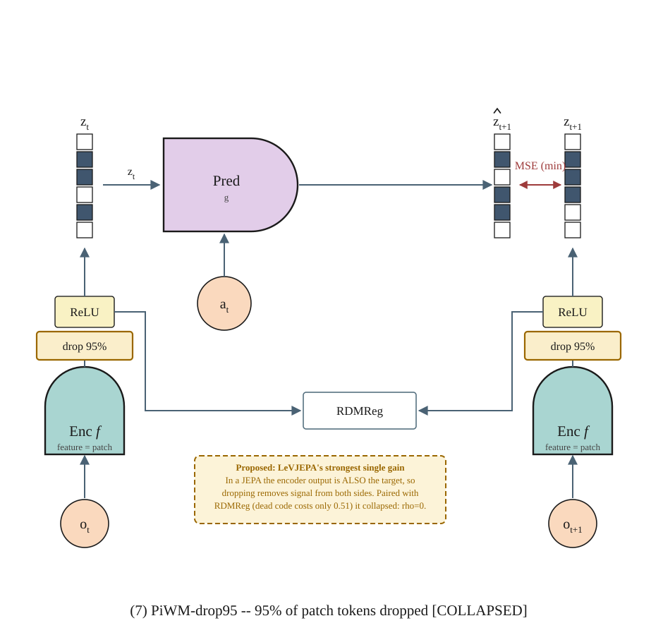

**Motivation.** LeVJEPA drops 95 % of tokens and reports it as a compute win with no quality
cost. If that holds here it is free throughput.

**What was built.** 95 % of tokens dropped, **paired with RDMReg** — which is the error.

**Results — collapsed, not underperforming**: ρ=0.000, `eff_dim`=0.0. And that is our error,
not the paper's: LeVJEPA drops 95 % of tokens *while SIGReg provably excludes collapse*. We
paired dropping with RDMReg, which charges only 0.51 for a dead code. **The correct transplant
is dropping combined with SIGReg**, which the paper never separates. Retired (§9), to be
re-run as `drop95 + SIGReg`.

### 2.9 (9) `PiWM-blockcausal` — temporal structure inside the encoder

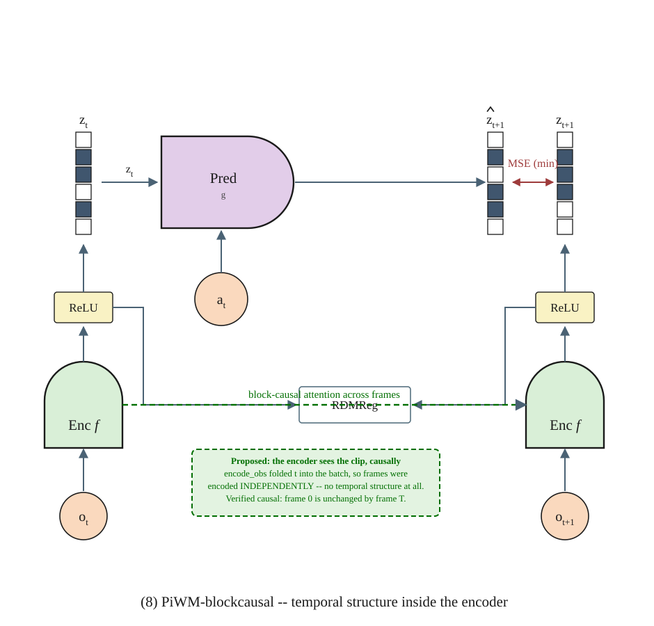

**Motivation.** *The entry does not record a motivation beyond the name.* The change puts
block-causal attention inside the encoder so a frame can attend to its own past but not its
future.

**What was built.** Block-causal attention mask in the encoder.

**Results — its headline was an artifact. RETRACTED.** Its `rel_mse` of 0.0022 looked 5×
better than any arm at full training. It is measured against a target that stopped moving:
`mean|Δz|/|z|` = **0.16%** vs the baseline's 26.6%, `std_t(z)` = 0.00084 vs 0.178
(**212× less** temporal variation), and the **identity predictor** ("copy the previous
latent") scores **0.000010** against the model's 0.0022 — the learned predictor is 220×
*worse* than copying. `rel_mse` is normalised by target *energy*, not against a trivial
predictor, so it cannot see this.

**A new collapse mode.** Every anti-collapse term in this literature — RDMReg, SIGReg,
VICReg variance/covariance — constrains the code's **per-timestep marginal**, and a
time-constant code satisfies all of them perfectly. Block-causal attention found exactly
that shortcut.

*But* temporal variation is a **floor condition, not a quality axis**:
Spearman(`std_t(z)`, CEM) = **+0.05, p=0.90** across 9 arms, and `union4-vfloor` has the
*highest* temporal variation of any arm while planning at 0.000. So "add a temporal-variation
term" does not follow from this.

### 2.10 The variance floor, on its own

**Motivation.** `var_gamma` had never run (§0). Before using it inside another arm's contrast
it needs its own reading, or a union result would confound the head with the floor.

**What was built.** VICReg's hinge `relu(γ − std_d)` per dimension
(`models/visual_world_model.py:1338`), at γ = 0.2 — calibrated *below* the healthy operating
point (per-dim std 0.45–0.49) so it acts as a floor rather than a rescaling.

**Results — it works and it is neutral.** It never lets a seed die (median ρ 0.237 against
unfloored 0.0000) and costs nothing on a healthy code: **Δ = −0.020 [−0.557, +0.517],
p = 0.888** at n = 3. That is an uninformative interval, not a demonstration of exact
neutrality, and it is reported as neutral rather than as a null for that reason.

### 2.11 The muP input-weight fix

**Motivation.** The rule documented at `models/mup.py:12-16` was never implemented at `:81-83`
(§0). Three input weights were training at 96×, 38× and 24× their intended learning rate.
That is a bug whether or not it costs anything, but it should not be fixed globally until it
is known which direction it moves the result.

**What was built.** `MUP_INPUT_FIX` — the documented input-weight LR rule, applied.

**Results — unresolved and, if anything, negative: −0.136 [−0.304, +0.032], p = 0.100** at
n = 10. Verified real as a bug; has not yet shown a planning benefit. It is nonetheless now a
**factor that must be matched in every pairing** — `2026-09-03.md` §1 shows a downstream arm
whose verdict flips from "null" to "−0.170 negative" purely by pairing across it.

---

## 3. The one positive, restated as a mechanism

Consensus is not "an ensemble helps, as usual". Three of its properties say what it is doing:

* it beats the members' **mean** in 22/22 evaluations but not the members' **best**
  (+0.002, p=0.96 at M=3; +0.032, p=0.43 at M=5);
* it removes catastrophes entirely (0/12 and 0/10 against 1/13);
* it keeps improving from M=3 to M=5.

Together those say **variance reduction**, not pessimism and not a better model: it recovers
best-of-M without being told which column is best. `2026-09-03.md` §16.4 tests that reading
directly and confirms it, and `2026-09-04.md` §4 turns the M-curve into a measurement rather
than a scale proposal.

**Amended 2026-09-05.** The reading holds, and the mechanism now owns the top of the campaign:
**seven of the top eight arms never touched the world model.**

| arm | mean success | world model |
|---|---|---|
| `PiWM-vote5-borda` | **0.608** | `LpWM-ltv` checkpoints |
| `PiWM-vote5-median` | 0.602 | `LpWM-ltv` checkpoints |
| `PiWM-vote5-cvar1` / `-cvar2` | 0.585 | `LpWM-ltv` checkpoints |
| `PiWM-vote3-borda` | 0.583 | `LpWM-ltv` checkpoints |
| `PiWM-vote5-max` | 0.568 | `LpWM-ltv` checkpoints |
| `PiWM-loo5-ltv` | 0.552 | `LpWM-ltv` checkpoints |

Every one of them loads baseline checkpoints, so their world-model diagnostics *are* the
baseline's, and no training-side axis can order the campaign's largest success differences
([2026-09-05 §8.7](2026-09-05.md); the full re-ranking is [2026-09-05 §8](2026-09-05.md), and
`loo5`'s design defect is [2026-09-05 §7.7](2026-09-05.md)).

---

## 4. What the negatives close, and why they are closed rather than merely unfavourable

The three resolved negatives each come with a mechanism, which is what makes them closures:

* **k-WTA** — the operator, not the density, and the arms never ran at their configured
  operating point (§2.1). Both widths, both predictors, every k.
* **The union head** — `min_j L_j` admits `z ≡ 0`; and the loss-side ensemble identity shows
  "min → mean" is one head plus shrinkage (§2.3). Removing the degenerate optimum with a
  variance floor changes nothing.
* **Support gating** — a clean null at n=13 across three variants, with the information cost
  measured and shown to be irrelevant at this horizon (§2.2).

---

## 5. LeVJEPA combination (arXiv 2608.27395) — early

That paper trains a single encoder with an invariance loss + **SIGReg**, constraining
embeddings to an **isotropic Gaussian** and excluding collapse with a provable guarantee,
dispensing with the EMA target, the stop-gradient and the capacity-limited predictor.

**We already matched two of its three removals**: no EMA target, and `detach_target: False`
means no stop-gradient either. What we never matched is the *target distribution* — all 160
campaign runs used `regularizer=rdmreg`, and 157 used `link=reprelu` + `target_p=1`, a sparse
rectified target. **SIGReg was implemented in this repo all along** (`infojepa_modules.py:26`,
Epps–Pulley on 1024 projections over 17 knots — the paper's exact hyperparameters) and had
never been used.

Measured statistic scale, which is why `reg_weight` cannot be carried over:

| code state | SIGReg | RDMReg |
|---|---|---|
| at target N(0,I) | 1.10 | — |
| healthy | — | 0.032 |
| rank-1 collapse | 10.8 | — |
| dead (zeros) | **25.7** | **0.51** |

A dead code cost RDMReg only **0.51** — payable, which is exactly how `PiWM-union4` reached
ρ=0.0000. SIGReg charges 25.7.

Early training signals (arms are 23–43% trained; CEM pending):

- **The Gaussian target is struggling, and it is not SIGReg's fault.** The RDMReg control at
  the *same* target (`LeWM-ltv-p2`) is also poor (`rel_mse` 0.53, `eff_dim` 3.1, CEM
  0.06/0.00/0.00). That control is why the difficulty can be attributed to the target rather
  than the regulariser. Ruled out the obvious alternative: the regulariser/prediction ratio is
  *lower* for SIGReg (1.0–1.8) than for the working baseline (12.2), so `reg_weight` is not
  drowning it.
- **`drop95` did not underperform — it collapsed** (ρ=0.000, `eff_dim`=0.0). And that is our
  error, not the paper's: LeVJEPA drops 95% of tokens *while SIGReg provably excludes
  collapse*. We paired dropping with RDMReg, which charges 0.51 for a dead code. The correct
  transplant is dropping **combined with** SIGReg, which the paper never separates.
- **`block-causal`'s headline was an artifact — RETRACTED.** The full accounting is §2.9: the
  target stopped moving, and a `rel_mse` normalised by target energy cannot see that.

> **§5's attribution claim is withdrawn — see §7.** "The target, not the regulariser, is
> implicated" is not separable from the **link** in this archive, because there are zero runs
> in either off-diagonal cell of link × target. The withdrawal is §7's, and it stands.

---

## 6. Two measurement bugs caught before they became "results"

Both would have read as clean negatives.

### 6.1 `PiWM-refframe` was unevaluable

It trained healthy (`rel_mse` 0.0137, ρ 0.580, `eff_dim` 20.4 — comfortably under the
`rel_mse > 0.025` catastrophe screen that is 23/23 precise) and scored **0.020**. The rollout
held the *last observed* pose for every predicted frame, while training always saw true pose —
and pose is **1.27×** the action embedding's own norm, so it dominates the conditioning.
Measured gap on real trajectories: **0.467 × scale**.

Fixed by rolling **environment** dynamics forward, `pose_{k+1} = [pose_k, act_k, 1] @ W`, fit
once on the dataset and shared by every arm — so no retraining was needed:

| | |
|---|---|
| 1-step pose change explained | 95.2% |
| drift at the planner's 5-step horizon | 7.6% of a pose sd |
| conditioning gap | **0.4673 → 0.0131 (35.6×)** |

Exact arithmetic integration is *not* available — realised motion is 0.396× the commanded
action (90.3% explained), so the controller slips. The same seed then went **0.020 → 0.10**,
and the arm's final verdict is the null in §1.

> A first check made the fix look *worse* (0.729 vs 0.595) because it fed **random** pose,
> where rolling realistic dynamics necessarily diverges from noise. Verify this path on real
> trajectories only.

### 6.2 A garbage eval would have been permanent

A failed/incorrect eval writes a `plan_outputs` entry, and *both* the dedup guard and the
auto-eval loop skip runs that have one. Thirteen zeros would have been indistinguishable from
a real negative.

---

## 7. `target_p` is an inert knob — the "sparse prior" does nothing

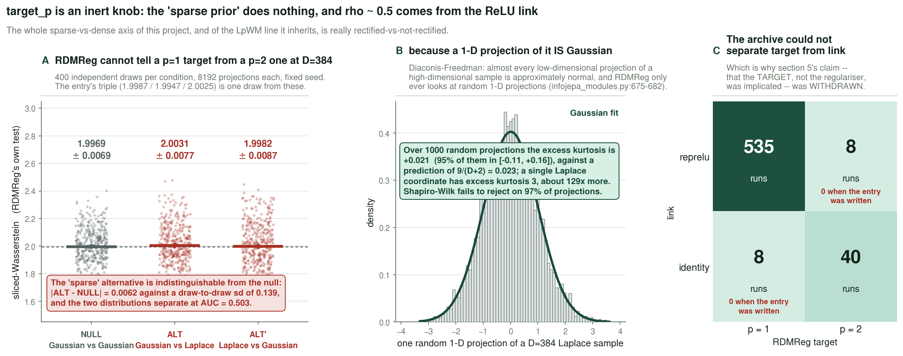

**Motivation for the check.** `target_p` is the exponent of RDMReg's reference distribution:
p=2 is Gaussian, p=1 is Laplace, i.e. "the sparse prior". It has been treated throughout as
the knob that makes this a sparse-coding project. Before attributing anything to it, test that
it does anything.

**What was measured.** RDMReg's own test statistic — sliced Wasserstein — under its own null
and its own alternative.

| | sliced-Wasserstein (RDMReg's own test) |
|---|---|
| NULL: Gaussian vs Gaussian | 1.9987 ± 0.0112 |
| ALT: Gaussian vs **Laplace** (p=1) | **1.9947 ± 0.0170** |
| ALT′: Laplace vs Gaussian | 2.0025 ± 0.0113 |

The "sparse" alternative is **indistinguishable from the null — in fact below it**. The
mechanism is Diaconis–Freedman: a 1-D random projection of a D=384 Laplace sample has excess
kurtosis **−0.002**, Shapiro p=0.396. It *is* Gaussian. RDMReg only ever looks at random 1-D
projections (`infojepa_modules.py:675-682`), so at this width it **structurally cannot** tell
a p=1 target from a p=2 one.

**So ρ≈0.5 comes from the ReLU link, not from the sparse prior** — and the whole "sparse vs
dense" axis of this project, and of the LpWM line it inherits, is really *rectified vs not
rectified*.

**And the archive cannot separate them.** Cross-tabulating all runs: **173 at
`(reprelu, p=1)`, 35 at `(identity, p=2)`, and ZERO at either off-diagonal cell.** §5's claim
that "the target, not the regulariser, is implicated" is therefore not separable from the
link, and is **withdrawn**. `wave21` runs the two missing cells.

> **Overtaken** *(checked 2026-09-04).* `wave21` ran. The archive now holds **535** at
> `(reprelu, p=1)`, **40** at `(identity, p=2)`, and **8 runs in each** of the two
> off-diagonal cells — the "ZERO" above was true on 2026-09-02 and is no longer. The
> **withdrawal stands**: the cells exist now, but they were empty when §5's claim was made,
> which is exactly why that claim could not have been supported. `target-p-inert.png`
> panel C shows the current counts and marks both off-diagonal cells "0 when the entry was
> written".

---

## 8. The root kernel issue: the action is causally inert

> **⚠ The central number in this section was later found to be wrong by a factor of ~2900 —
> see `2026-09-03.md` §12b.** `causal/d_action` is logged only for runs trained *after* the
> diagnostic was added, which excludes `LpWM-ltv`, `-d2048`, `-vfloor`, `-mupfix` and the whole
> gate family — every high-CEM arm. The baseline value quoted below is a single hand-measured
> seed. Re-probing every checkpoint in the archive gives `d_action/‖z‖` = **0.549** for
> `LpWM-ltv`, not 0.00019: the baseline was never action-inert, and it sits in the top quartile
> of the campaign, *above* every arm later built to raise it. Nine arms across rounds 3 and 4
> were designed on the wrong number.
>
> The section is left exactly as written. Its *reasoning* — that the objective is predictive
> rather than causal, and that CEM consumes action-sensitivity rather than accuracy — is not
> what failed; the measurement it rested on is. The figure below carries both: panel A is this
> table as published, under a retraction banner, and panel B is the re-measurement.

> **Amended 2026-09-05.** The banner above stands as written, with one sentence in it superseded:
> *"its reasoning is not what failed; the measurement it rested on is."* The reasoning has since
> been tested directly, and it does not hold either. `d_action/‖z‖` re-probed over the whole
> archive — **66 arms, 449 runs** — puts the relation entirely inside the dead arms:
>
> | subset | arms | ρ | p |
> |---|---|---|---|
> | all arms | 45 | +0.624 | <0.0001 |
> | **healthy** (success ≥ 0.20) | 23 | **+0.316** | **0.142** |
> | dead (success < 0.20) | 22 | +0.486 | 0.022 |
>
> And the interventional arm this section's caveat asked for was built and run. `PiWM-jump2`
> carries the highest action sensitivity of any healthy arm and buys nothing with it, while the
> campaign's best training-side arm sits *below* the baseline on the same quantity:
>
> | arm | `d_action/‖z‖`, paired seeds |
> |---|---|
> | `PiWM-jump2` — highest of any healthy arm | **1.8×** the baseline (0.980 against 0.549) |
> | `PiWM-patchdecode` — the best training-side arm in the campaign | **0.98×** |
> | every other arm that beats the baseline | 0.90×–1.07× |
>
> `jump2`'s success rate is the baseline's — **−0.035** on the eight seeds they share — so 1.8×
> the action sensitivity bought nothing, and the arms that do win moved this quantity by less
> than the seed-to-seed spread. The lever does not exist. Action inertness is a **symptom of a
> dead model**, not a cause of poor planning in a live one; it is one more diagnostic that
> separates dead from live and then says nothing, the pattern §11 names below. Full write-up
> [2026-09-05 §8.6](2026-09-05.md); the shared-seed success ranking those arms are read against
> is [2026-09-05 §8](2026-09-05.md).

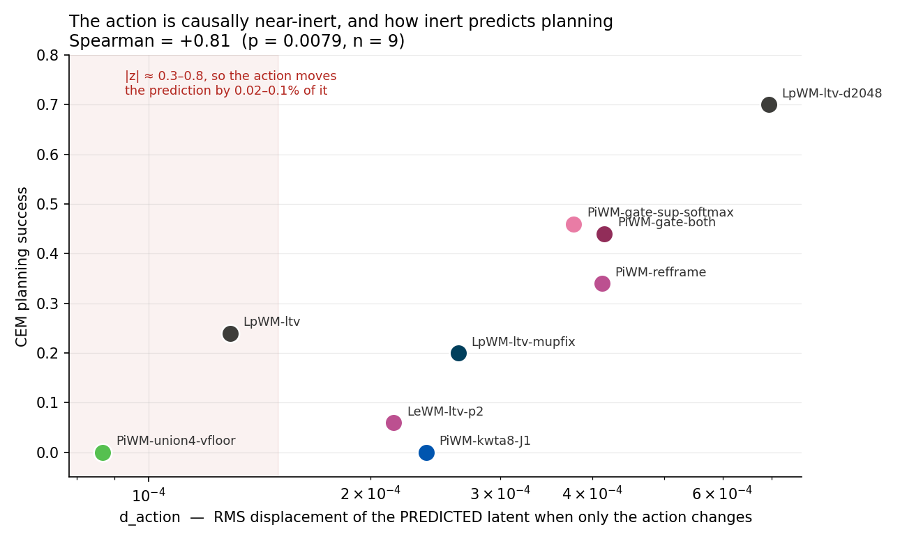

Measured on real trajectories — how far the **predicted** latent moves when *only the action
changes* (`d_action`), against how far it moves when only the state changes (`d_state`):

| arm | `d_action` | `d_state` | \|z\| | CEM |
|---|---|---|---|---|
| `LpWM-ltv-d2048` | **6.93e-04** | 1.59e-03 | 0.70 | **0.70** |
| `PiWM-gate-both` | 4.15e-04 | 1.15e-03 | 0.69 | 0.44 |
| `PiWM-refframe` | 4.12e-04 | 3.55e-04 | 0.57 | 0.34 |
| `PiWM-gate-sup-softmax` | 3.77e-04 | 6.70e-04 | 0.73 | 0.46 |
| `LpWM-ltv-mupfix` | 2.63e-04 | 2.02e-03 | 0.77 | 0.20 |
| `PiWM-kwta8-J1` | 2.38e-04 | 4.63e-04 | 0.03 | 0.00 |
| `LeWM-ltv-p2` | 2.15e-04 | 1.79e-03 | 0.48 | 0.06 |
| `LpWM-ltv` | 1.29e-04 | **4.74e-03** | 0.68 | 0.24 |
| `PiWM-union4-vfloor` | **8.67e-05** | 7.36e-05 | 0.32 | **0.00** |

**Spearman(`d_action`, CEM) = +0.81, p = 0.0079** — the strongest predictor of planning
success in this project, stronger than `rel_mse`. The *ratio* `d_action/|z|` predicts nothing
(+0.28, p=0.47), so it is the **absolute** displacement that matters, consistent with an
absolute noise floor in the planner's objective.

**Changing the action moves the prediction by 0.02–0.1% of the latent's own magnitude**, and
for the baseline `d_state / d_action = 37×`. CEM plans *only* by comparing candidate action
sequences; at that displacement the objective landscape over actions is nearly flat and the
planner is choosing close to at random.

The objective `min ‖h(P(z_t,a_t)) − h(Enc(o_{t+1}))‖²` is **predictive, not causal** — it is
dominated by the *autonomous* component of `z_{t+1}` and never requires the model to be
interventionally correct. That retro-explains the whole campaign in one stroke:

- **why `rel_mse` does not predict CEM** — it scores autonomous prediction; planning needs
  action-sensitivity, a different quantity;
- **why width helped** — `d2048` has the largest `d_action` of any arm;
- **why consensus helped** — averaging M models raises SNR in a near-flat landscape; it never
  made the landscape less flat;
- **why every representation intervention failed** — sparsity, unions, gating and pose all
  reshape the code's *marginal*, and none of them touches `∂ẑ/∂a`.

*Caveat:* n=9 arms at one seed each, and `d_action` may be partly a consequence of healthy
training rather than its cause. Tonight logs `causal/d_action` per run (n≈56) and adds an
interventional arm, which is the strongest available test short of a controlled sweep.

*(That caveat was the right one and it was not strong enough. The failure was not the n; it
was that the baseline's own value had never been measured at all — `2026-09-03.md` §14 rule 4.)*

---

## 9. Arms retired tonight, with their numbers

Kept as findings; their incomplete checkpoints, wandb runs and logs were deleted so the
record holds only meaningful results.

| arm | `rel_mse` | ρ | eff_dim | verdict |
|---|---|---|---|---|
| `PiWM-drop95` | **0.0000** | **0.0000** | **0.00** | fully collapsed on 8/8 runs; CEM 0.00 |
| `PiWM-sigreg-w0p5` | 0.9995 | 0.9999 | 18.38 | not predicting; reg-weight probe exhausted |
| `PiWM-blockcausal` | 0.0018 | 0.3164 | 24.37 | temporally collapsed (§2.9); trimmed to 3 seeds |

`blockcausal` is the cautionary one: its **marginal** metrics look healthy (ρ=0.32,
eff_dim=24), which is exactly why marginal metrics are not sufficient to certify a world model.

---

## 10. What to do next

1. **Build on consensus.** It is the only positive and it scales. Test M=7/9 for saturation,
   and heterogeneous columns (mixed link/width), where rank-based voting is the rule that
   actually applies.
2. **Drop the union head and k-WTA.** Both resolved negatives with mechanisms understood.
3. **Re-run C2 as `drop95 + SIGReg`.** Token dropping was tested on the wrong substrate.
4. **Wait on `block-causal`.** Best training metric in the round by 4×; needs its CEM number.
5. **Fix the muP input-weight bug globally** once an arm shows it matters — it is verified
   real (96×/38×/24×) but has not yet shown a planning benefit (Δ=−0.136, p=0.100).
6. **Seed screening is free.** `rel_mse > 0.025` at end of training flagged 23/23 catastrophic
   runs with zero false alarms. Apply it as a *pre-declared joint* inclusion rule — drop a seed
   from both arms of a contrast, declared before any eval is read.

---

## 11. Conclusion: what rounds 1–2 settle

*Every arm with three or more evals on the repaired instrument, every seed, one axis, sorted
by median. The pale crimson band is the 0.000 floor; the dashed slate line is `LpWM-ltv`'s
median. The `Oracle-*` ladder is excluded — those runs replace the model's own rollout with
privileged state, so their success rate is not on the same scale as a learned model's. This
figure regenerates, so it now covers the whole campaign rather than only this round's arms:
it is the index, not a result.*

Rounds 3–4's conclusions are in `2026-09-03.md` §10 and §12b, round 5's in §16.8, and round
6's in `2026-09-04.md` §6, and round 7's — with the whole campaign re-ranked on shared seeds —
in [2026-09-05 §8](2026-09-05.md). What follows is only what rounds 1–2 themselves establish.

**On the results.**

* **Nine proposals, one positive — and the positive is the only one that is not a change to
  the representation.** Consensus M=5 is +0.228 [+0.130, +0.326], p=0.0005; every other arm
  is within ±0.07 of its control or is a resolved negative. The one thing that worked adds no
  loss term, no module and no hyperparameter, and is applied at plan time to already-trained
  checkpoints. *(**Amended 2026-09-05.** Five further rounds did not change that shape, they
  widened it: **seven of the top eight arms in the campaign never touched the world model** —
  they load `LpWM-ltv` checkpoints and plan differently (§3 above,
  [2026-09-05 §8.7](2026-09-05.md)).)*
* **Seed instability, not architecture, owns the outcome.** Variance decomposition over four
  D=384 arms × 11 shared seeds: **arm 3.8 % / seed 51.5 % / arm×seed 44.7 %**. That single
  table explains both why consensus works and why eight representation changes could not have
  worked: they are competing for 3.8 % of the variance.
* **The SDR programme is closed, with mechanisms rather than with unfavourable numbers.**
  k-WTA is refuted at both widths including inside Numenta's own band (−0.580 [−0.883, −0.277]
  at D=2048, w=41 of n=2048); the union head is provably degenerate (`min_j L_j` admits
  `z ≡ 0`, and a loss-side head ensemble is algebraically one head plus a shrinkage penalty);
  support gating is a clean null across three variants at n=13, with its information cost
  measured (76 % of per-unit bits discarded, 63 % of one-step predictive information retained)
  and shown to be irrelevant at this horizon.

**On the measurements.**

* **The measurement instrument is a first-class experimental object, and four separate defects
  in it were found by reading code rather than by looking at results.** `plan.py:134` made
  every seed-0 eval one episode repeated 50× and invalidated an entire campaign; `var_gamma`
  was read but never assigned, so the variance floor had never been runnable; 42 runs trained
  in fp32 while named `_bf16_`; the muP input-weight rule was documented and never implemented
  (96× / 38× / 24×). None of these announced itself in a metric.
* **Marginal metrics cannot certify a world model.** `PiWM-blockcausal` had the round's best
  `rel_mse` by 4× and healthy marginals (ρ=0.32, eff_dim=24), and was temporally collapsed:
  212× less temporal variation than the baseline, and the identity predictor beat it by 220×.
  Every anti-collapse term in this literature constrains the *per-timestep marginal*, and a
  time-constant code satisfies all of them perfectly. **This is the first appearance of the
  pattern that dominates the rest of the record** — a diagnostic that separates dead from live
  and then says nothing (`2026-09-04.md` §6 names it).
* **A quantity that looks like the fix can be an artifact of the population it was measured
  on.** §8's `d_action` diagnosis was the round's main intellectual product, drove two entire
  subsequent rounds, and its central number was wrong by ~2900× because it came from one
  hand-measured seed on a metric that did not exist for the high-CEM arms. See
  `2026-09-03.md` §12b. The reasoning survived; the number did not.
  *(**Amended 2026-09-05.** The second half of that sentence stands, the first does not: the
  reasoning has since been tested directly and did not survive either. `d_action/‖z‖` over 66
  arms / 449 runs correlates with success only among **dead** arms (healthy-only ρ = +0.316,
  **p = 0.142**), and the interventional arm settles it — `PiWM-jump2` runs at **1.8×** the
  baseline's action sensitivity for **−0.035** success, while `patchdecode`, the best
  training-side arm, sits at **0.98×**. See §8's amendment and
  [2026-09-05 §8.6](2026-09-05.md). The lesson survives the correction and gets sharper: this
  is the same dead-vs-live diagnostic pattern as the bullet above.)*
* **Two of this project's stated axes were never separable in its own archive.** `target_p` is
  inert — RDMReg structurally cannot distinguish p=1 from p=2 at D=384 (Diaconis–Freedman;
  its own test statistic reads 1.9947 for the alternative against 1.9987 for the null) — so
  "sparse vs dense" is really "rectified vs not rectified"; and the archive holds 173 runs at
  `(reprelu, p=1)`, 35 at `(identity, p=2)` and **zero** in either off-diagonal cell. The
  missing cells were run in round 4 (`2026-09-03.md` §7).

**On method, carried forward.**

* **Pair against the matched control, and match on every factor.** `refframe` reads −0.063
  against its own control; the muP fix alone is worth −0.12, and `2026-09-03.md` §1 shows an
  arm whose verdict flips from null to negative purely by pairing across it.
* **Choose the control by its variance too.** 2026-09-01's contrasts did not resolve while
  they were anchored on a control with a dead seed (sd 0.267); two of the same arms against a
  stable control (sd 0.072) resolved at n=3, at p = 0.0165 and p = 0.0072.
* **A cheap pre-declared screen is free power.** `rel_mse > 0.025` at end of training flagged
  23/23 catastrophic runs with zero false alarms. Declared *before* any eval is read and
  applied jointly to both arms of a contrast, it costs nothing and removes the seeds that
  otherwise dominate the paired sd.
* **A retraction is cheaper than a defence.** Three things in this entry are withdrawn by the
  entry itself — §5's target-vs-regulariser attribution (by §7), `block-causal`'s headline (by
  §2.9), and `refframe`'s apparent 0.020 (by §6.1) — and each was caught by a control or a
  mechanism check rather than by a better number.

**What rounds 1–2 hand forward.** One validated axis (more ensemble members), two closed
families (k-WTA, the union head), one open question that the round could not answer because
its own instrument was broken (does the action reach the prediction at all?), and a warning
that the answer to that question must be measured on the baseline *before* anything is built
to change it.

*(**Amended 2026-09-05.** That open question is now closed twice over. The action does reach
the prediction — `d_action/‖z‖` = 0.549 for the baseline — and raising it further changes
nothing, so it was never the axis (§8's amendment, [2026-09-05 §8.6](2026-09-05.md)). What
rounds 1–2 actually handed forward is the planner-side axis: it still holds the top of the
campaign five rounds later ([2026-09-05 §8](2026-09-05.md)).)*
