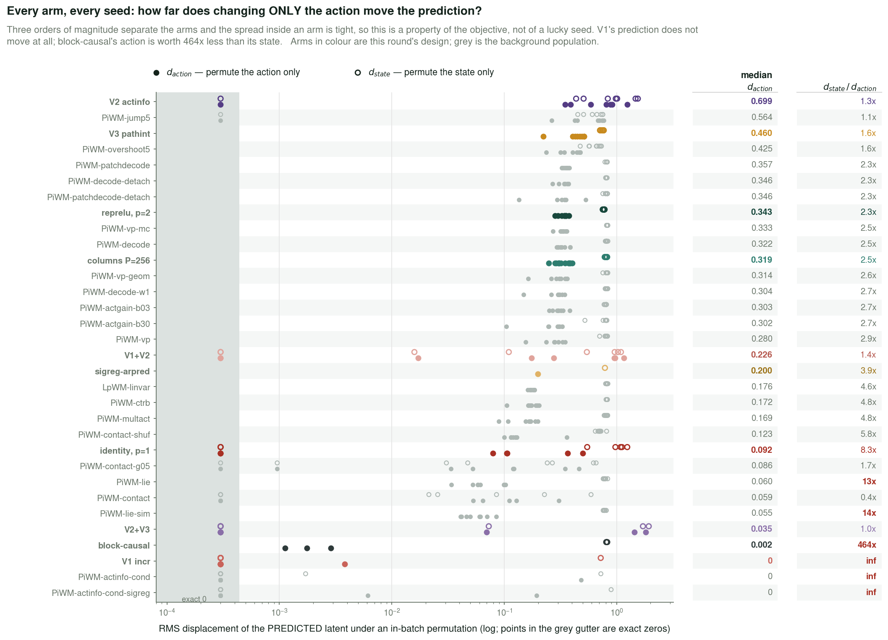
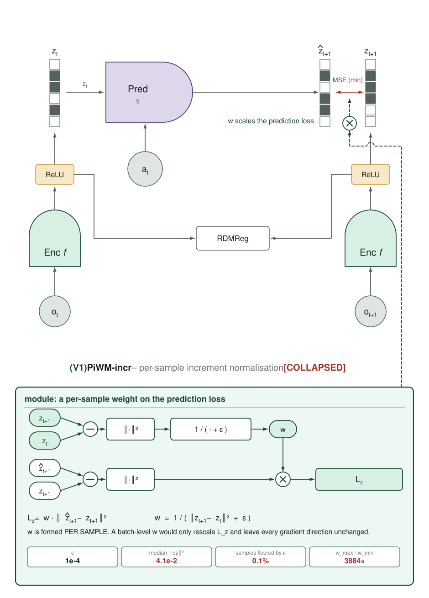
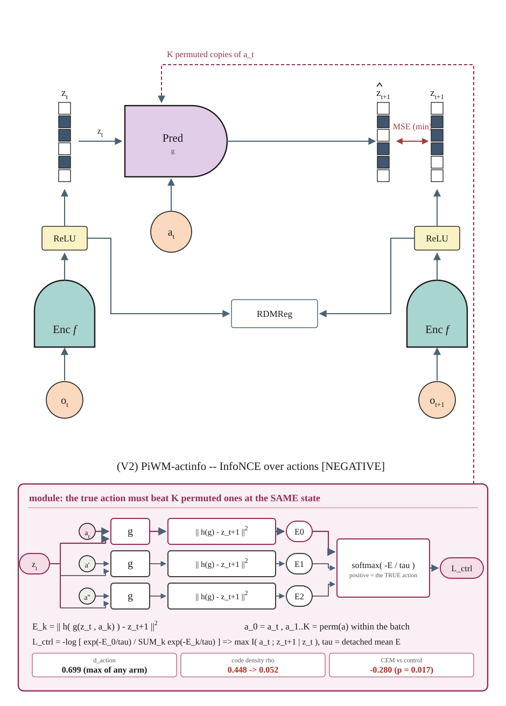
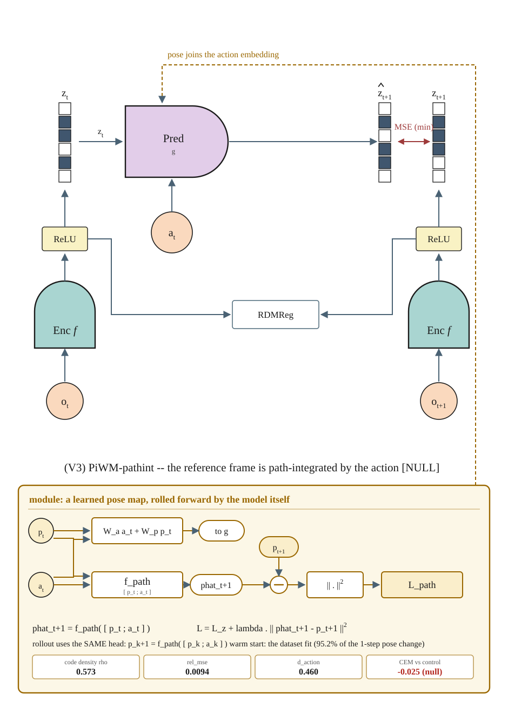
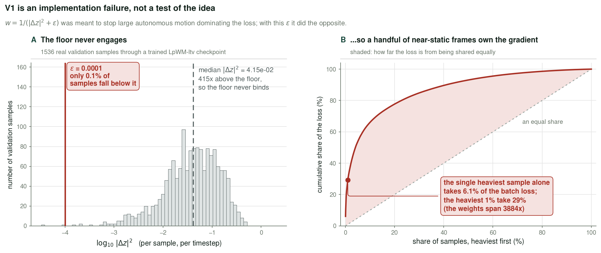
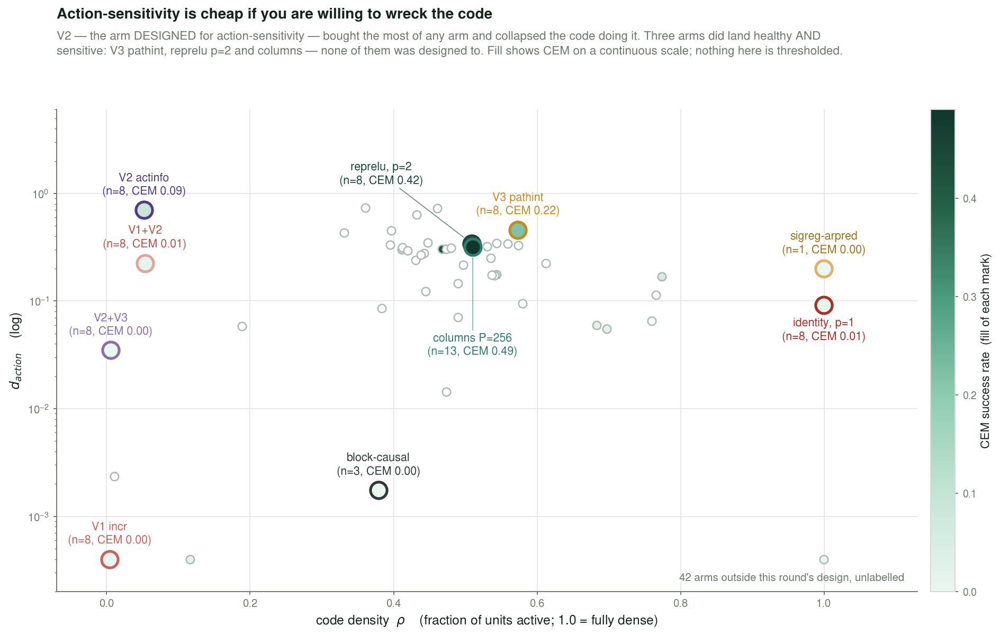
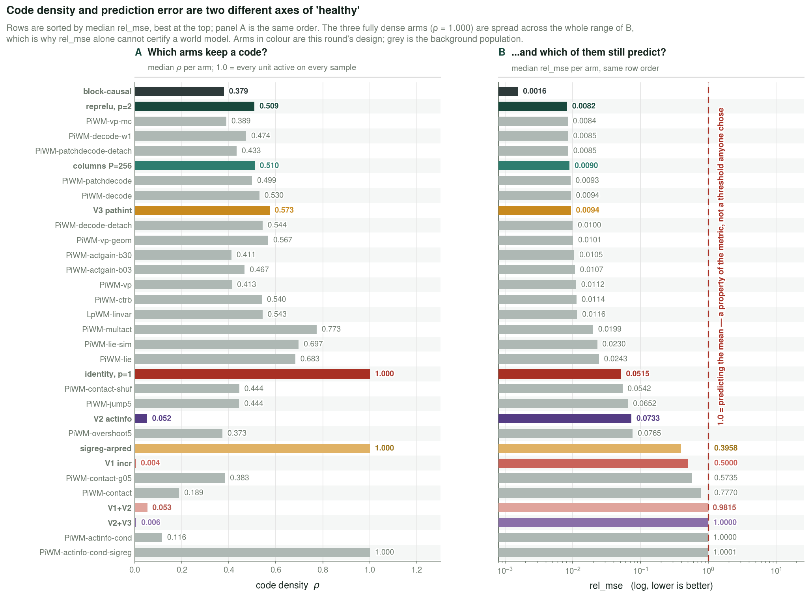
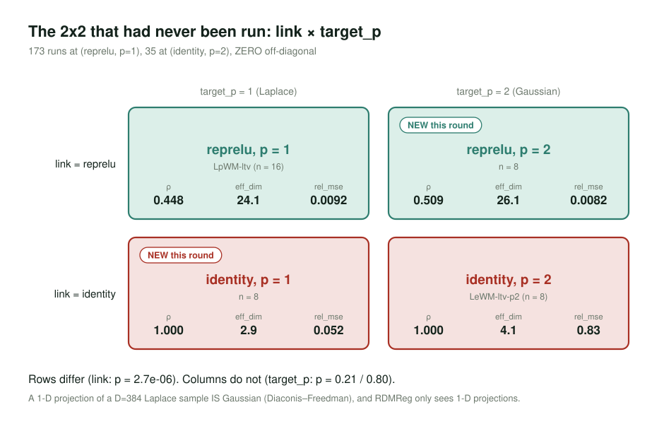
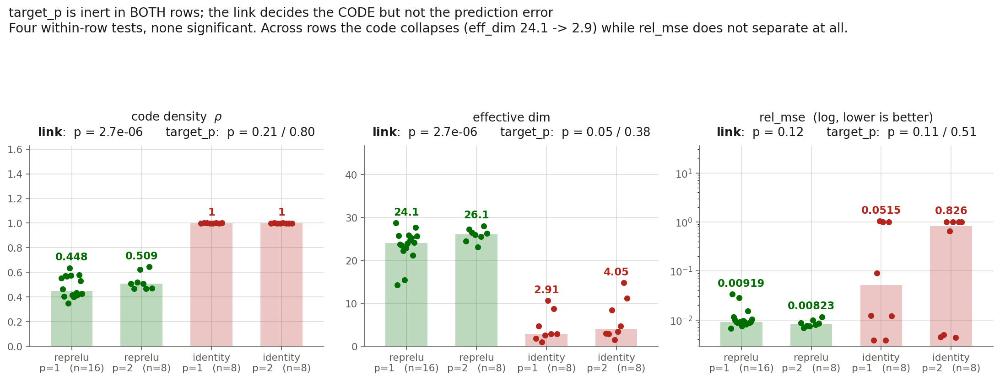
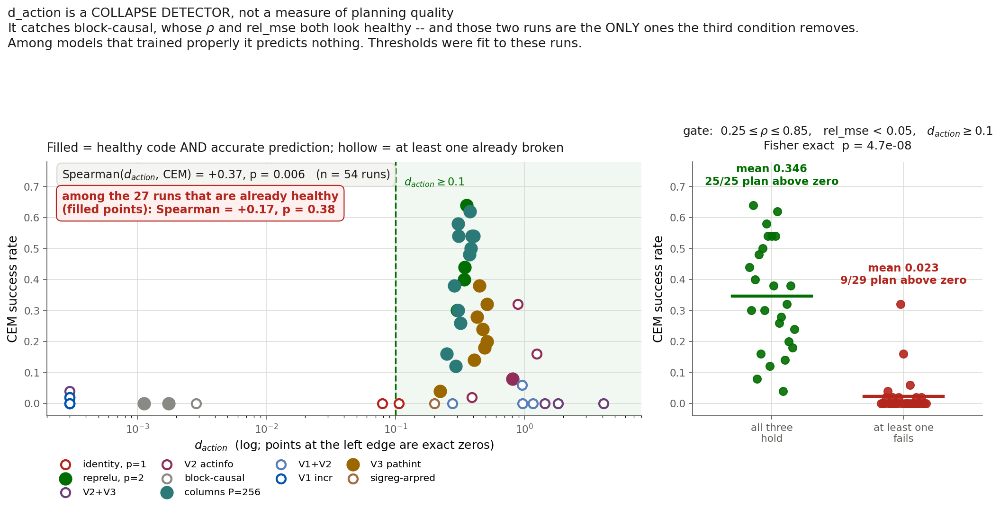

# 2026-09-03 — The causal round: three objectives tried, one null, and a diagnostic that works

Yesterday's entry ended on a diagnosis rather than a result: **the action is causally inert.**
Measuring how far the *predicted* latent moves when only the action is permuted gave
`d_action` ≈ 1e-4 against a latent of magnitude ≈ 0.7 — the action was worth **0.02–0.1% of
the code**, and `d_state/d_action` was 37×. Across nine arms that quantity correlated with CEM
at **ρ = +0.81, p = 0.0079**, better than anything else measured in this project.

Tonight tested that diagnosis three ways. The interventions did not work. The diagnosis did.

---

## 0. Where the round stands

**All 56 training runs finished** (7 arms x 8 seeds, 3-10). 194 CEM evaluations have landed;
**18 evals are still queued** behind cluster priority, plus 33 training windows that are pure
no-ops — later links of chains whose run already wrote its `DONE` sentinel, which
`train_slurm.sbatch:90` exits on immediately. Every number
below is regenerable: `analysis/causal_figs.py` re-harvests each run's own
`wandb-summary.json` and the campaign JSON at call time, so re-running it after the queue
drains refreshes every figure without editing anything.

```
python analysis/collect_evals.py --out campaign.json
python analysis/causal_figs.py --out diary/assets/2026-09-03 \
       --campaign campaign.json --incr-stats assets/incr_stats_lpwm_ltv_s3.json
python analysis/arch_figs_causal.py --out diary/assets/2026-09-03
```

---

## 1. Results

Paired against **each arm's own control at matched seeds**. The control differs by arm on
purpose: V3 re-activates the proprio encoder, so it carries `MUP_INPUT_FIX` and must be paired
against `LpWM-ltv-mupfix` (`run_campaign.sh:312`); everything else pairs against plain
`LpWM-ltv`. Pairing V3 against the wrong control would have made a null look like a −0.170
negative — the muP fix alone is worth −0.12.

| arm | control | n | arm mean | ctrl mean | paired Δ | 95% CI | p | verdict |
|---|---|---|---|---|---|---|---|---|
| **V3 `PiWM-pathint`** | `-mupfix` | 8 | 0.223 | 0.247 | **−0.025** | [−0.177, +0.127] | 0.709 | **null** |
| `LpWM-ltv-relu-p2` | `LpWM-ltv` | 4 | 0.445 | 0.370 | +0.075 | [−0.117, +0.267] | 0.301 | null (n=4) |
| `PiWM-columns` | `LpWM-ltv` | 12 | 0.418 | 0.347 | +0.072 | [−0.064, +0.207] | 0.269 | null |
| V2 `PiWM-actinfo` | `LpWM-ltv` | 5 | 0.116 | 0.396 | −0.280 | [−0.478, −0.082] | 0.017 | negative |
| V2+V3 | `-mupfix` | 7 | 0.009 | 0.283 | −0.274 | [−0.408, −0.140] | 0.002 | negative |
| V1+V2 | `LpWM-ltv` | 4 | 0.015 | 0.365 | −0.350 | [−0.549, −0.151] | 0.011 | negative |
| `LpWM-ltv-ident-p1` | `LpWM-ltv` | 4 | 0.005 | 0.420 | −0.415 | [−0.695, −0.135] | 0.018 | negative |
| V1 `PiWM-incr` | `LpWM-ltv` | 6 | 0.007 | 0.417 | −0.410 | [−0.565, −0.255] | 0.001 | negative |

**No new positive.** The honest one-line summary of the interventions: *three objectives
designed from the causal diagnosis, and the best of them merely fails to hurt.*

The round's actual product is §8, and it is smaller than it first appears: `d_action` is a
**collapse detector** that catches a failure mode `ρ` and `rel_mse` cannot see, but among
models that trained properly it does **not** predict planning (partial Spearman +0.174,
p = 0.384, n=27).

---

## 2. The diagnosis the round was built on

`min ‖h(P(z_t,a_t)) − h(Enc(o_{t+1}))‖²` is **predictive, not causal**. It asks the model to be
marginally accurate; it never asks it to be interventionally correct. Nothing in it rewards
`∂ẑ/∂a`. A model that ignores the action entirely and extrapolates the autonomous motion pays
almost no penalty — and PushT's autonomous component dominates, so that is exactly what the
baseline learned.

CEM plans *only* by comparing action sequences. If the action barely moves the prediction, the
objective landscape over actions is flat and the planner is near-random. That retro-explains
the campaign: why `rel_mse` never predicted CEM, why width helped (largest `d_action`), why
plan-time consensus helped (raises SNR in a flat landscape rather than un-flattening it), and
why every representation intervention failed — they all reshape the code's *marginal* and
none of them touches `∂ẑ/∂a`.

`d_action` is now logged per run, every eval interval, so the n=9 cross-arm correlation became
a per-run measurement:



Three orders of magnitude separate the arms, and the spread *within* an arm is tight — this is
a property of the objective, not of a lucky seed. Two readings worth keeping:

- **`block-causal`'s action is worth 464× less than its state.** Yesterday it was reclassified
  as temporally collapsed on the basis of `std_t(z)`; `d_action` reaches the same verdict
  independently, from a completely different measurement.
- **V1's `d_action` is exactly 0.0000 on 7 of its 8 seeds** — not small, zero. Permuting the
  action changes the prediction not at all, and on those same 7 seeds `d_state` is 0 too:
  the predictor emits a constant. The eighth (s6) has `d_state` = 0.72 against `d_action` =
  0.0038, so it is action-blind rather than fully frozen. Either way the arm is dead.

---

## 3. The architecture of each variant

Same drawing conventions as `assets/fig1_lpworldmodel.png` and yesterday's set: peach
observation/action circles, teal encoder, pale-yellow ReLU link, lavender predictor, navy/white
code stacks, dark-red MSE.

Each figure is the unmodified LpWM schematic on top and a **module panel** below: the proposed
addition drawn the same way — blocks, operator nodes, arrows — with the equation it implements
underneath and the measured outcome as a value strip. Every panel is a strict left-to-right
dataflow on fixed row baselines, and any wire that changes rows does so on its own vertical
corridor, so no two wires share a segment.

### (V1) `PiWM-incr` — per-sample increment normalisation · **collapsed**



### (V2) `PiWM-actinfo` — InfoNCE over actions, `max I(a_t ; z_{t+1} | z_t)` · **negative**



### (V3) `PiWM-pathint` — a reference frame updated *by the movement* · **null**



---

## 4. V1 is an implementation failure, not a test of the idea

Two corrections to the framing V1 was launched with, both established before the numbers came
back:

1. Putting the loss "on the increment" is a **no-op**. `Δ_pred − Δ_true = ẑ − z_{t+1}` exactly;
   the `z_t` cancels.
2. A **batch-level** normaliser is near-inert — a detached scalar only rescales the term.

Only **per-sample** weighting `w = 1/(‖Δz‖² + ε)` changes gradient direction. So that is what
shipped. It collapsed the model completely: ρ 0.448 → 0.004, eff_dim 24.1 → 7.5, `d_action` 0,
CEM −0.410.

The reason is a single badly-chosen constant, measured on 1536 real validation samples through
a trained `LpWM-ltv` checkpoint (`assets/incr_stats_lpwm_ltv_s3.json`):



**ε = 1e-4 sits 400× below the median ‖Δz‖² = 4.1e-2.** It floors 0.1% of samples — the floor
never engages. The weights therefore span **3884×**, the single heaviest sample takes **6.1%**
of the batch loss, and the top 1% of samples take **29%**. The term was designed to stop large
autonomous motions dominating the loss; it handed the loss to the near-static frames instead,
which is the same failure with the sign flipped.

**This does not refute the idea.** V1 as run is a test of ε = 1e-4, and ε = 1e-4 is wrong. A
rerun at ε ≈ the median increment (≈ 4e-2), or with the weight clipped to a bounded range, is
a different experiment and has not been done.

---

## 5. V2 bought action-sensitivity by wrecking the code

V2 is the only intervention in this project that changes **what the model is asked to
distinguish** rather than what its code looks like: the true `z_{t+1}` must be better explained
by the action actually taken than by K=4 actions permuted in from the batch. Negatives are
free, τ is the detached mean energy, and the cost is K extra *predictor* forwards — 0.81M
parameters against the encoder's 12.56M.

**It worked, on its own terms.** `d_action` = 0.699, the largest of any arm, 5400× the
baseline. And it was a −0.280 negative at CEM, because it paid for that sensitivity with the
code:



ρ collapsed 0.448 → 0.052 and eff_dim 24.1 → 11.3. The lesson is the figure's title:
**action-sensitivity is cheap if you are willing to wreck the code.** Nothing in the InfoNCE
term constrains the marginal, and the easiest way to make `z_{t+1}` depend strongly on `a_t` is
to throw away everything else it depended on. RDMReg was supposed to prevent exactly this and
did not — it charges 0.51 for a dead code, which is not enough to outweigh a term that wants
one.

Three arms *did* land in the healthy-and-sensitive box — `V3 pathint`, `reprelu p=2`, and
`columns`. **None of them was designed to.** The arm designed for action-sensitivity is the one
that fell out.

---

## 6. V3 is healthy, action-sensitive — and a null

`PiWM-refframe` (yesterday, −0.063, p=0.169) *received* pose as a static side-channel. TBT
requires the location to be **path-integrated by the movement**: a head predicting the next
pose from `(pose_t, a_t)`, supervised by the true next pose, warm-started from the linear map
already fit on the dataset (95.2% of one-step pose change explained), with **rollout using the
model's own head** so training and planning cannot drift apart.

Every training-time signal says this is the best-behaved arm in the round:



| | ρ | eff_dim | rel_mse | `d_action` |
|---|---|---|---|---|
| `LpWM-ltv-mupfix` (control, n=13) | 0.467 | 21.4 | 0.0110 | — |
| **V3 `PiWM-pathint`** (n=8) | **0.573** | **22.8** | **0.0094** | **0.460** |

Slightly *better* than its control on prediction and effective dimension, healthy code, and
the largest `d_action` of any arm that stayed healthy. **8 of 8 seeds pass the §8 gate** — as
do 8/8 of `reprelu p=2` and 13/13 of `columns`, the only other arms that manage it.

And CEM is **0.223 vs 0.247, Δ = −0.025, CI [−0.177, +0.127], p = 0.709** — a clean null at
full n=8.

That is the most informative negative result of the round, because it is the cleanest available
falsification of the causal story in its strong form. If action-sensitivity were *sufficient*
for planning, V3 would have been positive. It is not. Raising `d_action` from ~1e-4 to 0.46
while holding everything else healthy bought **nothing** at the planner.

`V2+V3` (−0.274) tells the same story from the other side: adding the InfoNCE term to V3
destroyed the arm (ρ 0.573 → 0.006, rel_mse 0.0094 → 1.000, i.e. predicting the mean). V2 is
not a component that composes.

---

## 7. The link × target 2×2, finally run

The archive had **173 runs at `(reprelu, p=1)`, 35 at `(identity, p=2)`, and zero off-diagonal** —
the link and the target distribution were perfectly confounded, so the "sparse vs dense" axis
of this project had never actually been tested. Both missing cells ran this round.





**`target_p` is inert in both rows.** Four within-row Mann-Whitney tests, not one significant:

| | ρ | eff_dim | rel_mse |
|---|---|---|---|
| reprelu, p=1 → p=2 | p = 0.21 | p = 0.052 | p = 0.11 |
| identity, p=1 → p=2 | p = 0.80 | p = 0.38 | p = 0.51 |

**The link decides the code**: ρ and eff_dim separate across the rows at p < 1e-4 and p = 2e-4
(24.1 → 2.9 effective dimensions). This is the empirical half of the Diaconis–Freedman argument
from §9 of yesterday's entry — a 1-D random projection of a D=384 Laplace sample *is* Gaussian
(excess kurtosis −0.002, Shapiro p = 0.396), and RDMReg only ever looks at 1-D projections, so
it structurally cannot see p=1 vs p=2. Measured directly: `swd(Gaussian, Laplace)` = 1.9947 ±
0.0170 against a null of 1.9987 ± 0.0112 — *below* it.

**So ρ ≈ 0.5 comes from the ReLU link, not from the sparse prior.** The whole sparse-vs-dense
axis of the LpWM line is really *rectified vs not rectified*.

Two details that cut against the tidy story and should be kept:

- The one test closest to significance, eff_dim at reprelu p=1 vs p=2 (p = 0.052), goes the
  **wrong way for the sparse prior**: the Gaussian target gives the *higher* effective
  dimension (26.1 vs 24.1).
- **`rel_mse` does not separate the links at all** (p = 0.12 at p=1, p = 0.44 at p=2), because
  `identity`'s `rel_mse` is bimodal — its IQR spans 0.0099 to 0.9990. Some dense seeds predict
  perfectly well while being completely collapsed as a code. One more reason `rel_mse` cannot
  certify a world model.

---

## 8. The gate: a good collapse detector, not a measure of planning quality

This is what the per-run instrumentation bought. It is a weaker result than it first looks,
and the deflation is in the second half of this section.



Across **54 runs** with all four quantities measured, take three training-time conditions:

> **ρ ∈ [0.25, 0.85]**  ·  **rel_mse < 0.05**  ·  **`d_action` ≥ 0.1**

| gate | plan above zero | mean CEM | Fisher p |
|---|---|---|---|
| ρ alone | 26/32 | 0.281 | 0.0014 |
| rel_mse alone | 27/34 | 0.260 | 0.0016 |
| `d_action` alone | 29/37 | 0.249 | 0.00087 |
| **all three** | **25/25** | **0.346** | **4.7e-08** |
| at least one fails | 9/29 | 0.023 | |

**Every run that passes all three plans above zero; there are no exceptions.** Per-run
Spearman(`d_action`, CEM) is **+0.367, p = 0.0064** at n=54, confirming yesterday's cross-arm
+0.81 at the level where it can no longer be an artefact of comparing arms.

### But the `d_action` term is doing almost none of the work

Grilling the result properly deflates it. Drop `d_action` and keep only the two health
conditions:

| gate | plan above zero | mean CEM | Fisher p |
|---|---|---|---|
| ρ + rel_mse | 25/27 | 0.321 | 1.1e-05 |
| ρ + rel_mse + `d_action` | 25/25 | 0.346 | 4.7e-08 |

The third condition removes **exactly two runs**, and both are `PiWM-blockcausal` — an arm
already known to be broken from `std_t(z)` a day earlier. The p-value improvement from 1e-5 to
5e-8 is entirely those two seeds.

The decisive test is the partial correlation. **Within the healthy subset** — runs that already
satisfy `ρ ∈ [0.25,0.85]` and `rel_mse < 0.05`, n=27, with `d_action` spanning 0.001 to 0.809:

> **Spearman(`d_action`, CEM) = +0.174, p = 0.384.** Pearson +0.179, p = 0.372.

**Null.** Once you know the model trained properly, knowing how action-sensitive it is tells you
nothing more about whether it plans. So the honest statement is not "a conjunctive causal gate"
but:

- `d_action` is a good **collapse detector** — it catches `block-causal`, whose marginal metrics
  look healthy, from a direction `ρ` and `rel_mse` cannot see. That is a real and useful
  property, and it is the whole of what has been demonstrated.
- It is **not** a measure of planning quality among working models. Yesterday's cross-arm
  ρ = +0.81 was, at least in part, "broken models plan badly", which everything measures.

The thresholds were also **chosen by inspection after seeing these runs**, so even the retained
2-condition result is a fitted decision boundary reported at its training accuracy.

If it survives, it is directly useful: all three quantities are available **at training time,
from one validation batch, without running CEM at all** — and CEM evaluation is the expensive
half of this campaign.

---

## 9. Three bugs caught before they became results

All three were caught by the pre-launch verification, not by staring at outputs afterwards.
Each would have silently produced a publishable-looking table of nonsense.

1. **`tests/lpwm_build.py` did not pass the new flags.** It mirrors `train.py`'s construction
   and is the fixture the bit-identity test uses. Without the V1–V3 kwargs, every variant built
   there was **byte-identical to the baseline** — the "verification" would have confirmed that
   the interventions do nothing, because it never enabled them. ~40 runs of wasted GPU.
2. **The same file used the wrong proprio `emb_dim`.** With `use_pose=true` the proprio encoder
   must emit `action_emb_dim`, not `proprio_emb_dim`. Wrong width → construction error → V3
   invisible to every test.
3. **`path_int` device mismatch.** `train.py` prepares submodules individually, so a head added
   after that loop stays on CPU while its inputs are on GPU. 32 jobs died on the first step.
   Fixed with lazy device pinning in `forward`, proven by a single-seed canary
   (`path_int_loss` = 0.024 at step 250, `d_action` = 0.018) before the wave was resubmitted.

One smaller wart found while writing tonight's probe and worth recording: **`VWorldModel.eval()`
returns `None`** (`models/visual_world_model.py:158` overrides it without `return self`),
breaking the `model = model.to(dev).eval()` idiom that every PyTorch codebase uses. Nothing in
the repo currently chains it, so no live bug — but it is a trap for the next probe script.

---

## 10. What this round settles, and what it does not

**Settled:**

- `target_p` is inert at D=384, in both link rows, on all three metrics. The sparse-prior axis
  of this project is really the rectification axis. *(Four tests, none significant.)*
- Action-sensitivity is **not sufficient** for planning. V3 raised `d_action` ~3500× while
  holding the code and the prediction healthy, and CEM did not move (p = 0.709).
- Action-sensitivity is trivially purchasable by collapsing the code, and an InfoNCE-over-actions
  term does exactly that unless something else holds the marginal in place. RDMReg does not.
- `rel_mse` cannot certify a world model — established twice more tonight, once by `identity`'s
  bimodality and once by `block-causal`'s 464× state/action ratio at `rel_mse` = 0.0016.

**Not settled:**

- **Whether V1's idea is wrong or only its ε was.** As run it is a test of ε = 1e-4, which is
  400× below the median increment. The idea is untested.
- **Whether the 2-condition health gate survives out of sample.** Its thresholds were fit to
  these runs. The 18 queued evals decide it. `d_action`'s incremental value is already
  answered: none, among healthy models.
- **Whether `reprelu p=2` is a real positive.** +0.075 at n=4 is nothing yet; all 8 seeds are
  trained and 4 more evals are queued. Note it is the *dense-target* cell, which if it holds
  would be a mildly awkward result for a project named after sparse codes.
- **The composition question V2 raises.** If a term that maximises `I(a;z′|z)` were paired with
  an anti-collapse regulariser strong enough to hold ρ — SIGReg charges 25.7 for a dead code
  against RDMReg's 0.51 — V2 might be a different experiment. That pairing has not been run.
