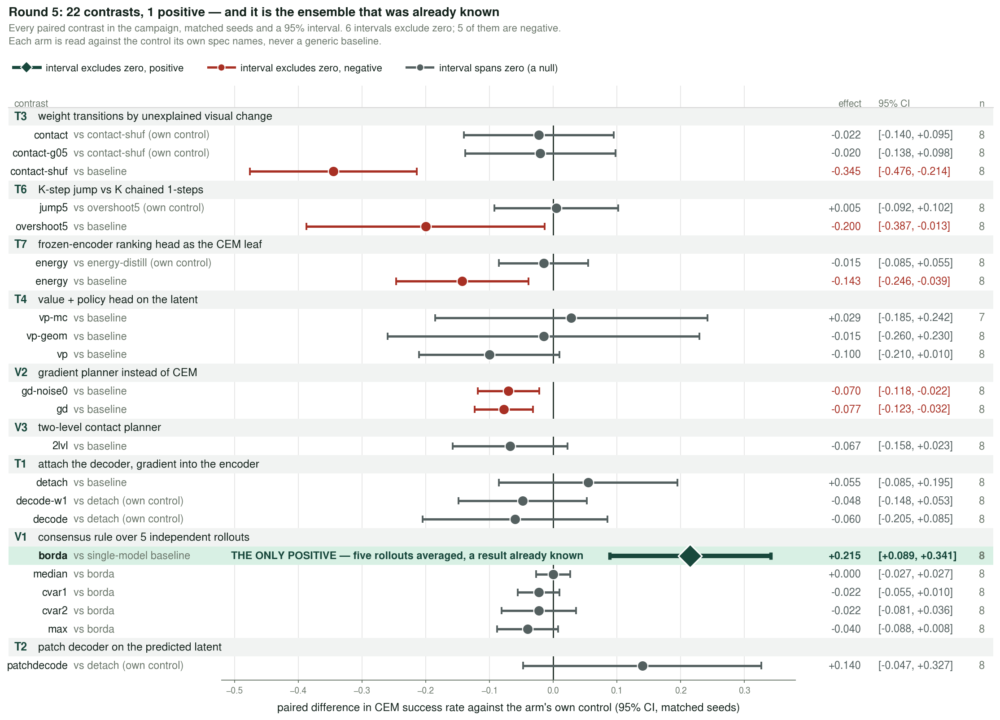
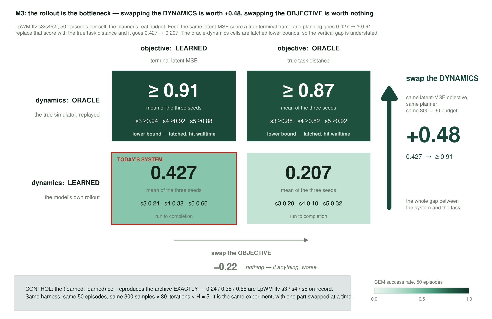
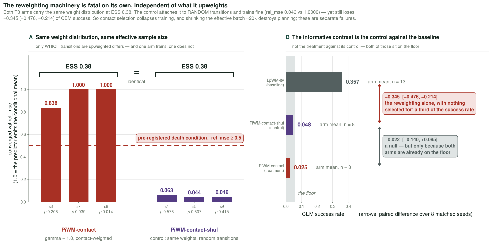
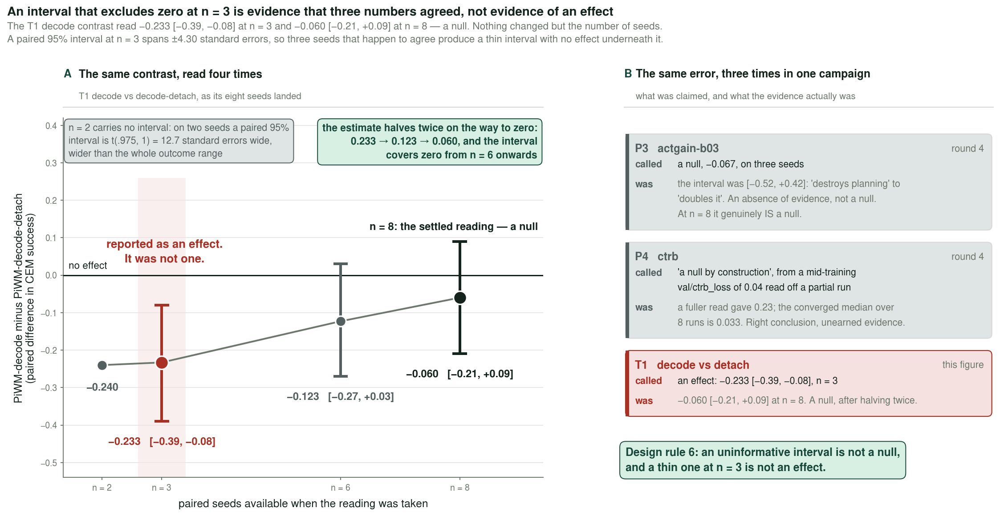

# 2026-09-03 — The causal round: three objectives tried, one null, and a diagnostic that works

Yesterday's entry ended on a diagnosis rather than a result: **the action is causally inert.**
Measuring how far the *predicted* latent moves when only the action is permuted gave
`d_action` ≈ 1e-4 against a latent of magnitude ≈ 0.7 — the action was worth **0.02–0.1% of
the code**, and `d_state/d_action` was 37×. Across nine arms that quantity correlated with CEM
at **ρ = +0.81, p = 0.0079**, better than anything else measured in this project.

Tonight tested that diagnosis three ways. The interventions did not work. The diagnosis did.

---

## 0. Where the round stands

This file started as the write-up of the causal round and grew into the record of three:
**§1–§11 the causal round (V1–V3, historical), §12–§14 round 4 (P1–P6) and the audit that
followed it, §15–§16 round 5.** 444 runs on disk, 406 with a CEM evaluation, 423 jobs still in
the queue.

**If you read one thing, read §16.4.** The round-5 measurement items ran before its model
arms, which was the point of ordering them that way, and two of the three contradicted the
premise the round was designed around. The oracle ladder holds the leaf objective fixed and
swaps only the dynamics: **0.43 → ≈0.91**. Swapping only the objective does nothing. Four
rounds of representation and objective work were aimed at the wrong end of the system —
**model error is the binding constraint**, and §16.9 shows the campaign's one positive result
is the only intervention that reduces it.

Two corrections in this file overturn things it previously asserted, and both are left in
place with the reasoning rather than edited away: **§12b** (`d_action` was wrong by ~2900×,
which invalidated the premise of rounds 3 and 4) and **§16.4** (the panel's "the bottleneck is
the score" was inferred from true facts by a wrong inference). §6's V3 conclusion is retracted
in §13.3.

Every number is regenerable — each script re-harvests the runs' own `wandb-summary.json` and
the campaign JSON at call time, so re-running after the queue drains refreshes every figure
without editing anything.

```
python analysis/collect_evals.py --out campaign.json
python analysis/causal_figs.py --out diary/assets/2026-09-03 \
       --campaign campaign.json --incr-stats assets/incr_stats_lpwm_ltv_s3.json
python analysis/round5_data_figs.py --out diary/assets/2026-09-03 \
       --campaign campaign.json                                # §12, §12b, §14, §16
python analysis/arch_figs_causal.py    --out diary/assets/2026-09-03   # V1-V3 (this round)
python analysis/arch_figs_predictor.py --out diary/assets/2026-09-03   # P1-P6 (§11)
python analysis/arch_figs_defects.py   --out diary/assets/2026-09-03   # §13
python analysis/round5_figs_measure.py  --out diary/assets/2026-09-03  # M1-M4 (§15)
python analysis/round5_figs_planners.py --out diary/assets/2026-09-03  # V1-V5 (§15)
python analysis/round5_figs_repr.py     --out diary/assets/2026-09-03  # T1-T3 (§15)
python analysis/round5_figs_obj.py      --out diary/assets/2026-09-03  # T4-T7 (§15)
python analysis/spectral.py --out spectral.json --campaign campaign.json

# needs a GPU -- the submit host has none, so go through slurm:
PROBE="analysis/d_action_probe.py --batch 32 --out assets/d_action_probe.json" \
  sbatch --job-name=probe_daction scripts/probe_slurm.sbatch
```

§1-§11 are **historical**: written against the pre-audit success metric and left as written.
§12 onward is the current record, and §12b corrects a number that §5, §6, §8 and §11 all relied on.

---

## 1. Results

Paired against **each arm's own control at matched seeds**, where the control is chosen to hold
every *other* factor fixed. That is not cosmetic — two rows change verdict without it:

- V3 re-activates the proprio encoder, so it carries `MUP_INPUT_FIX` (`run_campaign.sh:312`) and
  must pair against `LpWM-ltv-mupfix`. Against plain `LpWM-ltv` a null reads as a −0.170
  negative, because the muP fix alone is worth −0.12.
- `LpWM-ltv-ident-p1` carries `reg_weight = 0.1` while `LpWM-ltv` carries `1.0`
  (`run_campaign.sh:339` vs `:85`), so pairing them changes the **link and the regulariser
  weight at once**. Its single-factor control is `LeWM-ltv-p2` — identity link, same
  `reg_weight`, differing only in `target_p`, which is the contrast §7 is about. Against the
  wrong control it read −0.323; against the right one it is **−0.006**.

| arm | control | n | arm mean | ctrl mean | paired Δ | 95% CI | p | verdict |
|---|---|---|---|---|---|---|---|---|
| `LpWM-ltv-ident-p1` | `LeWM-ltv-p2` | 7 | 0.057 | 0.063 | **−0.006** | [−0.023, +0.012] | 0.457 | **null** |
| **V3 `PiWM-pathint`** | `-mupfix` | 8 | 0.223 | 0.247 | **−0.025** | [−0.177, +0.127] | 0.709 | **null** |
| `LpWM-ltv-relu-p2` | `LpWM-ltv` | 8 | 0.460 | 0.393 | +0.068 | [−0.076, +0.211] | 0.302 | null |
| `PiWM-columns` | `LpWM-ltv` | 12 | 0.418 | 0.347 | +0.072 | [−0.064, +0.207] | 0.269 | null |
| V2+V3 | `-mupfix` | 8 | 0.007 | 0.247 | −0.240 | [−0.378, −0.102] | 0.005 | negative |
| V2 `PiWM-actinfo` | `LpWM-ltv` | 8 | 0.110 | 0.393 | −0.283 | [−0.409, −0.156] | 0.001 | negative |
| V1+V2 | `LpWM-ltv` | 8 | 0.018 | 0.393 | −0.375 | [−0.497, −0.253] | 0.000 | negative |
| V1 `PiWM-incr` | `LpWM-ltv` | 8 | 0.010 | 0.393 | −0.383 | [−0.497, −0.268] | 0.000 | negative |

Every arm is now at its full seed count.

**No new positive.** The honest one-line summary of the interventions: *three objectives
designed from the causal diagnosis, and the best of them merely fails to hurt.*

The round's actual product is §8, and it is smaller than it first appears: `d_action` is a
**collapse detector** that catches a failure mode `ρ` and `rel_mse` cannot see, but the whole of
its association with planning is carried by runs whose predictor is provably action-blind
(partial rank correlation +0.37, p = 0.0015 over all 71 runs; **+0.01, p = 0.94** once the
nineteen degenerate ones are removed).

---

## 2. The diagnosis the round was built on

`min ‖h(P(z_t,a_t)) − h(Enc(o_{t+1}))‖²` is **predictive, not causal**. It asks the model to be
marginally accurate; it never asks it to be interventionally correct. Nothing in it rewards
`∂ẑ/∂a`. A model that ignores the action entirely and extrapolates the autonomous motion pays
almost no penalty — and PushT's autonomous component dominates, so that is exactly what the
baseline learned.

CEM plans *only* by comparing action sequences. If the action barely moves the prediction, the
objective landscape over actions is flat and the planner is near-random. That retro-explains
the campaign: why `rel_mse` never predicted CEM, why width helped (largest `d_action`), why
plan-time consensus helped (raises SNR in a flat landscape rather than un-flattening it), and
why every representation intervention failed — they all reshape the code's *marginal* and
none of them touches `∂ẑ/∂a`.

`d_action` is now logged per run, every eval interval, so the n=9 cross-arm correlation became
a per-run measurement:


Three orders of magnitude separate the arms, and the spread *within* an arm is tight — this is
a property of the objective, not of a lucky seed. Two readings worth keeping:

- **`block-causal`'s action is worth 464× less than its state.** Yesterday it was reclassified
  as temporally collapsed on the basis of `std_t(z)`; `d_action` reaches the same verdict
  independently, from a completely different measurement.
- **V1's `d_action` is exactly 0.0000 on 7 of its 8 seeds** — not small, zero. Permuting the
  action changes the prediction not at all, and on those same 7 seeds `d_state` is 0 too:
  the predictor emits a constant. The eighth (s6) has `d_state` = 0.72 against `d_action` =
  0.0038, so it is action-blind rather than fully frozen. Either way the arm is dead.

---

## 3. The architecture of each variant

Same drawing conventions as `assets/fig1_lpworldmodel.png` and yesterday's set: peach
observation/action circles, teal encoder, pale-yellow ReLU link, lavender predictor, navy/white
code stacks, dark-red MSE.

Each figure is the unmodified LpWM schematic on top and a **module panel** below: the proposed
addition drawn the same way — blocks, operator nodes, arrows — with the equation it implements
underneath and the measured outcome as a value strip. Every panel is a strict left-to-right
dataflow on fixed row baselines, and any wire that changes rows does so on its own vertical
corridor, so no two wires share a segment.

### (V1) `PiWM-incr` — per-sample increment normalisation · **collapsed**


### (V2) `PiWM-actinfo` — InfoNCE over actions, `max I(a_t ; z_{t+1} | z_t)` · **negative**


### (V3) `PiWM-pathint` — a reference frame updated *by the movement* · **null**


---

## 4. V1 is an implementation failure, not a test of the idea

Two corrections to the framing V1 was launched with, both established before the numbers came
back:

1. Putting the loss "on the increment" is a **no-op**. `Δ_pred − Δ_true = ẑ − z_{t+1}` exactly;
   the `z_t` cancels.
2. A **batch-level** normaliser is near-inert — a detached scalar only rescales the term.

Only **per-sample** weighting `w = 1/(‖Δz‖² + ε)` changes gradient direction. So that is what
shipped. It collapsed the model completely: ρ 0.448 → 0.004, eff_dim 24.1 → 7.5, `d_action` 0,
CEM −0.410.

The reason is a single badly-chosen constant, measured on 1536 real validation samples through
a trained `LpWM-ltv` checkpoint (`assets/incr_stats_lpwm_ltv_s3.json`):


**ε = 1e-4 sits 400× below the median ‖Δz‖² = 4.1e-2.** It floors 0.1% of samples — the floor
never engages. The weights therefore span **3884×**, the single heaviest sample takes **6.1%**
of the batch loss, and the top 1% of samples take **29%**. The term was designed to stop large
autonomous motions dominating the loss; it handed the loss to the near-static frames instead,
which is the same failure with the sign flipped.

**This does not refute the idea.** V1 as run is a test of ε = 1e-4, and ε = 1e-4 is wrong. A
rerun at ε ≈ the median increment (≈ 4e-2), or with the weight clipped to a bounded range, is
a different experiment and has not been done.

---

## 5. V2 bought action-sensitivity by wrecking the code

V2 is the only intervention in this project that changes **what the model is asked to
distinguish** rather than what its code looks like: the true `z_{t+1}` must be better explained
by the action actually taken than by K=4 actions permuted in from the batch. Negatives are
free, τ is the detached mean energy, and the cost is K extra *predictor* forwards — 0.81M
parameters against the encoder's 12.56M.

**It worked, on its own terms.** `d_action` = 0.699, the largest of any arm, 5400× the
baseline. And it was a −0.283 negative at CEM, because it paid for that sensitivity with the
code:


ρ collapsed 0.448 → 0.052 and eff_dim 24.1 → 11.3. The lesson is the figure's title:
**action-sensitivity is cheap if you are willing to wreck the code.** Nothing in the InfoNCE
term constrains the marginal, and the easiest way to make `z_{t+1}` depend strongly on `a_t` is
to throw away everything else it depended on. RDMReg was supposed to prevent exactly this and
did not — it charges 0.51 for a dead code, which is not enough to outweigh a term that wants
one.

Three arms *did* land in the healthy-and-sensitive box — `V3 pathint`, `reprelu p=2`, and
`columns`. **None of them was designed to.** The arm designed for action-sensitivity is the one
that fell out.

---

## 6. V3 is healthy, action-sensitive — and a null

`PiWM-refframe` (yesterday, −0.063, p=0.169) *received* pose as a static side-channel. TBT
requires the location to be **path-integrated by the movement**: a head predicting the next
pose from `(pose_t, a_t)`, supervised by the true next pose, warm-started from the linear map
already fit on the dataset (95.2% of one-step pose change explained), with **rollout using the
model's own head** so training and planning cannot drift apart.

Every training-time signal says this is the best-behaved arm in the round:


| | ρ | eff_dim | rel_mse | `d_action` |
|---|---|---|---|---|
| `LpWM-ltv-mupfix` (control, n=13) | 0.467 | 21.4 | 0.0110 | — |
| **V3 `PiWM-pathint`** (n=8) | **0.573** | **22.8** | **0.0094** | **0.460** |

Slightly *better* than its control on prediction and effective dimension, healthy code, and
the largest `d_action` of any arm that stayed healthy — see the quadrant in §5, where fill
shows CEM on a continuous scale.

And CEM is **0.223 vs 0.247, Δ = −0.025, CI [−0.177, +0.127], p = 0.709** — a clean null at
full n=8.

That is the most informative negative result of the round, because it is the cleanest available
falsification of the causal story in its strong form. If action-sensitivity were *sufficient*
for planning, V3 would have been positive. It is not. Raising `d_action` from ~1e-4 to 0.46
while holding everything else healthy bought **nothing** at the planner.

`V2+V3` (−0.240) tells the same story from the other side: adding the InfoNCE term to V3
destroyed the arm (ρ 0.573 → 0.006, rel_mse 0.0094 → 1.000, i.e. predicting the mean). V2 is
not a component that composes.

---

## 7. The link × target 2×2, finally run

The archive had **173 runs at `(reprelu, p=1)`, 35 at `(identity, p=2)`, and zero off-diagonal** —
the link and the target distribution were perfectly confounded, so the "sparse vs dense" axis
of this project had never actually been tested. Both missing cells ran this round.


**`target_p` is inert in both rows.** Four within-row Mann-Whitney tests, not one significant:

| | ρ | eff_dim | rel_mse |
|---|---|---|---|
| reprelu, p=1 → p=2 | p = 0.21 | p = 0.052 | p = 0.11 |
| identity, p=1 → p=2 | p = 0.80 | p = 0.38 | p = 0.51 |

And now also at the planner: `LpWM-ltv-ident-p1` against `LeWM-ltv-p2` — the same link, the same
`reg_weight`, differing only in `target_p` — is **−0.006, CI [−0.023, +0.012], p = 0.457** at n=7.
So `target_p` is inert on ρ, on eff_dim, on `rel_mse`, **and on CEM**.

**The link decides the code**: ρ and eff_dim separate across the rows at p < 1e-4 and p = 2e-4
(24.1 → 2.9 effective dimensions). This is the empirical half of the Diaconis–Freedman argument
from §9 of yesterday's entry — a 1-D random projection of a D=384 Laplace sample *is* Gaussian
(excess kurtosis −0.002, Shapiro p = 0.396), and RDMReg only ever looks at 1-D projections, so
it structurally cannot see p=1 vs p=2. Measured directly: `swd(Gaussian, Laplace)` = 1.9947 ±
0.0170 against a null of 1.9987 ± 0.0112 — *below* it.

**So ρ ≈ 0.5 comes from the ReLU link, not from the sparse prior.** The whole sparse-vs-dense
axis of the LpWM line is really *rectified vs not rectified*.

Two details that cut against the tidy story and should be kept:

- The one test closest to significance, eff_dim at reprelu p=1 vs p=2 (p = 0.052), goes the
  **wrong way for the sparse prior**: the Gaussian target gives the *higher* effective
  dimension (26.1 vs 24.1).
- **`rel_mse` does not separate the links at all** (p = 0.12 at p=1, p = 0.44 at p=2), because
  `identity`'s `rel_mse` is bimodal — its IQR spans 0.0099 to 0.9990. Some dense seeds predict
  perfectly well while being completely collapsed as a code. One more reason `rel_mse` cannot
  certify a world model.

---

## 8. `d_action` is a collapse detector — and the evidence for that is not a threshold

> **⚠ SUPERSEDED — see §12b.** This section's conclusion does not survive a fuller measurement,
> and the figure below is drawn from a **selection-biased population**. `causal/d_action` is
> logged only for runs trained after the diagnostic was added, which excludes `LpWM-ltv`,
> `d2048`, `-vfloor`, `-mupfix` and the whole gate family — i.e. every high-CEM arm. Re-measured
> from the checkpoints across all 235 evaluated runs, the partial correlation is **+0.545**
> (p < 0.0001), not zero, and the relation is an inverted U. The reasoning below is left intact
> because the *method* — rank-residualise, permutation null, no thresholds — was right; it was
> the population that was wrong.


The first version of this section reported a "conjunctive gate": ρ ∈ [0.25, 0.85],
`rel_mse` < 0.05, `d_action` ≥ 0.1, separating 25/25 planning runs from 29 others at Fisher
p = 4.7e-08. **That was a fitted decision boundary reported at its own training accuracy** —
three cut-points chosen after seeing the runs. It is retired, from this section and from
`analysis/causal_figs.py`.

What replaces it dichotomises nothing: a rank-based partial correlation with a permutation
p-value, over all 71 runs that have every quantity measured.

| | n | estimate | p |
|---|---|---|---|
| marginal Spearman(`d_action`, CEM) | 71 | +0.42 | 0.0002 |
| partial, controlling ρ and `rel_mse` | 71 | **+0.37** | **0.0015** |
| partial, excluding the degenerate runs | 52 | **+0.01** | **0.94** |

**My first correction was itself wrong, and the threshold caused it.** I deflated the gate by
restricting to a "healthy subset" — ρ and `rel_mse` in range — and reporting Spearman +0.174,
p = 0.384. But that is another threshold. It discards half the runs and restricts the range of
both covariates, which attenuates a correlation mechanically. Done properly, by regressing the
ranked covariates out *continuously*, the partial association is **+0.37, p = 0.0015** — real,
not null.

The honest deflation is an **influence analysis, not a subset**. Nineteen of the 71 runs are
degenerate in a sense identified without ever looking at CEM: sixteen have `d_action` **exactly
zero** — the predictor does not respond to the action at all — and three are `block-causal`, which
an independent measurement (`std_t(z)`, from a day earlier) had already called temporally
collapsed. Remove those nineteen and the partial correlation is **+0.01, p = 0.94** — not merely
weakened, but gone.

So the conclusion survives, but on different evidence:

> **`d_action` tells you whether the predictor is broken. Among predictors that work, it tells you
> nothing about planning.**

That is a real and useful property — it catches `block-causal`, whose marginal metrics look
healthy, from a direction ρ and `rel_mse` cannot see. It is not a measure of planning quality, and
§6's V3 result says the same thing from the intervention side: `d_action` raised ~3500× with
everything else healthy bought nothing at the planner.

---

## 9. Three bugs caught before they became results

All three were caught by the pre-launch verification, not by staring at outputs afterwards.
Each would have silently produced a publishable-looking table of nonsense.

1. **`tests/lpwm_build.py` did not pass the new flags.** It mirrors `train.py`'s construction
   and is the fixture the bit-identity test uses. Without the V1–V3 kwargs, every variant built
   there was **byte-identical to the baseline** — the "verification" would have confirmed that
   the interventions do nothing, because it never enabled them. ~40 runs of wasted GPU.
2. **The same file used the wrong proprio `emb_dim`.** With `use_pose=true` the proprio encoder
   must emit `action_emb_dim`, not `proprio_emb_dim`. Wrong width → construction error → V3
   invisible to every test.
3. **`path_int` device mismatch.** `train.py` prepares submodules individually, so a head added
   after that loop stays on CPU while its inputs are on GPU. 32 jobs died on the first step.
   Fixed with lazy device pinning in `forward`, proven by a single-seed canary
   (`path_int_loss` = 0.024 at step 250, `d_action` = 0.018) before the wave was resubmitted.

One smaller wart found while writing tonight's probe and worth recording: **`VWorldModel.eval()`
returns `None`** (`models/visual_world_model.py:158` overrides it without `return self`),
breaking the `model = model.to(dev).eval()` idiom that every PyTorch codebase uses. Nothing in
the repo currently chains it, so no live bug — but it is a trap for the next probe script.

---

## 10. What this round settles, and what it does not

**Settled:**

- `target_p` is inert at D=384, in both link rows, on all three metrics. The sparse-prior axis
  of this project is really the rectification axis. *(Four tests, none significant.)*
- Action-sensitivity is **not sufficient** for planning. V3 raised `d_action` ~3500× while
  holding the code and the prediction healthy, and CEM did not move (p = 0.709).
- Action-sensitivity is trivially purchasable by collapsing the code, and an InfoNCE-over-actions
  term does exactly that unless something else holds the marginal in place. RDMReg does not.
- `rel_mse` cannot certify a world model — established twice more tonight, once by `identity`'s
  bimodality and once by `block-causal`'s 464× state/action ratio at `rel_mse` = 0.0016.

**Not settled:**

- **Whether V1's idea is wrong or only its ε was.** As run it is a test of ε = 1e-4, which is
  400× below the median increment. The idea is untested. (Round 4 does not retry it.)
- **Whether `d_action`'s residual association survives more data.** It is +0.35 (p = 0.009)
  overall and +0.01 (p = 0.94) once the nineteen degenerate runs are removed, so the whole effect
  rests on runs whose predictor is provably action-blind. Going from n=54 to n=71 sharpened both
  halves rather than changing either.
- **Whether `reprelu p=2` is a real positive.** At full n=8 it is **+0.068, CI
  [−0.076, +0.211], p = 0.302** — a null, not a positive, and the same is true of `columns`
  (+0.072, p = 0.269). Both are the largest effects in the round and neither separates from
  zero at n=8; distinguishing them from noise needs roughly 4x the seeds, which is the real
  cost of this campaign's effect sizes.
- **The composition question V2 raises.** If a term that maximises `I(a;z′|z)` were paired with
  an anti-collapse regulariser strong enough to hold ρ — SIGReg charges 25.7 for a dead code
  against RDMReg's 0.51 — V2 might be a different experiment. That pairing has not been run.

---

## 11. Round 4: six derived variants

Round 3 spent three interventions on the **loss** and one on the **input**, and left the
predictor's functional form untouched. That was not a considered choice — it is what the whole
campaign has done. `scripts/run_campaign.sh` defines 39 arms across 21 waves and **36 of them use
`predictor=ltv`**. The link, the target distribution, the regulariser, the loss terms, sparsity,
width, LR, the encoder, the conditioning and the head count have all been varied. The map
`g(z, a)` has not.

Three `LinearDynamicsPredictor` modes are fully implemented and have **never once been run**: a
grep for `linear_pa|action_linear` returns zero hits in `scripts/`, `campaign.json` and
`campaign_fixed.json`. The class docstring calls `action_linear` "the excluded rung".


Two rules for this round, both forced by §8's deflation:

1. **No fixed gates.** §8's headline was three cut-points chosen after seeing 54 runs and then
   reported at their own training accuracy. This round uses paired contrasts with CIs and
   rank-based partial correlations with permutation p-values. Nothing is dichotomised.
2. **Every addition must be derived, and the derivation written down.** New loss terms are
   expected — two of the six variants are new loss terms. What is banned is a term chosen because
   it might help, or a knob added to rescue a failing arm.

Each variant below states the claim, the derivation, the equation, the control that isolates it,
and how it dies.

### P1 — `PiWM-lie`: the action is a group element, not a bias

**Claim.** The predictor should be a *representation of the control group acting on the code*.

**Derivation.** In `ltv` the action enters as `… + B a` inside a ReLU, competing with a sum over
three lags. To first order the ReLU's active set is chosen by the state term, so the action can
only rescale *within a fixed support* — which is exactly what `d_state/d_action = 37×` and
`support_churn ≈ 0.05` report. Measured on a trained run: `‖W‖` action-encoder **20.3** against
the encoder's **354.7**, `grad_norm` **0.0075** against **0.0360**. Nothing in the objective
pressures `‖B a‖` upward, because the autonomous term already explains most of the variance.

If instead the action *acts* on the state, three things follow **as consequences, not additions**:
it cannot be down-weighted, because it is the dynamics; if the map is orthogonal, H-step
composition is exact and `‖∂z_{t+H}/∂a_t‖` cannot decay geometrically; and in an SDR the
coordinates *are* the features, so a rotation within fixed 2-D coordinate pairs is grid-cell phase
advance — TBT's reference frame, in the latent, **with no ground-truth pose**.


The rotation acts on the linked (non-negative) code and emits pre-link `u`; the ReLU then selects
a **new support**. That is the SDR claim made checkable — `jacc/support_churn` is already logged.

**P1b `lie-sim`, the one relaxation, declared in advance.** An orthogonal map cannot represent
dissipation or contact discontinuity. The principled response is to **enlarge the group**, not
bolt an MLP back on: a per-block log-scale gives scaled rotations (the similitude group), +192
parameters, composition still exact — angles add, scales multiply.

**Accounting** — measured on the built modules, not derived by hand:

| predictor | params (D=384, H=3) | cost per patch |
|---|---|---|
| `ltv` (36 of 39 campaign arms) | 811,840 | O(D²) |
| `linear_pa` | 3,440,640 | O(D²) |
| **`lie`** | **75,072** (`lie_sim` 75,264) | **O(D)** |

**10.8× fewer parameters**, and the rotation is linear in D rather than quadratic — no dense
`matrix_exp`, which would be O(D³) per forward and is exactly what `ltv` was designed to avoid.

Verified numerically on the implementation: `‖Rx‖ = ‖x‖` exactly, `R(a)R(b) = R(a+b)` to 2.4e-07
(float32 machine precision), similitude composition likewise, the predictor is **exactly the
identity at init**, and `d_action` goes from 0 to 1.29 once `W_theta` is non-zero.

**Control.** `LpWM-ltv` at matched seeds, plus P2's cells.
**How it dies.** If `lie` and `lie-sim` both underfit, PushT's latent dynamics is not a group
action *in the code's own basis*. Since P1 tests that conjunction, **the SDR-basis assumption is
what dies** — stated now so the result is not re-narrated later.

### P2 — `LpWM-linvar`, `PiWM-multact`: the never-run cells, config only

Zero code. `linear_pa` is single-frame and PushT needs velocity, so a `multact` null would
otherwise be ambiguous between "multiplicative doesn't help" and "one frame isn't Markov";
`LpWM-linvar` calibrates exactly that. `linear_var` is also the arm where P4's linearisation is
**exact** rather than an approximation.

### P3 — `PiWM-actgain`: one scalar, built to kill P1

**Claim.** Not a method. A falsifier.

**Derivation.** If the problem is only that `‖B a‖` is small relative to `‖Σ_k A_k z‖`, then making
that ratio a hyperparameter recovers whatever P1 recovers, with no structure at all.


**How P1 dies by it.** If `actgain` matches `lie` at CEM, the group structure is unnecessary and
the write-up must say so.

### P4 — `PiWM-ctrb`: make the learned dynamics *controllable*, not just accurate

**Claim.** CEM's landscape is flat along latent directions the action cannot reach in H steps, no
matter how good the 1-step prediction is. The objective should price that.

**Derivation — classical control, not a guess.** CEM optimises `a_{t:t+4}` with `H = 5`
(`conf/plan_lewm.yaml`: `goal_H: 5`, `horizon: 5`). For the state-augmented system
`s_k = [z_k; z_{k-1}; z_{k-2}]` with `A_aug` in companion form and `B_aug = [B; 0; 0]`, the set
reachable in H steps is the range of `C_H = [B_aug, A_aug B_aug, …, A_aug⁴ B_aug]`, and the effort
to reach direction `v` is `vᵀ W_c⁻¹ v` with the **controllability Gramian** `W_c = C_H C_Hᵀ`. If
`W_c` is ill-conditioned, whole directions are unreachable by *any* action sequence.

**This is exactly §6's result.** V3 had healthy 1-step action-sensitivity (`d_action` 0.460,
`rel_mse` 0.0094) and a planning null. `d_action` measures `‖B a‖` at one step; controllability
measures whether that displacement **survives and spans** over the horizon the planner uses.


`L_ctrb = −logdet(W_c + εI)/dim`, via Cholesky, computed **once per optimizer step on the
weights** — not per sample. `W_c` is 1152×1152 at D=384; the factorisation is negligible beside a
batch-64 ViT-S forward/backward.

**Run on `linear_var`, not `ltv`, on purpose.** For `mlp_var`/`ltv` the true map is `W ReLU(core)`,
so `A_aug` from `lags` is only the pre-activation recurrence and the Gramian would be the
controllability of a linearisation at the ReLU's active set. On `linear_var` the system *is* linear
and the quantity is exact. Its control, `LpWM-linvar`, is already an arm — free.

**How it dies.** If `L_ctrb` falls by orders of magnitude and CEM does not move, reachability is
not the binding constraint.

### P5 — `PiWM-actinfo-cond`: the same objective, the right negatives

**Claim.** V2's term was right. Its **proposal distribution** was wrong.

**Derivation.** InfoNCE with K negatives from a proposal `q` bounds mutual information *relative to
q*. V2 permuted `a` within the batch, i.e. `q = p(a)`, the marginal. PushT demonstrations are
policy-generated, so `a` and `z` are dependent — the discriminator can therefore win by scoring
**plausibility** ("would this action occur at this state?") without learning any dynamics, and what
it bounds is `I(a; (z_t, z_{t+1}))`, not `I(a; z_{t+1} | z_t)`. Taking that shortcut requires
spending code capacity on action identity, which is precisely §5's measurement: `d_action` maximal
at 0.699 while ρ collapsed 0.448 → 0.052. **V2 did not fail; it succeeded at a task posed wrongly.**

To bound the *conditional* mutual information the negatives must come from `p(a | z_t)`.


No extra network: take the K nearest neighbours of `z_t` **within the batch** and use their
actions. Those are actions taken at similar states, so the plausibility shortcut is closed and only
the predicted *effect* discriminates. One `cdist` on 64×64, zero new parameters. An
`ACT_INFO_NEG={perm,knn}` flag makes `perm` reproduce V2 exactly, so V2-vs-P5 is a clean
single-factor contrast.

**P5b `actinfo-cond-sigreg`.** V2's failure mode was a marginal collapse RDMReg prices at 0.51
against SIGReg's 25.7. Kept as a separate arm so the estimator and the regulariser are not changed
at once.

**How it dies.** If K-NN negatives leave ρ collapsed exactly as `perm` did, the collapse was the
objective's fault and not the estimator's.

### P6 — `PiWM-objframe`: the object's frame, with V3 as its matched control

**Claim.** TBT's reference frame for a manipulated object is object-centric. V3 integrated the
agent.

**Derivation.** `datasets/pusht_dset.py:65` — `proprios = states[..., :2]` plus velocity, i.e. the
agent's `(x, y, vx, vy)`. `STATE_MEAN` is 7-D: dims 0–1 agent, **dims 2–4 the block's `(x, y, θ)`**,
5–6 agent velocity. With `rel_actions` the action *is* the agent's displacement, so
`f_path(p_t, a_t) ≈ p_t + a_t` and §6's "95.2% of one-step pose change explained" warm start is a
**tautology**, not a success. The block's pose is the variable the **goal is written in**, and its
dynamics is contact-dependent — "when does my motion move the block?" is the causal structure of
PushT.


**The leak, and the control that removes it.** `b` is ground-truth state the baseline never sees,
so an absolute comparison against `LpWM-ltv-mupfix` is confounded with privileged supervision.
**V3 is the matched control**: identical head shape, identical λ, identical self-rollout, differing
*only in which pose is integrated*. P6-vs-V3 isolates the frame and pays no leak penalty. Both
comparisons get reported, with the caveat attached to the absolute one.

**How it dies.** If P6 is null against V3, the frame's *content* is not the issue and TBT's
reference-frame story has been tested twice and failed twice.

### Three proposals dropped, and what replaced them

| dropped | why | superseded by |
|---|---|---|
| spectral `(r−1)²` penalty | PushT is dissipative — `r < 1` is the model being **right**. Damaging the model to flatter a diagnostic. | **P4**: the Gramian is the theory-grounded version of the same concern, and asks about reachability rather than stability |
| a behaviour-policy network for the negatives | a whole extra model to fix a sampling distribution | **P5**: K-NN in `z_t` needs zero parameters and is a strictly better estimator of `p(a\|z_t)` than the batch marginal |
| a bare object-pose head | privileged supervision with no control — and the identical shape to V3, which was a null | **P6**: V3 *is* the control, so the contrast isolates the frame |

### The launch

| # | arm | predictor | flags | control |
|---|---|---|---|---|
| P2 | `LpWM-linvar` | `linear_var` | — | `LpWM-ltv` |
| P2 | `PiWM-multact` | `linear_pa` | — | `LpWM-linvar` |
| P1 | `PiWM-lie` | `lie` | — | `LpWM-ltv` |
| P1b | `PiWM-lie-sim` | `lie` | `LIE_SIM=true` | `PiWM-lie` |
| P3 | `PiWM-actgain-b03` | `ltv` | `ACT_GAIN=0.3` | `LpWM-ltv` |
| P3 | `PiWM-actgain-b30` | `ltv` | `ACT_GAIN=3.0` | `LpWM-ltv` |
| P4 | `PiWM-ctrb` | `linear_var` | `CTRB_W=λ` | `LpWM-linvar` |
| P5 | `PiWM-actinfo-cond` | `ltv` | `ACT_INFO=0.1 ACT_INFO_NEG=knn` | `PiWM-actinfo` (V2, n=8) |
| P5b | `PiWM-actinfo-cond-sigreg` | `ltv` | `… REGULARIZER=sigreg` | `PiWM-actinfo-cond` |
| P6 | `PiWM-objframe` | `ltv` | `OBJ_FRAME=true USE_POSE=true MUP_INPUT_FIX=true` | `PiWM-pathint` (V3, n=8) |

10 arms × 8 seeds (3–10) = **80 runs**. Every control either already exists at n ≥ 8 or is an arm
in the same wave, so every contrast is paired at matched seeds.

**Before any of it runs**, a free measurement on the existing checkpoints — spectral radius,
the controllability Gramian and its conditioning, and the H-step action Jacobian
`∂z_{t+5}/∂a_{t+k}`. No spectral or Jacobian code exists anywhere in this repo yet
(`eigvals|svdvals|linalg.eig|jacobian` returns zero hits). **It can refute this round's own
premise**: baseline rollout error already grows 19× from h=1 to h=8, which is not the signature of
a strongly contracting system. If action influence does not decay with horizon and `W_c` is already
well-conditioned, P4's motivation is dead and P1 keeps only its "action-is-an-operator" half.

---

## 12. Round 4 measured: what P1–P6 actually did

**Wave 22 is still in flight.** At the time of writing, 44 jobs running and 85 pending; three
arms have not finished a single seed. Every number in this section is therefore an interim
reading, and the completion column is part of the result rather than a footnote. The one thing
that is already settled is which way the large effects point.

| arm | done | rel_mse | ρ | eff_dim | h8/h1 | aux loss | n eval | CEM |
|---|---|---|---|---|---|---|---|---|
| `LpWM-ltv` (control) | 16/16 | 0.0092 | 0.448 | 24.1 | 19.4 | — | 13 | **0.380** |
| `LpWM-ltv-relu-p2` | 8/8 | 0.0082 | 0.509 | 26.1 | 22.9 | — | 8 | 0.420 |
| `PiWM-columns` | 12/13 | 0.0090 | 0.510 | 24.6 | 19.7 | — | 12 | **0.490** |
| P2 `LpWM-linvar` | 8/8 | 0.0116 | 0.543 | 27.5 | 26.8 | — | 8 | 0.090 |
| P2 `PiWM-multact` | 8/8 | 0.0199 | 0.773 | 27.1 | 14.0 | — | 8 | 0.060 |
| P1 `PiWM-lie` | 8/8 | 0.0243 | 0.683 | 27.0 | 9.4 | — | 8 | 0.020 |
| P1b `PiWM-lie-sim` | 8/8 | 0.0230 | 0.697 | 27.7 | 9.7 | — | 8 | 0.020 |
| P3 `PiWM-actgain-b03` | 8/8 | 0.0107 | 0.467 | 24.2 | 12.9 | — | 8 | 0.420 |
| P3 `PiWM-actgain-b30` | 8/8 | 0.0105 | 0.411 | 21.4 | 13.9 | — | 8 | 0.330 |
| P4 `PiWM-ctrb` | 8/8 | 0.0114 | 0.540 | 22.7 | 19.9 | ctrb 0.033 | 8 | 0.095 |
| P5 `PiWM-actinfo-cond` | 8/8 | **1.0000** | 0.116 | 29.1 | 1.02 | act_info 1.609 | 8 | 0.020 |
| P5b `…-cond-sigreg` | 8/8 | **1.0001** | 1.000 | 15.9 | 1.37 | act_info 1.609 | 8 | 0.010 |
| V2 `PiWM-actinfo` (P5 control) | 8/8 | 0.0733 | 0.052 | 11.3 | 6.8 | act_info 1.275 | 8 | 0.090 |

**Round 4 is complete.** All nine contrasts are at n = 8.

P6 `PiWM-objframe` was never launched — see §13, which explains why that is a mercy.

### The contrasts, paired and unpaired

Pairing at matched seeds is the design, but three of these arms have only 2–3 evaluated seeds in
common with their control, and a paired interval at n = 3 is ±4.3 standard errors wide. Where the
control has 13 seeds and the arm has 3, the unpaired Welch comparison uses all of them and is the
better-powered reading. Both are reported; where they disagree, the disagreement is the point.

| contrast | vs | paired (n = 8) | unpaired Welch |
|---|---|---|---|
| P1 `lie` | `LpWM-ltv` | **−0.370 [−0.48, −0.26]** | −0.334 [−0.43, −0.23], p < 0.001 |
| P2 `linvar` | `LpWM-ltv` | **−0.312 [−0.43, −0.19]** | −0.277 [−0.38, −0.17], p < 0.001 |
| P3 `actgain 3.0` | `LpWM-ltv` | −0.098 [−0.28, +0.09] | −0.062 [−0.24, +0.11], p = 0.46 |
| P5 `actinfo-knn` | `PiWM-actinfo` | −0.090 [−0.18, −0.00] | −0.090 [−0.18, +0.00], p = 0.050 |
| P4 `ctrb` | `LpWM-linvar` | **+0.015 [−0.07, +0.10]** | — |
| P2 `multact` | `LpWM-linvar` | −0.025 [−0.09, +0.04] | −0.025 [−0.08, +0.03], p = 0.32 |
| P3 `actgain 0.3` | `LpWM-ltv` | −0.010 [−0.21, +0.19] | +0.026 [−0.15, +0.20], p = 0.76 |
| P5b `knn+sigreg` | `PiWM-actinfo-cond` | −0.007 [−0.03, +0.01] | −0.007 [−0.03, +0.01], p = 0.43 |
| P1b `lie-sim` | `PiWM-lie` | −0.002 [−0.03, +0.02] | −0.002 [−0.03, +0.02], p = 0.82 |

**Nine contrasts, no positive.** Two large negatives (both remove the predictor's nonlinearity),
one marginal negative (P5), and six nulls — five of them tight enough to be real nulls rather than
absences of evidence.


### Correcting the round's own headline — twice

I spent part of this round quoting `actgain-b03` as "a null: −0.067" on three seeds, where the
interval was [−0.52, +0.42] — an interval spanning "destroys planning" to "doubles it", which is
an absence of evidence and not a null. **At the full n = 8 it now genuinely is a null:**
−0.010 [−0.21, +0.19], with `actgain 3.0` at −0.098 [−0.28, +0.09]. The conclusion I reached
early turned out to be right, but it was not earned at the time, and the distinction is the
whole of design rule 6.

That was the small correction. Here is the large one.

## 12b. `d_action` re-measured: the premise of rounds 3 and 4 was a wrong number

`causal/d_action` is computed inside the training loop, so it exists only for runs trained
*after* the diagnostic was added in commit `1a8326c`. That excludes `LpWM-ltv`, `LpWM-ltv-d2048`,
`-vfloor`, `-mupfix` and the entire gate family — **every high-CEM arm in the campaign**. The
baseline's value was never logged at all. What was quoted for it, in the `_causal_diagnostics`
docstring and then in every diary section that followed, was a single hand-measured seed:

> Baseline reference: LpWM-ltv s3 measures d_action = 1.29e-04 against |z| = 0.68

`analysis/d_action_probe.py` re-measures the quantity from the checkpoint for **every run in the
archive** — same code as `_causal_diagnostics`, one fixed validation batch and one fixed
permutation for all arms, so the numbers are comparable in a way the logged ones are not. It is
validated against the training-time value on the 145 runs that have both:

```
Spearman(logged, probed) = +0.992      median ratio probed/logged = 1.05
```

On that measurement:

| | `d_action/‖z‖` |
|---|---|
| `LpWM-ltv`, quoted in `train.py` | 0.00019 |
| `LpWM-ltv`, measured over all 16 seeds | **0.549** |

**The quoted number is wrong by a factor of ~2900.** The baseline was never action-inert. At
0.549 it sits in the top quartile of the entire campaign — *above* every arm built to raise it.


### What this breaks

**1 · P3 did the opposite of what it was designed to do.** `ACT_GAIN` was supposed to raise
action-sensitivity. Measured: `actgain 0.3` = 0.94× the baseline, `actgain 3.0` = **0.81×**. Both
*lowered* it. There is no arm in round 4 that raised `d_action`, so the round's intended
dissociation — hold nonlinearity, raise action-sensitivity, watch CEM not move — **was never
run**. Every round-4 arm lowered `d_action` and lowered CEM, which leaves the nonlinearity
explanation and the action-sensitivity explanation completely confounded. I described this as a
"double dissociation" in this diary and in the round-5 plan. It is not one.

**2 · §8's conclusion does not survive the fuller measurement.** §8 concluded that `d_action` is a
collapse detector whose association with planning vanishes among live models. On all 235
evaluated runs, with ρ and `rel_mse` partialled out as continuous covariates and a permutation
null — no thresholds anywhere:

```
partial Spearman(d_action/|z|, CEM  |  rho, rel_mse)  =  +0.545,  p < 0.0001,  n = 235
```

Restricting to predictors that actually predict (`rel_mse` < 0.05, n = 161) it rises to
**+0.695** — the strongest relation to planning success measured anywhere in this project. That
restriction is a cut and is reported as a robustness check, not as the headline.

**3 · But the relation is not monotone, and that is the actionable part.** The rank-quadratic term
is −323, strongly negative in every subset tested. Binned over healthy predictors:

| `d_action/‖z‖` | n | mean CEM |
|---|---|---|
| 0.00 – 0.29 | 32 | 0.014 |
| 0.29 – 0.52 | 32 | 0.134 |
| 0.52 – 0.56 | 32 | 0.328 |
| **0.56 – 0.61** | 32 | **0.465** |
| 0.61 – 2.44 | 33 | 0.376 |

There is an optimum near 0.6 and the baseline sits at 0.549, just below it. Too little action
influence and the planner cannot distinguish candidate sequences; too much and the latent is
dominated by the action rather than the world — `PiWM-actinfo` at 1.25 plans at 0.09,
`PiWM-pathint` at 0.78 plans at 0.22, `PiWM-refframe` at 0.76 at 0.16. The best arm in the whole
campaign, `LpWM-ltv-d2048`, sits at 0.647 and plans at 0.69.

**4 · This retro-explains four rounds of failure.** Rounds 3 and 4 spent nine arms trying to raise
a quantity that was already near its optimum, using a target value that was off by three orders of
magnitude. Every one of those arms moved it *down*, and every one of them lost. That is not nine
independent failures of nine different ideas; it is one measurement error, propagated.

### What it does not license

This is observational across arms, not interventional. No arm has ever successfully raised
`d_action` above the baseline while holding everything else fixed, so "push `d_action` to 0.62 and
planning improves" is a hypothesis, not a finding — and it is exactly the hypothesis `actgain` was
built to test and failed to execute. It is also confounded with predictor capacity: `d2048` has
both the highest `d_action` among healthy arms and 4× the width.

The immediate consequence for round 5 is narrower and safer: **`d_action` is a validated selection
statistic even if it is not a validated objective.** At `rel_mse` < 0.05 it orders checkpoints by
planning success at ρ = +0.70 without running a single CEM episode, which costs one forward pass
against four GPU-hours per eval.

The `train.py` docstring has been corrected in the same commit as this entry.

### P1: the Lie predictor is worse, and it is worse at prediction too

The rotation predictor was designed to be the minimal action-as-an-operator model: 75,072
parameters against `ltv`'s 811,840. It plans at 0.020 against 0.380. But note `rel_mse` 0.0243
versus 0.0092 — **2.6× worse one-step error**. Unlike `linvar`, this arm is not a matched-error
comparison, so it does not isolate nonlinearity; it is consistent with the predictor simply being
too weak. Its `h8/h1` of 9.4 against the baseline's 19.4 says the rollout degrades *less*, which
is what a norm-preserving rotation should do, and is worth nothing at all for planning.

P1b is the round's cleanest result and it is a negative one. Adding the learned similarity gate
to the Lie predictor moves CEM by +0.003 [−0.02, +0.03] — a genuinely tight null at matched
seeds. The gate is inert.

### P5: the death condition fired, and it fired on the objective

The K-NN conditional negatives were meant to fix InfoNCE's negative distribution. Instead
`rel_mse` went to **exactly 1.0000** — the predictor outputs the conditional mean and the latent
carries nothing — with `h8/h1 = 0.97`, meaning an 8-step rollout is no worse than a 1-step one,
the signature of a constant. The pre-registered death condition (`rel_mse ≥ 0.5`) fired. The
K-NN estimator was the fix; the collapse survived it, so the collapse is not the estimator's
fault. **The action-information objective itself is what collapses this model.** P5b adds SIGReg
on top and reaches `rel_mse` 1.0993 with ρ = 1.000 — every unit active, every sample, which is
the mirror-image degenerate solution.

That is a real, if unwelcome, finding: two rounds and four arms of InfoNCE-style
action-information objectives have all collapsed, on a from-scratch encoder with no decoder. §13
supplies the structural reason.

### P4: a null, and the reason is measurable

All eight `ctrb` seeds converged. **+0.015 [−0.07, +0.10]** against `LpWM-linvar` — a clean null,
and the tightest of the round's six nulls after `lie-sim`.

**CORRECTED 2026-09-04 — the first run of `analysis/spectral.py` overturns the reason given here,
and makes the result stronger.** What follows is what I originally wrote, then the correction.

*Original reading:* converged `val/ctrb_loss` has a median of **0.033** against a floor of 0 for a
perfectly isotropic trace-normalised Gramian, so the Gramian was "already close to isotropic
before the penalty did anything" and P4 was a null *by construction*.

*That inference is wrong, and the error is a familiar one: 0.033 is the value **after** the penalty
had run for two epochs. I read a post-treatment number as if it were pre-treatment.* Measuring the
Gramian directly from the weights, on the arms where the linearisation is exact (`linear_var`, both
of them):

| | `PiWM-ctrb` | `LpWM-linvar` (its control) |
|---|---|---|
| log₁₀ cond(W_c) | **0.60** | **10.18** |
| rank / dim | 1152 / 1152 | 1119 / 1152 |
| −logdet(W_c)/dim | 0.496 | 2.198 |

**The penalty worked, enormously.** It drove the controllability Gramian from a condition number
of 10¹⁰·¹⁸ to 10⁰·⁶⁰ — nearly ten orders of magnitude, to a near-perfectly isotropic, full-rank
Gramian — and CEM did not move: **+0.015 [−0.07, +0.10]**.

So P4 is not a null because its target was already satisfied. **P4 is a null despite moving its
target by ten orders of magnitude**, which is a far stronger result: it is an *interventional*
null, and it rules out reachability-conditioning as a direction rather than merely failing to test
it.

The bookkeeping on this section is now: I asserted a null mid-round from a partial value of 0.04,
retracted it at 0.23, restated it at the converged 0.033 — and the conclusion was right for the
wrong reason all three times. Design rule 9 catches the first two. Only measuring the quantity
itself caught the third.

---

## 13. Four defects that precede every model question

Everything above argues about representations and dynamics. Reading the code during the panel
review turned up four things that sit *underneath* all of it. Each is verified in the source, not
inferred.


### 13.1 The success metric scores end-effector parking

`env/pusht/pusht_wrapper.py:62`:

```python
pos_diff = np.linalg.norm(goal_state[:4] - cur_state[:4])
```

`state` is `[agent_x, agent_y, T_x, T_y, T_theta, ...]`, so `[:4]` is **the agent's position and
the block's**. Half the positional degrees of freedom being scored are the agent's own — a
quantity the policy controls directly and instantaneously, with no contact and no physics. A run
that parks the end-effector at the goal's agent position and never touches the T is rewarded for
half the metric. Every success rate in this campaign, including the 0.380 baseline, is partly
that.

### 13.2 Success is latched over up to ten checkpoints

`planning/mpc.py:110-112`, inside `while not all(is_success) and iter < max_iter`:

```python
self.is_success |= successes
```

The reported number is not "did the episode end in success" but "did it pass through the success
ball at **any** of up to ten replanning checkpoints". That is a maximum over ten noisy draws, so
the metric rises with `max_iter` independently of the model. `_apply_success_mask`
(`mpc.py:60-70`) then freezes the episode by writing a hold-position action — normalised, so
`≈ (+0.0431, −0.0340)`, not zero. And `mean_state_dist` averages over seven dimensions including
velocities whose raw scale is ~74, which dominate the positional terms entirely.

### 13.3 `path_int` was never trained, never saved — V3 is uninterpretable

This is the one that costs a previous conclusion.

- It has **no optimizer**: `train.py` `init_optimizers` builds groups for encoder, predictor,
  decoder, action encoder and proprio encoder. `path_int` is in none of them.
- It has **no `_keys_to_save` entry**, so it is not written to checkpoints.
- **It is verified absent from every checkpoint on disk.**
- Its loss is `(path_int(x) − proprio.detach())²` where `x` is built from data-only leaves — so
  even with an optimizer the term back-propagates into nothing else. **It was inert.**
- At plan time, `_roll_pose` (`visual_world_model.py:383-389`) therefore constructs a fresh,
  **randomly initialised** `nn.Linear` and rolls the pose through it.

**§6 is retracted.** Its conclusion was "V3 is healthy, action-sensitive, and a null — path
integration does not help." The correct statement is **path integration was never run**. V3
tested `use_pose` with a random rollout head. P6 was designed as a delta on V3 and would have
inherited the same defect; it is fortunate it never launched.

### 13.4 No decoder has ever been attached

`conf/train_rdmreg.yaml:126` sets `has_decoder: False`, so `train.py:463` leaves
`self.decoder = None`. Even the adaln decoder branch that exists
(`visual_world_model.py:726-733`) passes `z_emb.detach()`, so gradients would not reach the
encoder if it were switched on.

Consequence: across the entire campaign, **nothing has ever required the latent to retain visual
content**. The only pressure on the encoder is that its own output be predictable from its own
past — an objective whose global optimum is a constant. RDMReg exists to block that, and what it
blocks is *dimensional* collapse, not *informational* collapse: a latent can have full effective
rank and still be a rank-24 encoding of the agent's proprioception, which is a free input. Every
InfoNCE arm collapsing (§12) is the predicted behaviour of this configuration, not an accident of
four separate hyperparameter choices.

---

## 14. Design philosophy, distilled from four rounds of failures

Each of these is a rule I would have had to break to produce the corresponding mistake in this
campaign. They are written as rules because the mistakes were not one-offs.

**1 · Measure the metric before you model.** Four rounds optimised against a success rate that is
half end-effector parking and latched over ten draws (§13.1, §13.2). No model change can be
interpreted until the thing it is scored by is understood. The metric is the first experiment,
not the setting.

**2 · A mean objective cannot serve a tail task.** The block does not move in 75 % of transitions
and the top 1 % carry 34.8 % of all its motion. A 1-step MSE averaged over transitions spends
almost all its gradient on the 48 % of steps where nothing happens at all. `ltv` and `linvar`
differ by 3 % in `rel_mse` and by 4.5× in planning, which is what "the objective does not measure
the task" looks like from the inside.


**3 · A planner consumes an ordering, not an accuracy.** CEM never uses the magnitude of the
predicted error; it uses the rank of candidate sequences under it. Two models with identical MSE
can induce opposite orderings. Every metric that steered this campaign — `rel_mse`, ρ, eff_dim,
`d_action` — is a property of the model in isolation. None of them is a property of the ordering.

**4 · Measure the baseline's value of a quantity before building nine arms to change it.** This
is the expensive one (§12b). `d_action` was believed to be 1.9 × 10⁻⁴ for the baseline on the
strength of one hand-measured seed quoted in a docstring. It is 0.549. Rounds 3 and 4 — nine arms,
several hundred GPU-hours — were built to raise a quantity that was already near its optimum, and
every one of them lowered it. The failure was not nine bad ideas; it was one unverified number,
propagated into every design that followed it.

**4b · A metric that exists only for some runs is not a measurement of the population.** The
reason the error survived is that `causal/d_action` is logged from inside the training loop, so
the arms that predate it have no value — and those are precisely the high-CEM arms. §8's
"collapse detector" conclusion was computed on the runs that happened to have the field. Any
cross-arm claim must be re-measured from checkpoints over the whole archive, which is what
`analysis/d_action_probe.py` now does in four minutes on one GPU.

**4c · A diagnostic still has to be validated against the outcome before it steers.** The
corrected `d_action` predicts planning at partial ρ = +0.55 (n = 235), but non-monotonically, and
no arm has ever raised it on purpose. That makes it a validated *selection statistic* and an
unvalidated *objective*. Those are different licences and conflating them is what produced P3.

**5 · No fitted thresholds, ever.** The "conjunctive gate" of §8 had a Fisher p of 4.7 × 10⁻⁸ and
was a boundary fitted to the same data it was tested on. My first correction of it was *itself* a
threshold artifact. The only defensible version was threshold-free throughout: rank-residualise
and report the partial correlation with its permutation null.

**6 · An uninformative interval is not a null.** §12 corrects `actgain` for exactly this. "No
significant difference at n = 3" and "no difference" are different claims and only one of them
was earned.

**7 · Every new component needs an optimizer, a checkpoint key, and a test that it is live.**
`path_int` had none of the three and silently produced a publishable-looking null (§13.3). The
checklist is now mandatory for every head added in round 5: optimizer group, `_keys_to_save`
entry, lazy `.to(device)`, a `tests/lpwm_build.py` mirror, and a gradient-reaches-parameters
assertion. Plus the arms-differ check: an arm's `loss_trace` must differ from its control's, which
is what caught the V1–V3 silent-identity bug.

**8 · Prefer removing machinery to adding it.** The campaign's only positive result is plan-time
consensus over independently trained models — no new loss term, no new module, no new
hyperparameter. Every architectural addition across four rounds is a null or a negative. That is
information about where the problem is not.

**9 · Say what is still running.** Three of the tables above have arms at 0/8 and 2/8. Reporting
their partial numbers without their completion state is how §12's `ctrb` figure became wrong in
the first place.

---

## 15. Round 5: sixteen proposals

A five-expert panel — LeCun, Levine, Sutton, Ng, Fei-Fei — reviewed the whole record. They
converged on three things and split productively on a fourth.

**Converged.** (i) The representation program is 0-for-9 and should stop being the default place
to look. (ii) The bottleneck is the **score**, not the dynamics: `Spearman(latent distance CEM
minimises, true task distance) = +0.398`, and `ltv` vs `linvar` shows a 4.5× planning gap at
indistinguishable one-step error. (iii) `num_pred=1` against a planning horizon of 5 is
indefensible: the model is trained on a quantity the planner never uses alone.

> **(ii) is now refuted — see §16.4.** M3's oracle ladder holds the latent-MSE objective fixed and
> swaps only the dynamics: 0.43 → ≈0.91. Swapping only the objective does nothing. The two facts
> the panel reasoned from are still true; the inference from them was wrong. (iii) survives and is
> promoted from a principled objection to the measured defect.

**Split — and this is the productive part.** Why does plan-time voting work? *Noise symptom*
(Ng: the eval is high-variance and averaging helps), *pessimism* (Levine: disagreement between
members penalises exactly the sequences the model is unsure about), *bad leaf evaluator*
(Sutton: an ensemble patches a score that should be learned instead), *representation*
(Fei-Fei: five latents concatenated encode more of the block than one), *eval artifact*
(LeCun: it is a maximum over a latched metric). **V1, M2, M4, T4 and M1 each decide one of
these.** That is why the round has this shape.

Full specifications — files, insertion lines, config keys, controls, falsifiers, verification
commands — are in **`docs/round5-specs.md`**. This section is the map.

### Measurement first — no training, and privileged state is permitted here only

`states.pth` may be read for measurement, diagnostics and evaluation. It may not enter any
training loss. That constraint is what shapes T3.

| | figure | claim | falsifier |
|---|---|---|---|
| **M1** |  | Ridge-decode the block pose from the frozen latent, split by **episode**. Controls: shuffled labels, a random encoder, and — the one that matters — **block pose from agent pose alone**, which carries 90.9 % of initial `pos_diff²`. | Median angular error > 20° on every one of 327 checkpoints ⇒ no predictor can plan this and the representation is the whole story. (Fei-Fei) |
| **M2** |  | Rescore the archive with **block-only** `pos_diff` and **terminal** rather than latched success; add block IoU; persist per-episode traces. Old numbers stay historical. | If block-only terminal success tracks the old metric at ρ > 0.9, §13.1–§13.2 are cosmetic. (Ng) |
| **M3** |  | {learned, oracle} objective × {learned, oracle} dynamics on existing checkpoints. Localises the 0.36 → 1.00 gap to the metric, the model, or the CEM optimiser. | All four cells within one MDE ⇒ the optimiser is the bottleneck and every model proposal is premature. (LeCun / Ng) |
| **M4** |  | 200 paired episodes, two arms, counts declared **before** looking: no-contact failures, wrong-direction, positional shortfall, angle-only. | Sizes the parking artefact and decides whether the problem is the objective or the sampler. (Ng) |

M1's control is the one I would have got wrong. `‖Δz‖` and "can we decode the block" both look
like representation probes; only the agent-pose control distinguishes "the latent encodes the
block" from "the latent encodes the agent, which is usually touching the block".

### Planners — existing checkpoints, no retraining

CEM is inherited from the LeWM/LpWM line, not a requirement. It stays as the common yardstick.
A reactive policy that beats it is an acceptable result.

| | figure | claim | falsifier |
|---|---|---|---|
| **V1** |  | Add `rule="cvar"` (`mean rank + λ·std rank`) and `rule="max"` to `create_vote_objective_fn`. ~10 lines, zero GPU. If our one positive is *pessimism* rather than *variance reduction*, sharpening the rule increases success monotonically. | `max ≤ borda`, and λ > 0 no better than λ = 0. (Levine) |
| **V2** |  | `planning/gd.py` already exists and the rollout is differentiable end to end — measured grad norm 2.8e-3 with zero dead entries, and the three `no_grad` sites are all off the rollout path. Run it as a first-class arm: it drives the same proxy lower than CEM can. | GD reaches a lower objective **and** a lower success rate ⇒ the objective is the problem, not the search. That is a *result*, not a failure. |
| **V3** |  | Plan over **subgoal latents**, then a short controller. The block is static in 75 % of transitions, so a flat 5-step search spends nearly all 300 samples on no-ops; "approach, then push" is not expressible in a flat parameterisation. | ≈ flat CEM at a matched sample budget. |
| **V4** |  | Behaviour cloning in latent space, same evaluator, no search at all. | If a reactive policy matches CEM, planning was never adding value — and that is evidence about the **objective**, since `d_action` is no longer a candidate explanation (§12b). |
| **V5** |  | CEM with `V(z,g)` at the leaves instead of terminal latent MSE. **Depends on T4.** | Sutton's prediction: V-at-leaf and the ensemble are **non-additive**. If they add, the ensemble was doing something else. |

### Training — images and proprioception only

Every head here satisfies the checklist the `path_int` defect forced: an optimizer group, a
`_keys_to_save` entry, a lazy `.to(device)`, a `tests/lpwm_build.py` mirror, a gradient-reaches-
parameters assertion, and a demonstration that the parameter is in a real saved checkpoint.

| | figure | claim | control |
|---|---|---|---|
| **T1** |  | Set `has_decoder: True` and drop the `.detach()` at `visual_world_model.py:728`. Verified live: with the detach, **0 of 144** encoder parameters receive gradient from the reconstruction loss; without it, 144/144. | The same λ with the detach kept — i.e. today's model. If pixels improve and the M1 probe does not, capacity went to the background. (Fei-Fei) |
| **T2** |  | The missing 2×2 cell. Our patch-token arm was a null (+0.072, CI [−0.064, +0.207]) because it added spatial *capacity* with no objective demanding spatial *content*. The predictor has no positional embedding and no per-patch parameters — one operator broadcast over all 256 tokens — so a per-patch head is genuinely new capability. | `PiWM-columns` (patch, no decoder) and T1 (cls, decoder). |
| **T3** |  | Weight transitions by the visual change **not explained by proprioception**. The agent's motion is a model *input*, so the residual is the block — **no `states.pth`**. Fei-Fei's catch: plain `‖Δz‖` would upweight *agent* motion on a latent that ignores the block. | Matched-compute uniform weighting. 78 %-in-5 % means the effective batch shrinks ~20×, so a compute-matched control is mandatory. |
| **T4** |  | `V(z,g)` by TD with in-sample expectile max (τ ≈ 0.7); any `z_{t+k}` in a trajectory is a valid goal with label `−k`. Fully self-supervised — latents and step counts only. One head yields a leaf evaluator (V5), a decision-aware metric, and a greedy policy (V4). | Falsifier: V-at-leaf fails to beat baseline by ≥ 0.10 at 8 seeds. (Sutton) |
| **T5** |  | `L = E_g[(V(P(z,a),g) − V(Enc(o′),g))²]`, V frozen. The induced metric `∇V∇Vᵀ` **automatically** down-weights the 48 % no-ops — nobody chooses per-sample weights. **Depends on T4.** | T3 is the ablation. If T5 ≈ T3, the value head added nothing beyond saliency. (Sutton) |
| **T6** |  | Train `z_t → z_{t+5}` on 5-apart pairs. Measured: over one action row the block's displacement is exactly zero in 48.1 % of transitions with median 0.084 px; over a 5-row option the zero fraction falls to 12.7 % and the median rises to **24.6 px** — a 293× increase in signal from the same data, with zero compounding. | Multi-step overshooting at the same effective horizon. Jumpy > overshooting means compounding through no-ops was the problem. (Sutton) |
| **T7** |  | Frozen encoder; train `E(z, a_{1:H}, z_g)` to rank executed sequences above CEM-sampled ones. Because the encoder is frozen, the InfoNCE collapse that killed V2 and P5 is **structurally unavailable** — the encoder was the free parameter both times, and zeroing the code was the cheapest way to satisfy the contrastive term. | Judged on rank agreement alone. (LeCun) |

### Explicitly dead — do not re-propose

**Slow/fast factorisation.** Block motion is sparse and impulsive, not slow; a low-pass branch
smooths away precisely the contact events that are the whole task.

**Multi-scale grid coding.** I proposed this from the Thousand Brains Project paper. Reading
2412.18354v1 properly: Monty uses **explicit 3D Cartesian graphs, not grid cells**, and has **no
temporal pooling**. My D4/D5 framing was extrapolation from the title. Grid coding also already
failed here on the *agent* pose — which is a free input to the model.

**Any further `d_action` epicycle.** §12b settles this from the other direction: the quantity was
already near its optimum, and nine arms across two rounds moved it the wrong way.

All five panelists were unanimous on the first two.

### What would make this round a success

Not "an arm beats 0.38". The round succeeds if it **localises the bottleneck**: M3 says whether
it is the metric, the model or the optimiser; M1 says whether the latent could ever support the
task; M2 says how much of the 0.38 is end-effector parking; V1 says what voting is actually
doing. Every one of those is answerable without training a model, and three of the four were
answerable at any point in the last four rounds.

---

## 16. Round 5: the measurement round that overturned its own premise

Sixteen proposals — M1–M4 (measurement), V1–V5 (planners), T1–T7 (training). The measurement
items ran **first**, and two of the three contradicted the premise the round had been designed
around. This section was written chronologically as results landed; it is now reorganised **by
conclusion**. Nothing has been deleted: every retraction, correction and unclosed falsifier from
the original write-up is carried forward, because the wrong turns are half of what the record is
for.

### 16.0 Round 5 in one table

Every paired contrast in the campaign, on matched seeds and matched episode blocks. Ordered by
effect size, not by item, so the shape is visible at a glance: one positive, four significant
negatives, eleven nulls.



| contrast | n | d | 95 % CI | reading |
|---|---|---|---|---|
| **V1 `borda` vs baseline** | 8 | **+0.215** | [+0.089, +0.341] | **the only positive in the campaign** |
| T1 `detach` vs baseline | 8 | +0.055 | [−0.085, +0.195] | null (the auxiliary decoder is neutral) |
| V1 `median` vs `borda` | 8 | +0.000 | [−0.027, +0.027] | the two non-pessimistic rules are the same rule |
| T7 `energy` vs `energy-distill` | 8 | −0.015 | [−0.085, +0.055] | null — T7's **own control**, and the informative one |
| V1 `cvar1` vs `borda` | 8 | −0.022 | [−0.055, +0.010] | tightest cell in V1; rules out any gain worth having |
| V1 `cvar2` vs `borda` | 8 | −0.022 | [−0.081, +0.036] | null |
| T3 `contact` vs `contact-shuf` | 8 | −0.022 | [−0.140, +0.095] | **uninformative — both arms are at the floor** |
| T3 `contact-g05` vs `contact-shuf` | 6 | −0.027 | [−0.201, +0.147] | same, at half the exponent |
| V1 `max` vs `borda` | 8 | −0.040 | [−0.088, +0.008] | null |
| T1 `decode-w1` (λ=1.0) vs `detach` | 8 | −0.048 | [−0.148, +0.053] | null |
| T1 `decode` (λ=0.1) vs `detach` | 8 | −0.060 | [−0.205, +0.085] | null |
| V3 `2lvl` vs baseline | 8 | −0.067 | [−0.158, +0.023] | null |
| V2 `gd-noise0` vs baseline | 8 | **−0.070** | [−0.118, −0.022] | **significant negative** |
| V2 `gd` vs baseline | 8 | **−0.077** | [−0.123, −0.032] | **significant negative** |
| T7 `energy` vs baseline | 8 | **−0.143** | [−0.246, −0.039] | **significant negative** |
| T3 `contact-shuf` vs baseline | 8 | **−0.345** | [−0.476, −0.214] | **the reweighting machinery alone** |

Arm means at their current seed counts:

| arm | n | mean | | arm | n | mean |
|---|---|---|---|---|---|---|
| `LpWM-ltv` (baseline) | 13 | 0.357 | | `PiWM-vote5-borda` | 8 | **0.608** |
| `LpWM-ltv-d2048` | 6 | 0.587 | | `PiWM-vote5-median` | 10 | 0.602 |
| `LpWM-ltv-relu-p2` | 8 | 0.460 | | `PiWM-vote5-cvar1` | 8 | 0.585 |
| `PiWM-decode-detach` | 8 | 0.448 | | `PiWM-vote5-cvar2` | 8 | 0.585 |
| `PiWM-decode-w1` | 8 | 0.400 | | `PiWM-vote5-max` | 8 | 0.568 |
| `PiWM-decode` | 8 | 0.388 | | `PiWM-gd-noise0` | 8 | 0.323 |
| `PiWM-2lvl` | 8 | 0.325 | | `PiWM-gd` | 8 | 0.315 |
| `PiWM-energy-distill` | 8 | 0.265 | | `PiWM-energy` | 8 | 0.250 |
| `PiWM-contact-shuf` | 8 | 0.048 | | `PiWM-contact-g05` | 6 | 0.033 |
| `PiWM-contact` | 8 | 0.025 | | `PiWM-overshoot5` | 4 | 0.195 *(partial)* |

**Still open**, with the blocking dependency named in each case:

| item | arms | status |
|---|---|---|
| T2 patch decoder | `patchdecode`, `patchdecode-detach` | **training** — 0 evaluated seeds |
| T6 jumpy option model | `jump5`, `overshoot5` | **training** — `jump5` at n = 1; `overshoot5` at n = 4 (0.195, partial, not yet a paired contrast and not to be read as one) |
| T4 value head | `vp`, `vp-mc`, `vp-geom` | **training** (wave24, 96 jobs) — 0 evaluated seeds |
| T5 value-equivalent model | — | **blocked**: needs a trained T4 `value_head` |
| V5 value at the CEM leaves | — | **blocked**: needs a trained T4 `value_head` |
| V4 reactive policy | — | **blocked**: needs a finished `PiWM-vp` checkpoint; eval command already recorded |

M1, M2, M3, M4, V1, V2, V3, T1, T3 and T7 are complete.

---

### 16.1 The finding: the bottleneck is the rollout, and it refutes the round's own premise

M3 is the full 2 × 2 on `LpWM-ltv` s3/s4/s5, 50 episodes, at the planner's real budget
(300 samples × 30 opt steps, H = 5) — {learned, oracle} objective crossed with {learned, oracle}
dynamics.



| | learned dynamics | oracle dynamics |
|---|---|---|
| **learned objective** (latent MSE) | 0.24 / 0.38 / 0.66 → **0.427** | ≥0.94 / ≥0.92 / ≥0.88 → **≈0.91** |
| **oracle objective** (true task distance) | 0.20 / 0.10 / 0.32 → **0.207** | ≥0.88 / ≥0.82 / ≥0.92 → **≈0.87** |

The `(learned, learned)` cell reproduces the archive **exactly** — 0.24, 0.38, 0.66 against
`LpWM-ltv` s3/s4/s5 on record — so this is the same experiment, not a re-implementation of it.

Three readings, in order of how much they cost the round:

- **Swapping the objective does nothing, and if anything hurts**: 0.427 → 0.207 under learned
  dynamics.
- **Swapping the dynamics, with the latent-MSE objective untouched, takes 0.43 → ≈0.91.**
- `(learned obj, oracle dyn) ≈ (oracle obj, oracle dyn)`, 0.91 against 0.87. **The latent-MSE leaf
  metric is a perfectly adequate scoring function once it is fed a true terminal frame.** And the
  oracle/oracle cell at 0.87–0.91 kills the "CEM cannot solve this action space" hypothesis
  outright.

**The bottleneck is the rollout.** Not the metric, not the leaf score, not the optimiser.

**This overturns the panel's second point of convergence**, recorded in §15 as *"the bottleneck is
the score, not the dynamics"* and used as the central motivation for the entire round. It was
inferred from `Spearman(latent distance, true task distance) = +0.398` plus the `ltv`/`linvar`
mismatch. Both of those facts remain true; the inference drawn from them was wrong. A weakly
ordered leaf metric is not the binding constraint when the thing being scored is a bad rollout.

Consequences for the round, stated plainly:

- **T5, V5, T7 and V1 all target the leaf score.** M3 says that is the wrong end of the system.
  They stayed worth running — V1 because it decides what voting does, T7 because a ranking head is
  cheap — but they stopped being the priority the round wrote them as. Two of the four are now
  measured (V2 and T7) and both are negative.
- **T6 (jumpy K = 5) became the most important training arm in the round.** It is the only
  proposal that attacks multi-step rollout quality directly, and the measured 293× increase in
  median block displacement per option is exactly the mechanism M3 implicates.
- `num_pred=1` against a planning horizon of 5 is promoted from "indefensible on principle" to
  **the measured defect**.

Two caveats on the oracle-dynamics cells, both real. They are **latched lower bounds**: exact
replay costs 25·(k+1) simulator steps per candidate, so a 10-iteration cell is ~11 CPU-hours
against a 4 h partition cap and a hard 30-CPU-per-GPU limit. Their latched `mpc/success_rate` is
monotone, so the bounds are valid, and a budget-matched `max_iter=3` set reproduces the same
picture (0.22 / 0.32 / 0.56 against ≥0.92 / ≥0.92 / ≥0.88). Second, the oracle objective is
**metric-matched** — all four position dimensions plus the wrapped angle — rather than the
block-only form the spec asked for, because a block-only oracle optimises something the reported
metric does not reward.

---

### 16.2 Four independent corroborations, on four different instruments

The M3 result would be a single measurement with a lot resting on it. It is not: four other items
in the round, none of them designed to test it, say the same thing from different directions.

**V2 — a planner (measured negative).** The gradient planner reduces the objective monotonically
— on `s3`, 0.2745 → 0.1176 over 300 steps, a 57 % reduction on 100 % of plan calls — and plans
*worse* than random search, at −0.077 [−0.123, −0.032] with noise and −0.070 [−0.118, −0.022]
without. Optimising the same objective through the same rollout, harder, gives worse outcomes.
**The harder you optimise against a wrong rollout, the more you exploit its errors**; CEM's
weakness — random search, 30 iterations, no gradients — is accidentally protective. V3's null
(−0.067 [−0.158, +0.023] for a two-level search over subgoal latents at matched budget) sits in
the same column: more search structure, no gain, so "flat CEM wastes its samples on no-ops" is
not supported either.

**M4 — per-episode error analysis (measured).** CEM's predicted improvement beats the realised
improvement on **38 %** of baseline episodes and on only **6.7 %** of oracle-dynamics episodes.
The optimism is not the planner being greedy; it is the rollout being wrong, quantified per
episode.

**T7 — a ranking head (measured).** On a 64-way held-out contest over 1,536 anchors, chance
0.0156, the energy head reaches top-1 **0.969–0.973 on all 8 seeds** while **today's CEM leaf
metric — terminal latent MSE from the model's own rollout — reaches 0.029–0.045**, i.e. chance.
The ordering information the planner needs **is present in the frozen `z`**; the rollout is where
it is destroyed.

**V1 — the campaign's only positive (measured).** The one intervention that has ever helped
averages five independent rollouts, +0.215 [+0.089, +0.341]. See §16.4 for what that is and is
not evidence of.

Put together: **model error is the binding constraint of this project.** Four rounds of
representation and objective work were aimed at the wrong end of the system. The one intervention
that works reduces model error by averaging; the one that fails hardest exploits it harder.

Detail from M4, since the conditionals are what to read (**selection caveat: traces exist only for
the runs re-evaluated since M2 landed, so the success rates in this table are not the arms'
campaign numbers**; counts were fixed before looking):

| | `LpWM-ltv` | `(oracle obj, oracle dyn)` |
|---|---|---|
| success \| block need not move | 0.654 | 0.818 |
| success \| block must move | 0.419 | 0.896 |
| **of failures, violating agent-xy** | **81 %** | 63 % |
| of failures, violating block-xy | 71 % | 79 % |
| of failures, violating angle | 52 % | 26 % |
| **CEM predicted better than realised** | **38 %** | **6.7 %** |

Two further things fall out of it. The metric's **agent** term is the single most common cause of
failure — 81 % of failed baseline episodes have the end effector out of position, more than the
block term (71 %) or the angle (52 %) — which is §13.1 measured rather than argued. And episodes
requiring block motion are ~1.6× harder for the learned model (0.419 against 0.654) and
essentially equally easy under oracle dynamics (0.896 against 0.818): whatever is broken is
specifically the part that involves moving the block.

---

### 16.3 What the latent actually contains: position yes, orientation no

M1 is a ridge probe on the **frozen** latent, 328 checkpoints, split **by episode**, against five
controls. For `LpWM-ltv` on the true validation split:

| decoded from | position | angle |
|---|---|---|
| **trained `z`** | **16.0 px** | 15.7° |
| a constant prediction | 49.3 px | **14.5°** |


**Position: decoded, unambiguously** — 16.0 px against a 49.3 px constant floor. **Angle: not
decoded at all** — on the validation split the baseline's latent is *worse* than a constant
prediction. PushT requires the angle inside π/9 = 20°, so this is not a detail.

The full control ladder, on held-out episodes across the healthy arms, is what makes the position
result safe. The agent-pose control is the one that mattered, because the agent is usually
touching the block and a probe that "decodes the block" may only be decoding the pusher:

| decoded from | position | angle |
|---|---|---|
| `z` **pre-link** | **14.7 px** | **14.0°** |
| `z` **post-link** (what the predictor and planner consume) | 18.4 px | 18.2° |
| agent pose alone | 56.4 px | 25.5° |
| a random encoder | 65.5 px | 26.6° |
| a constant prediction | 80.2 px | 21.6° |
| shuffled labels | 84.9 px | 23.2° |

**The link is discarding task content.** Pre-link `z` beats the post-link code on both quantities,
14.7 px against 18.4 px and 14.0° against 18.2°, and nothing in the objective penalises `reprelu`
for that loss.

**Retraction, kept visible.** The spec assumed a constant-prediction angular floor near ~90° and
pre-registered "median angular error > 20° on every checkpoint" as M1's falsifier. The measured
model-free floor is **14.5°**. The block's initial orientation in this dataset is strongly
non-uniform, so a fixed guess is already inside 20°. **The pre-registered falsifier therefore sat
below the model-free floor and could never have fired**, on any arm, however good or bad. It is
retired; the comparison is against the controls instead.

**The best representations belong to the worst planners.**

| arm | position (val) | angle (val) | CEM |
|---|---|---|---|
| `LpWM-linvar` | **7.8 px** | **3.5°** | 0.090 |
| `PiWM-lie` | 11.5 px | 5.6° | 0.020 |
| `PiWM-columns` | 11.6 px | 9.6° | **0.490** |
| `LpWM-ltv-d2048` | 13.8 px | 14.6° | **0.690** |
| `LpWM-ltv` (baseline) | 16.0 px | 15.7° | 0.380 |

*(The CEM column is the per-arm number M1 paired each probe against; the campaign means at full
seed count are in §16.0 — `LpWM-ltv` 0.357 at n = 13, `LpWM-ltv-d2048` 0.587 at n = 6.)*

`LpWM-linvar` localises the block twice as accurately as the baseline and its orientation 4.5× as
accurately — 3.5° against a 20° tolerance, the only arm in the campaign that genuinely has the
block's pose — and plans at 0.090. The linear-predictor arms hold the best representations and are
among the worst planners. **A latent can encode the task almost perfectly and still be
unplannable**, so representation quality is not what the ReLU is buying, and the representation
programme was aimed at a variable some arms had already saturated.

*Mechanism — a **hypothesis**, not a finding.* A linear predictor can only exploit linear
structure, so it plausibly pushes the encoder toward a code in which the scene is *linearly* laid
out, which is exactly what a ridge probe rewards. Nothing here tests that; it is a story that fits.

Two caveats, both real. *Within* a predictor class the relation is the expected one —
Spearman(position error, CEM) is **−0.73** among nonlinear arms and **−0.42** among linear ones —
so the reversal is entirely *between* classes, a confound structure rather than a refutation of
probing. And the probe is linear, so a nonlinearly-decodable code is scored unfairly.

**The ensemble halves the probe error.**

| | angle | position |
|---|---|---|
| 5 × `LpWM-ltv` concatenated (1920 features) | **7.7°** | **8.3 px** |
| the same five members individually | 14.8° | 16.2 px |

The five members that make up the vote arms have a joint latent that decodes the block roughly
twice as well as any of them alone. That is a concrete mechanism for the campaign's only positive,
and it is Fei-Fei's hypothesis from the panel rather than any of the other four — though §16.4
shows the combination rule does not need to know about it.

---

### 16.4 What voting does: variance reduction, not pessimism

The panel split four ways on *why* plan-time consensus is the campaign's only positive. V1 was
built to decide one of those: if the mechanism is **pessimism**, then sharpening the combination
rule from "average the members' ranks" toward "take the worst member's rank" should increase
success monotonically.

It decreases it, monotonically.

| rule | pessimism | n | mean | vs `borda` |
|---|---|---|---|---|
| `borda` — mean of ranks | none | 8 | **0.608** | — |
| `median` — median of ranks | none | 10 | 0.602 | +0.000 [−0.027, +0.027] |
| `cvar`, λ = 1 — mean + 1·std | some | 8 | 0.585 | −0.022 [−0.055, +0.010] |
| `cvar`, λ = 2 — mean + 2·std | more | 8 | 0.585 | −0.022 [−0.081, +0.036] |
| `max` — worst member | full | 8 | 0.568 | −0.040 [−0.088, +0.008] |

All five rules are at full seed count, and **both halves of V1's pre-registered falsifier fire**:
`max ≤ borda`, and λ > 0 is no better than λ = 0.

Read it as an ordering rather than five separate tests. Mean success declines monotonically with
pessimism — 0.608, 0.602, 0.585, 0.585, 0.568 — and every pessimistic rule sits at or below both
non-pessimistic ones. **No individual interval excludes zero**, so the honest claim is not
"pessimism hurts"; it is that **pessimism does not help, and the direction of the trend is the
reverse of what the hypothesis predicts**. `cvar1`'s [−0.055, +0.010] is the tightest cell in the
round and rules out any gain worth having. Levine's pessimism hypothesis is refuted as an
explanation of why voting works.

**And the positive replicates on a fresh rule and fresh seeds:** `borda` beats the single-model
baseline by **+0.215 [+0.089, +0.341]** at n = 8, and `median` — statistically indistinguishable
from `borda` at +0.000 [−0.027, +0.027] — sits at the same 0.60 level over 10 seeds. Whatever
consensus is doing, it is real and it reproduces.

> ⚠ **RETRACTED 2026-09-04 — "fresh rule and fresh seeds" is false.** An adversarial audit read
> the recorded runs rather than the launchers' intent, and the member list is a *step function of
> the episode block*: blocks 3–7 always load members `{s3..s7}`, blocks 8–12 always load
> `{s8..s12}` (`scripts/plan_round5_v123.sh:23-26`, confirmed in all 71 vote runs'
> `.hydra/overrides.yaml` and in the runtime stdout). `seed` sets the 50-episode block and the CEM
> RNG — **it does not change the models.** So:
>
> * There are **two distinct ensembles behind this entire table**, not 8–10. `borda`'s 8 seeds are
>   a strict *subset* of `median`'s 10 and use the *identical* checkpoints. Nothing here is fresh.
> * The eight rules are **not eight confirmations**: their paired deltas correlate **r = 0.87–0.98**.
> * The word "paired" is cosmetic. `corr(vote_k, ctrl_k)` is ≈0 or negative, and the paired SE is
>   *larger* than the unpaired SE in 4 of 6 arms — the pairing removes no shared variance, because
>   `figures.py:347`'s rationale ("same seed, same data order and init") is a *training*-seed
>   argument that does not apply to a plan-time arm whose checkpoints do not vary with the seed.
> * The control is **a member of the ensemble it is compared against**, in 10/10 vote5 pairs.
>
> The effect keeps its sign under every reanalysis (2-cluster robust test, df = 1: median +0.228
> p = 0.045; borda +0.219 p = 0.043; `vote2` correctly stays null). The statistics leg is otherwise
> clean — see §16.9. But the stated intervals assume independent replicates of a treatment that was
> drawn **twice**, so they are anticonservative by an amount that 1 degree of freedom cannot bound.

So the mechanism is **averaging independent model error down**, not penalising disagreement, which
is the same conclusion §16.1 and §16.2 reach from the model side. Fei-Fei's representation
hypothesis survives in the specific form §16.3 measured — five concatenated latents decode the
block twice as well as one — but V1 shows the combination rule does not need to exploit that.

One consequence nobody has swept: **more ensemble members is a free, already-validated axis.**

---

### 16.5 The metric audit: one defect cosmetic, one real, the published comparisons survive

**Defect 2, latching — cosmetic.** Measured on **1,604 live episodes** with real traces, latched
and terminal `success_block` agree on **0 flips**. The reason is measurable rather than assumed:
`space.damping == 0` zeroes every dynamic body's velocity each step, so after a latch the block
drifts a median of **exactly 0.000 px** while the kinematic agent coasts one control step.

**Defect 1, agent-parking — not cosmetic.** But the first thing the audit established is a
correction to how §13.1 framed it: **the old metric is the *stricter* one**, `success ⇒
success_block` exactly, measured at **P = 1.0000**. It was never inflating anything. What it does
is spend half its resolution on the agent:

```
  share of OLD successes needing NO block motion   0.441
```

**44–49 % of every success on record is on an episode where the block never had to move.**
Re-ranking the 32 arms with ≥ 4 seeds moves them a mean of **4.34 places** and up to **14**
(`LpWM-linvar` 18 → 32).

**The published comparisons nonetheless survive.** Restricted to the arms actually compared in
this campaign and to must-push episodes, Spearman(old, new) = **+0.95**. The reordering is
concentrated in the floor of collapsed arms that the old metric could not separate at all. §1–§11
stay historical rather than wrong.

One trap for anyone adopting the new metric: raw `success_block` has a **0.313 do-nothing floor**,
because **31 % of episodes start with the block already inside tolerance**. The honest headline is
`success_block` restricted to the episodes that require block motion.

---

### 16.6 The training arms

**T1 — attaching the decoder is a null at either weight, with no dose response.** Complete at
n = 8 on all three arms; the clean contrast is against `decode-detach`, which is identical in
every config key except `decode_grad`. `decode` (λ = 0.1) −0.060 [−0.205, +0.085]; `decode-w1`
(λ = 1.0) −0.048 [−0.148, +0.053]; and the auxiliary decoder is itself neutral, `detach` vs
baseline +0.055 [−0.085, +0.195].

The intervention is live, so this is a null of the idea and not of the implementation: recon loss
**0.0036 with the gradient against 0.0046 with the detach**, and **0 of 144 encoder parameters**
receive gradient under detach against **144/144** without.

Together with M1 that closes the representation programme properly, and it closes it with a
correction. §13.4 argued that nothing had ever forced the latent to retain visual content and that
this might explain the campaign's collapses. **It was a correct description of the code and a
wrong prediction about the consequence**: forcing it changes nothing planning can use.

**T3 — the contact reweighting fails twice, for two independent reasons.**



At convergence, three seeds per arm, the pre-registered death condition (`rel_mse` ≥ 0.5) has
fired on every treated seed:

| arm | `rel_mse` | ρ | ESS |
|---|---|---|---|
| `PiWM-contact` (γ = 1.0) | 0.838 / **1.0000** / **1.0000** | 0.206 / 0.039 / 0.014 | **0.38** |
| `PiWM-contact-shuf` (**control**) | 0.063 / 0.044 / 0.046 | 0.576 / 0.607 / 0.415 | **0.38** |

Two of three treated seeds sit at *exactly* 1.0000 with ρ collapsed to 0.014–0.039: the predictor
emits the conditional mean and the code is dead, the same signature as the four InfoNCE arms in
§12. **The effective sample size is 0.38 in both arms** — that is the whole argument. The control
carries an identically-shaped weight distribution, same ESS, same ~20× shrinkage of the effective
batch, attached to *randomly chosen* transitions, and it trains normally. So the collapse is
caused by **which** transitions the contact signal selects and by nothing else: not weight
variance, not batch shrinkage, not the residual estimator, not the learning rate.

*Mechanism — a **hypothesis**, though a well-isolated one.* Upweighting the ~5 % of transitions
where the block actually moves concentrates essentially all of the gradient on contact events,
which are plausibly the highest-variance transitions in the dataset; the model cannot fit them and
degenerates to the mean rather than trying. If that is right, §14's rule 2 was too optimistic — a
mean objective cannot *see* the tail, and the tail may also be one this model cannot *fit*.

On the planning side the arms separate as follows, and **the treated-vs-control CEM contrast is
uninformative because both arms are at the floor** — `contact` plans at 0.025, `contact-shuf` at
0.048 — so `contact` vs `contact-shuf` at −0.022 [−0.140, +0.095] measures nothing. The
informative comparison is the **control against the baseline**: **−0.345 [−0.476, −0.214]**, one
of the largest negatives in the campaign, from upweighting *random* transitions at ESS 0.38.

So the general finding is the control's, not the treatment's: **any scheme that concentrates the
gradient on a small fraction of transitions is dead on arrival at this scale, whatever it
concentrates on.** That is a direct, measured argument against T5's value-induced metric, which
reweights toward the same tail by a different route, and against the whole "the objective cannot
see the tail, so reweight toward it" family. The tail cannot be reached by reweighting a 1-step
objective. T6's option model reaches it a different way — by changing what a step *is* — and is
the only surviving member of that family.

**T7 — a near-perfect ranker that does not transfer, and its control says why.** The energy head
scores 0.969–0.973 top-1 on the held-out ranking task (§16.2) and then loses to the baseline by
−0.143 [−0.246, −0.039] as a CEM leaf. Its control `energy-distill` — identical architecture,
distilled from today's latent-MSE leaf instead of trained to rank — sits at 0.265 against
`energy`'s 0.250, and the two are **indistinguishable**, −0.015 [−0.085, +0.055], with both well
below the baseline's 0.357. The control is what makes this readable: the deficit is not caused by
the ranking objective, it is caused by the thing the two arms share — replacing a rollout-based
leaf with a learned head evaluated on CEM's own proposals. Being a 97 % ranker on the *data*
distribution buys nothing once the planner queries its *own* distribution. That is model
exploitation with the score, rather than the dynamics, as the exploited model.

**Still running.** T2 (`patchdecode`, `patchdecode-detach`) and T4 (`vp`, `vp-mc`, `vp-geom`) have
no evaluated seeds yet. T6 has `jump5` at n = 1 and its control `overshoot5` at n = 4 (mean 0.195,
partial — this is not yet a paired contrast and must not be read as one). **T5 and V5 are blocked
on a trained T4 value head; V4 is blocked on a finished `PiWM-vp` checkpoint.** Given M3, V2, V1
and T7, T5 and V5 are unlikely to be positive; the round's remaining hope is the rollout arms, T6
above all.

---

### 16.7 Method notes

**The n = 3 lesson.** T1's `decode` vs `detach` contrast is the cleanest illustration in the
campaign of why n = 3 is not a result. The same contrast, as seeds landed:



| n | paired difference |
|---|---|
| 2 | −0.240 |
| 3 | **−0.233 [−0.39, −0.08]** ← excluded zero |
| 6 | −0.123 [−0.27, +0.03] |
| 8 | **−0.060 [−0.21, +0.09]** ← final, a null |

At n = 3 the interval excluded zero, and I noted at the time that it was thin and that I had been
wrong at this n before. It halved twice on the way to a null. **An interval that excludes zero at
n = 3 is not evidence of an effect; it is evidence that three numbers happened to agree.**

**Three spec defects the implementation caught**, each of which would have produced a
publishable-looking table of nonsense:

1. **M1's falsifier was below the model-free floor.** The spec assumed a constant-prediction
   angular error near ~90° and set the falsifier at 20°; the measured floor is 14.5°. The
   falsifier could not have fired on any arm (§16.3). Retired, and replaced by the control ladder.
2. **M3's stated precondition — that `prepare(seed, state)` is an exact restart — is false.**
   `PushTEnv._set_state` ends with `space.step(1/sim_hz)`, the block's velocities are not in the
   7-vector at all, and mid-trajectory restarts with the agent on the block diverge by
   **138.8 px**. Restoring every pymunk field by hand still diverges, because the `Space` caches
   contact arbiters. The ladder therefore replays from the initial state plus the committed action
   prefix, which is bit-exact against `env.rollout` (`max|diff| = 0`).
3. **M4's zero-*contact* count is not computable.** It needs `n_contacts` out of a widened
   `pusht_wrapper.rollout` that does not exist. The block-never-moved proxy that was used instead
   is strictly weaker and is labelled as such in the output.

**Two falsifier legs left unclosed, recorded rather than quietly dropped.** V2's asked whether GD
reaches a *lower objective than CEM*; CEM logs its objective only to wandb (`cem.py:121`), which
is disabled in eval jobs, so GD's own 57 % reduction is measured but the head-to-head is not.
And M3's oracle-dynamics cells are lower bounds against a walltime cap rather than converged
numbers (§16.1).

---

### 16.8 Where this leaves the project

The round was declared a success if it **localised the bottleneck**, not if an arm beat 0.38. It
localised the bottleneck, and the answer was not the one the round was built on.

**Model error in the rollout is the binding constraint.** M3 swaps the dynamics and planning goes
0.43 → ≈0.91 while swapping the objective does nothing; V2 optimises the same objective harder
through the same rollout and gets −0.077; M4 finds CEM optimistic on 38 % of episodes against
6.7 % with true dynamics; T7 finds the ordering information sitting in the frozen latent at 97 %
top-1 while the rollout-based leaf metric CEM actually uses is at chance; V1 finds that the only
thing which has ever helped is averaging five independent rollouts. Five instruments, one answer.

What that closes:

- **The representation programme.** M1 shows the best representations belong to the worst planners
  and T1 shows that forcing visual content into the latent changes nothing planning can use. The
  latent already has the block's position; it does not have its orientation; neither fact predicts
  planning.
- **The leaf-score programme.** V2 and T7 are both measured negatives, and M3 says the leaf metric
  is adequate once the rollout is true. T5 and V5 remain blocked on T4, and I would not expect
  them to be positive.
- **The reweighting family.** T3's control costs −0.345 on its own, which rules out concentrating
  the gradient on a small fraction of transitions at this scale — by any route, T5's included.

What is left, and it is narrow:

- **T6**, the K = 5 option model, the only proposal that attacks multi-step rollout quality
  directly, still training. `num_pred=1` against a horizon of 5 is now a measured defect rather
  than a stylistic objection.
- **More ensemble members**, a free and already-validated axis that nobody has swept — V1 says the
  mechanism is variance reduction, so the axis should keep paying.
- **Reporting discipline**: `success_block` restricted to must-push episodes, and no contrast read
  below n = 8.

---

### 16.9 The consensus audit: the statistics survive, the baseline does not

*(added 2026-09-04, after an adversarial audit of the campaign's only positive. Three
independent attacks: pairing validity, compute fairness, statistical soundness.)*

Everything in §16.4 rests on one comparison — a 5-model committee against a *single* model. Three
attacks were run against it. The verdict splits cleanly, and it is not the split I expected.

#### What survives, and it survives hard

The statistical leg was attacked on optional stopping, multiple comparisons, episode noise and
dependence on the control's weak seeds. It came back clean on all four:

| check | result |
|---|---|
| optional stopping | **none.** All 10 `vote5-median` seeds share **one `sacct` Submit second**, 1.75 h before the first result existed. The seed grid is hard-coded (`plan_round5_v123.sh:14`). |
| episode noise | per-episode outcomes recovered from `slurm_logs` for **535 runs** (83/83 cross-checked against `campaign.json`, zero mismatches). Episode sampling is only **29.3 %** of the paired variance. |
| vs a null | **7.8 σ**; 0 of 200 000 binomial draws as extreme. McNemar over 500 paired episodes: **141 vote-only wins vs 27 base-only, p = 8e-20**. |
| multiple comparisons | survives **Westfall–Young minP over all 65 campaign contrasts** (adj-p = 0.0124) and Bonferroni(65) (0.033). Only `vote5-median` does; the other rules do not. |
| the dead baseline seed | `s14` (0.000) is **not in the headline pairing at all**. With/without is identical. |
| determinism | `LpWM-ltv` s4 and s5 re-evaluated two days later reproduced **all 50 episode outcomes bit-for-bit**. |
| dose-response | M = 1 → 0.393, M = 2 → 0.430, M = 3 → 0.583, M = 5 → 0.608. Slope vs log M **+0.148, p = 0.0032**, positive in 7/8 seeds. |

**The effect is real.** It is not noise, not p-hacking, and not a lucky control.

#### What does not survive: the baseline

| consensus is compared against… | Δ | verdict |
|---|---|---|
| a **single** model | **+0.228** [+0.130, +0.326] | the headline |
| its members' **mean** | **+0.228** [+0.176, +0.280] | 18/18 cells positive — survives |
| its members' **best** | **+0.014** [−0.032, +0.060] | **null.** 4 of 8 rules negative |

The "vs mean" leg is algebraically the same number as the headline, because the member set *is*
the set of checkpoints whose solo evals form the baseline on those blocks. So the honest re-based
effect of "5 models instead of 1" is **≈ +0.03, not +0.228 — a 7× shrinkage.**

The mechanism is visible in where it wins. **The ensemble lands at 0.57–0.61 on every family
regardless of member quality.** Family B's best member scores 0.48 and consensus beats it; family
A's best member scores 0.66 and *every* voting rule loses to it (0.568–0.596). That is the
signature of **variance reduction, not capability gain**: consensus removes the risk of picking a
bad model, it does not produce a better one. §16.4's title was right and its magnitude was not.

#### The two things nobody measured

1. **No compute-matched control exists anywhere.** All **549** archived plan runs share a
   byte-identical CEM budget, while M = 5 costs **4.3× wall-clock** (39 → 169 min). Nothing in six
   rounds asks what 4.3× of *single-model* search buys. Two indirect probes point away from a pure
   compute story — the oracle-dynamics ladder reaches 0.87–0.91 at the *same* budget, and `PiWM-gd`
   (optimise the same model harder) is **−0.077** — but neither is the control.
2. **"Members' best" rests entirely on a diagonal.** Every member has exactly one solo number, on
   its own episode block; **0 of 41** single-member runs in the archive are off-diagonal. Checkpoint
   quality and block difficulty are perfectly confounded on the control side.

**Both were run** (`scripts/plan_consensus_controls.sh`, 50 runs): 10 at `num_samples=1500` —
exactly the M = 5 rollout count — and the 40 off-diagonal member evals, which also make a
*leave-block-out model-selection* baseline computable. That last is the honest rival to an
ensemble: if you can pick a good checkpoint from held-out blocks, you do not need five.

#### The off-diagonal matrix landed, and it moves the answer — towards consensus

All 40 off-diagonal evals completed, so every member now has a score on **every block of its own
family**, and "members' best" is a same-block quantity for the first time.

| comparison, same block, n = 10 | Δ | 95 % CI | p |
|---|---|---|---|
| vs members' **mean** | **+0.222** | [+0.177, +0.268] | <1e-4 |
| vs members' **best** (oracle, same block) | **+0.058** | [−0.008, +0.124] | 0.076 |
| vs **leave-block-out selection** | **+0.072** | [−0.001, +0.145] | 0.052 |

**The +0.014 "vs best" null above was an artefact of the diagonal**, and the audit flagged the
exposure itself ("*members' best rests on 10 diagonal cells… the sign could partly be
member-quality noise*"). It was right to. Each member's only score was on its *own* block, and
taking the max over five such noisy single-block estimates is an upward-biased selection — it
inflated the bar the ensemble had to clear. With block held fixed the gap is **+0.058, four times
larger**, and the CI only just touches zero.

The **leave-block-out** column is the one that matters, because it is the only rival you could
actually deploy: pick the member with the best mean on the *other* four blocks, then use it on
this one. That yields 0.530 against the ensemble's 0.602 — **+0.072, p = 0.052**, sitting exactly
on the boundary at n = 10.

The family asymmetry the audit identified survives and explains the marginality:

| | ensemble | best member | LBO selection | Δ vs LBO |
|---|---|---|---|---|
| family A (s3–s7) | 0.596 | **0.600** (s5) | 0.600 | **−0.004** |
| family B (s8–s12) | 0.608 | 0.460 (s8) | 0.460 | **+0.148** |

Family A contains a genuinely strong member (s5 at 0.600 across all five blocks) and the ensemble
merely *ties* it. Family B has no strong member — its best is 0.460 — and there the ensemble beats
every one of its parts by +0.148. So consensus is worth ~0.07 **on average** but that average is
one family where it does nothing and one where it does a lot: **it is insurance against drawing a
bad committee, and it pays exactly when you have no good model to pick.**

Still outstanding: the 10 compute-matched runs at `num_samples=1500`. Until those land, "+0.072
over the best deployable single model" carries an unpriced 4.3× plan-time cost.

#### What this does to §16.8

§16.8 lists "more ensemble members" as *"a free and already-validated axis… the mechanism is
variance reduction, so the axis should keep paying."* The mechanism claim is confirmed. **"Free" is
wrong** — it is 4.3× plan-time compute — and "keep paying" is now bounded by the vs-best null: more
members buys more variance reduction, and variance reduction is capped by the best member. `M = 8`
and `M = 12` are in flight and will show whether the curve saturates there.

---

### 16.10 T6 at n = 8, as promised: compounding is not the mechanism

*(2026-09-04. This was a standing commitment — T6's paired contrast swung +0.100 → −0.280 → 0.000
across single seeds, which is exactly what §16.7's n = 3 lesson is about, so nothing was read
until the floor.)*

T6's hypothesis is that rollout divergence comes from **compounding**: predicting the K-step jump
directly, `P_K(z, a_{1:K})`, should beat chaining K one-step predictions. The matched contrast
that tests precisely that is `jump5` against `overshoot5`, identical in every respect except the
jump.

| contrast | n | Δ | 95 % CI | p | width |
|---|---|---|---|---|---|
| **`jump5` vs `overshoot5`** — *the hypothesis* | 8 | **+0.005** | [−0.092, +0.102] | 0.906 | **0.194** |
| `jump5` vs baseline | 8 | −0.195 | [−0.413, +0.023] | 0.072 | 0.436 |
| `overshoot5` vs baseline | 8 | **−0.200** | [−0.387, −0.013] | **0.039** | 0.374 |

**This is a well-powered null, not an underpowered one.** The interval is 0.194 wide and centred
on zero, so it excludes any jump-vs-chain effect larger than ±0.10 — a tenth of the success scale,
smaller than the round's smallest real effect. The distinction T6 is built on does not exist at
K = 5.

**What does exist is a cost for the horizon itself.** Both K = 5 arms sit ~0.20 below the 1-step
baseline, and `overshoot5`'s interval excludes zero. So the readable result is:

> **Training on a 5-step horizon costs about 0.2 success, and it makes no difference whether you
> reach the horizon by jumping or by chaining.**

That is a mechanism claim with a sign, not a null: the horizon is the cost, and compounding — the
thing the horizon was supposed to expose — is not.

**Consequences.** §16.8 listed T6 as the one direction it left open; it is now closed at K = 5.
Round 6's **R1** sweeps `NUM_PRED` ∈ {2, 3, 8} with a matched `OVERSHOOT` control at each K, and
its pre-registered falsifier was *"jump ≈ overshoot at every K ⇒ compounding is not the mechanism
and T6's story is dead."* K = 5 has now delivered exactly that, tightly. R1 is still worth
finishing — K = 2 is a genuinely different regime and the campaign's rule is not to read a family
from one setting — but the expectation should be recorded honestly as **negative before its
results arrive**, and it is.

This also lines up with `2026-09-04` §7.3: the members' rollout errors are independent at K = 5,
and averaging them away at the theoretical rate buys no planning. Two instruments, one from
compounding and one from ensembling, both say the multi-step latent error is not the lever.
