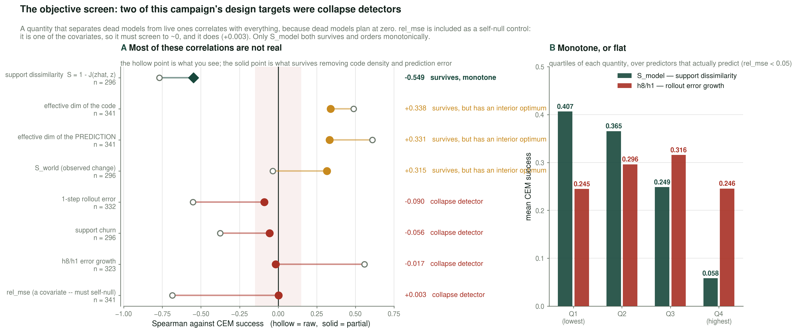
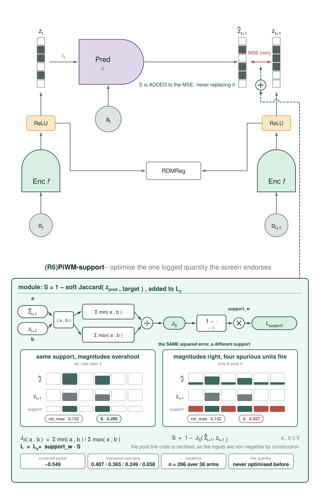
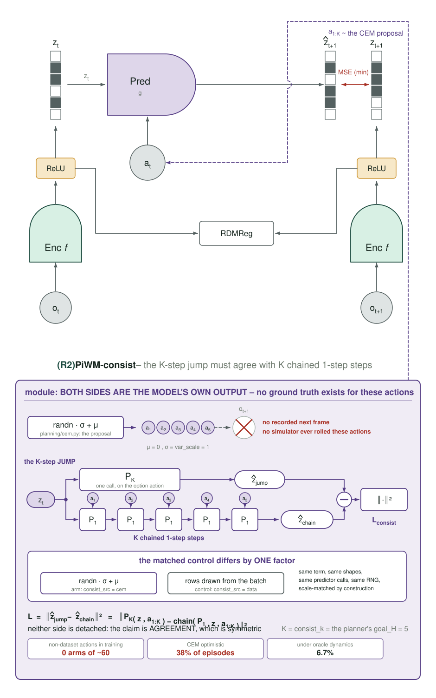
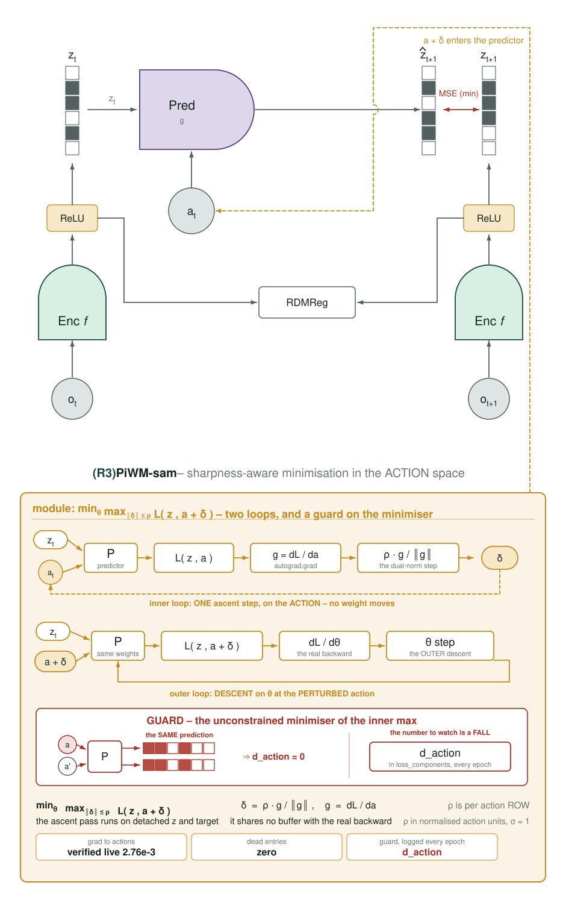
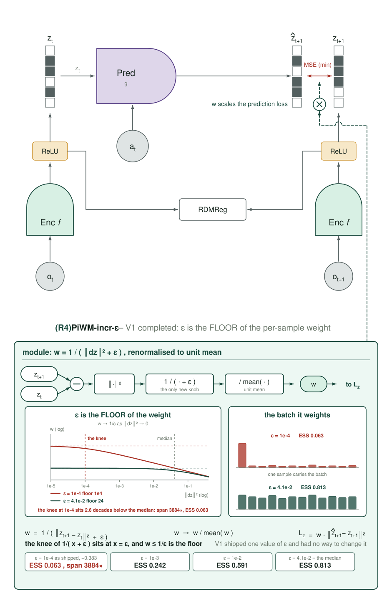
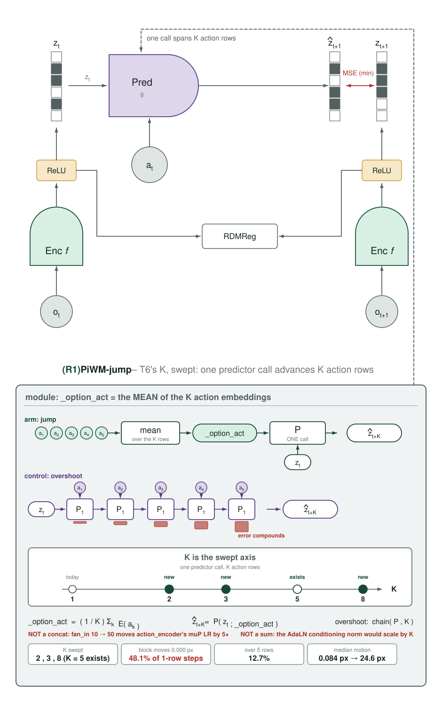
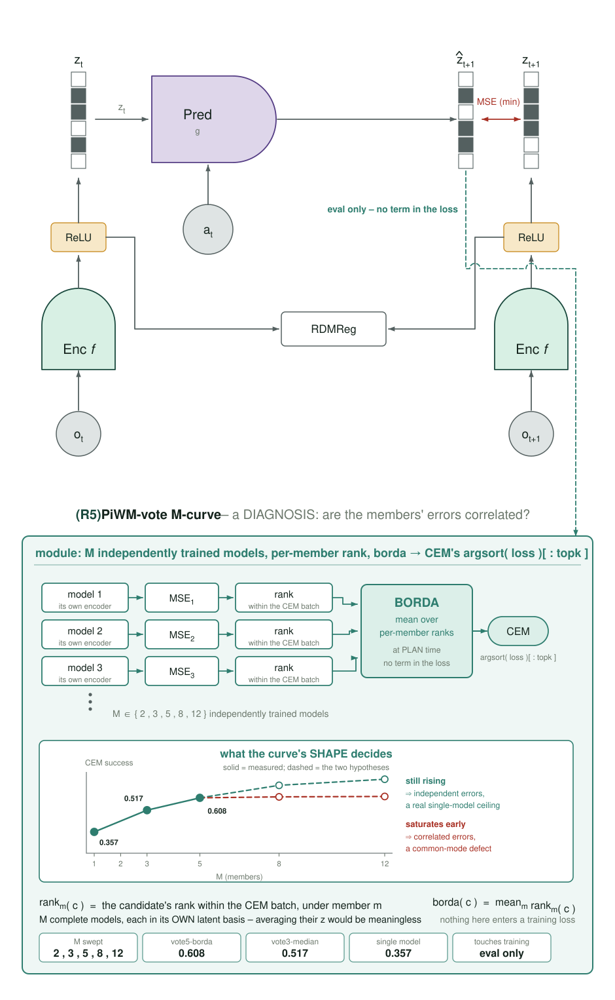

# 2026-09-04 — The round that started by auditing itself

## 0. Where round 6 stands

I proposed five objective terms to fix rollout divergence. Before building any of them the user
asked one question: **have we run this already?**

Three of the five were duplicates or rested on a premise the record refutes. A sixth idea, added
while writing the plan, was killed by a measurement that cost zero GPU. What survived is smaller,
better founded, and — for the first time in this project — includes a target that had to pass a
screen before it was allowed to become an arm.

This entry is written in the order the work happened: the audit, the screen, then the round.

Every figure here imports `analysis/style.py`, the palette derived from
`figures/motivation_teaser.svg` — green for the system, purple for the contrasting condition,
amber for the intervention under test, crimson for failure, slate for neutral, hues assigned by
identity and never by rank. Regenerate:

```
python analysis/collect_evals.py --out campaign.json
python analysis/screen_objective.py --key <k> [--over <k2>] --campaign campaign.json
python analysis/round6_figs.py --out diary/assets/2026-09-04
python analysis/spectral.py --out assets/spectral.json --campaign campaign.json   # first run ever
```

Round 5 is still finishing (§8). Round 6 implements and launches in parallel.

---

## 1. The duplication audit: three of my five proposals were already run

I asked for an adversarial audit of O1–O5 against every arm in rounds 1–5. It found what I had
missed.

| proposal | verdict | what it actually was |
|---|---|---|
| **O2** "scale-free rollout error" `‖ẑ−z‖²/‖z_{t+k}−z_t‖²` | **ALREADY RUN** | Algebraically **V1 `incr_norm`** (`visual_world_model.py:1082-1093`): `w = 1/(‖Δz‖²+ε)` times the same squared error. Ran as `PiWM-incr`: **−0.383 [−0.497, −0.268], n=8, 8/8 seeds dead**, `l0_frac_pred = 0.0` on 7 of 8 — the predictor emits an all-zero code. |
| **O1** "inverse-dynamics anchor" | **ALREADY BUILT** | Its encoded-latent half *is* `policy_head` / `POLICY_W=1.0`, launched in `PiWM-vp`; at k=1 it is literally `g(z_t, z_{t+1}) → a_t`. Its objective family (`ACT_INFO`, ±`knn`, ±`sigreg`) ran **five arms, all collapsed**. |
| **O4** "residual-aligned Jacobian damping" | **PARTIALLY OVERLAPS** | Round 4 dropped a spectral `(r−1)²` penalty for *"damaging the model to flatter a diagnostic"*. P4 `ctrb` is the surviving member: **+0.015 [−0.07, +0.10]**, null because the Gramian was already at its floor. |
| **O3** action-space SAM | **new** | Zero adversarial / minimax / perturbation / Jacobian-penalty code in ~78 arms. |
| **O5** train on the planner's action distribution | **new** | No training arm has *ever* fed a non-dataset action into a loss. T7 matched the CEM proposal but froze the world model by assertion. |

### Two claims of mine the audit falsified outright

**"O2 keeps ESS = 1.0, unlike T3's sample reweighting."** False. Dividing per-sample by a
per-sample scalar *is* sample reweighting — that is the definition. Measured on the 1536 real
validation samples in `assets/incr_stats_lpwm_ltv_s3.json`:

| | ESS/N | weight span |
|---|---|---|
| **V1-incr / O2 as I proposed it** | **0.063** | 3884× |
| T3 `contact` (γ=1.0) | 0.38 | — |
| uniform | 1.000 | 1× |

My proposal had an effective sample size **six times worse** than the arm whose *shuffled control*
alone cost −0.345.

**"A contracted rollout carries no action information, so an inverse model prevents contraction."**
Inverted. `PiWM-actinfo-cond` — an action-information arm — has **h8/h1 = 1.02**, the signature of
a constant. The untreated baseline sits at **19.4** and is not contracting. *The
action-information objective is what produced the contraction I proposed it to prevent.*

Neither error was subtle, and neither would have surfaced without checking. That is the whole
argument for doing this before spending GPU-hours.

---

## 2. The screen: two design targets were collapse detectors

While writing the plan I found what looked like the ideal target. `h8/h1` — how much rollout error
grows from one step to eight — spans 12.4 on the campaign's best arm to 24.6 on a near-worst one.
Not at a floor, unlike the Gramian that made P4 a null by construction.

Then I measured it against planning:

```
Spearman(h8/h1, CEM)                      = +0.558   p = 8e-28
partial, removing rho and rel_mse         = -0.017   p = 0.77
healthy only (rel_mse < 0.05), n = 213    = +0.002
```

**Another collapse detector, exactly like `d_action`.** A quantity that separates dead models from
live ones correlates with everything, because dead models plan at zero. Killed before a line was
written, for zero GPU.

So the test became a tool. `analysis/screen_objective.py` asks of any candidate: the raw Spearman
(the number that fools you), the rank-partial with ρ and `rel_mse` removed against a permutation
null (the number that matters), the same restricted to predictors that actually predict (a cut,
reported as a robustness check and never as the headline), and binned quartile means — because a
partial correlation cannot see a non-monotone relation, which is exactly what `d_action` turned
out to be.



| candidate | raw | partial | monotone |
|---|---|---|---|
| **`jacc/S_model` — support dissimilarity** | −0.769 | **−0.549** | **yes** |
| `sparsity/effective_dim` | +0.487 | +0.338 | no |
| `sparsity/effective_dim_pred` | +0.609 | +0.331 | no |
| `jacc/S_world` | −0.035 | +0.315 | no |
| `jacc/churn_model` | −0.375 | −0.056 | — |
| `h8/h1` rollout growth | +0.558 | −0.017 | — |
| `h1` rollout error | −0.552 | −0.090 | — |
| **`err/rel_mse`** *(self-null control)* | −0.684 | **+0.003** | — |

`rel_mse` is included as a **self-null control**: it is one of the covariates, so it must screen to
zero or the estimator is broken. It screens to +0.003.

### What the screen endorsed

`S_model = 1 − soft_Jaccard(ẑ, z)` is **support** dissimilarity — *which* units fire — as opposed
to `rel_mse`'s magnitude error. On a code at ρ ≈ 0.45 those are different quantities, and the
partial confirms it carries information `rel_mse` does not. Over healthy predictors it is monotone:
0.407 → 0.365 → 0.249 → 0.058.

And `soft_jaccard` appears **zero times** in `models/`. It has only ever been logged as a
diagnostic; nothing has ever optimised it. **It is a screen-validated, previously untargeted
objective — the first this campaign has had.**

Note the three amber rows. `effective_dim`, `effective_dim_pred` and `S_world` all survive the
partial and are all **non-monotone** — they have an interior optimum, so "raise it" is not a
direction. That is the `d_action` shape, and it is why item 4 of the screen exists.

*Caveat, stated before the arm runs:* the Jaccard is scale-invariant in a way MSE is not, so a
model could lower `S` by inflating the code's magnitude uniformly. The arm logs the code norm every
epoch so that is visible rather than inferred.

---

## 3. Why every round-6 arm is a grid

Six of the nine round-3/4/5 proposals were **single-shot** on their strength knob: V1, V2, V3, P4,
T6, T4. The consequences are on record:

- **V1 has no strength knob at all.** Its ε is the literal `1e-4` at `visual_world_model.py:1091`,
  **414× below** the median increment of 4.1e-2. The diary's own verdict: *"V1 as run is a test of
  ε = 1e-4, and ε = 1e-4 is wrong… a rerun has not been done."*
- **T6's K was never varied**, and T6 is the one direction §16.8 leaves open.
- **T4 would have died on its primary setting.** Gate: `val/rho_k > 0.6`. `vp` (TD, the spec's
  primary) measures **0.443** and fails; `vp-mc` measures **0.715** and passes. Only the variant
  grid saved it — and T5/V5/V4 must therefore build on `vp-mc`, not `vp`.

So: **full grid at 8 seeds**, and each grid brackets its failure mode around a *measured* quantity
rather than sampling uniformly. No screening stage, because **no early-epoch metric has ever been
validated against final CEM here** — the campaign has four documented retractions from mid-training
reads.

Measured cost from the real archive: **~7.3 GPU-h per (arm, seed)** — 6.6 h training across four
chained windows plus 0.68 h eval. One setting × 8 seeds ≈ **58 GPU-h / 40 jobs**.

---

## 4. Round 6

Every arm logs its own collapse diagnostics — ESS and weight span where it reweights, `d_action`
where it could buy flatness by ignoring the action, code norm where the objective is
scale-invariant — and every arm carries the pre-registered death condition `rel_mse ≥ 0.5`.

| | proposal | grid | control |
|---|---|---|---|
| **R6** | **support agreement** — optimise the one quantity the screen endorsed | `SUPPORT_W` ∈ {0.03, 0.1, 0.3} | `SUPPORT_W=0` (= baseline) |
| **R2** | **rollout self-consistency on the planner's own action distribution** | `CONSIST_W` ∈ {0.03, 0.1, 0.3} | same λ with `CONSIST_SRC=data` — isolates the *distribution*, which is the whole claim |
| **R3** | **action-space SAM**, `min_θ max_{‖δa‖≤ρ} L(z, a+δa)` | `SAM_RHO` ∈ {0.01, 0.03, 0.1} | `SAM_RHO=0` |
| **R4** | **V1 completed** — its ε made a knob | `INCR_EPS` ∈ {1e-3, 1e-2, 4.1e-2} + a clipped-weight variant | baseline |
| **R1** | **T6's K sweep** — its only untried axis | `NUM_PRED` ∈ {2, 3, 8} | matched `OVERSHOOT=true` at each K |
| **R5** | **ensemble M-curve** — diagnosis, eval only | M ∈ {2, 3, 5, 8, 12} | — |

### R6 · support agreement



The figure carries the argument as a worked pair rather than as prose. Against a target
`[0, 1.0, 0, 0.8, 0, 0]`: case A `[0, 1.4, 0, 1.1, 0, 0]` has the right support and overshooting
magnitudes; case B `[0.25, 1.0, 0.25, 0.8, 0.25, 0.25]` has exact magnitudes and four spurious
units firing. **Both have identical squared error, 0.152.** Their S differs — 0.280 against
0.357. That is the information `rel_mse` cannot see and the screen's −0.549 partial detects.
*(Those three numbers are computed from the drawn vectors; every number in the value strip is
measured.)*

The caveat is drawn too: the Jaccard is scale-invariant in a way MSE is not, so a model could
lower S by inflating the code uniformly. The arm logs the code norm every epoch.

**First finished runs — the objective works, and the caveat that fires is a different one**
*(2026-09-04, n = 1/1/2, far too early for a verdict; this is a guard reading, not a result).*

| `SUPPORT_W` | n | `d_action_over_scale` | vs baseline | `rel_mse` | `S_model` |
|---|---|---|---|---|---|
| 0.03 | 1 | 0.568 | 1.03× | 0.0072 | 0.0536 |
| 0.1  | 1 | 0.329 | 0.60× | 0.0125 | 0.0358 |
| 0.3  | 2 | 0.207 | **0.38×** | 0.044 – 0.100 | 0.0335 – 0.0414 |
| baseline `LpWM-ltv` | 16 | 0.549 (probe) | — | 0.0092 | 0.082 |

Three quantities move monotonically with the dose, which is what makes this worth recording at
n = 1: **`S_model` falls** (0.082 → 0.054 → 0.036 → 0.034), so the objective is doing exactly what
it was built to do; but **action sensitivity falls with it** (1.03× → 0.60× → 0.38×) and
**`rel_mse` rises** (0.0072 → 0.0125 → up to 0.100, an order of magnitude above baseline).

The scale caveat above is *not* what fired — the code norm is behaving. What fired is the
`d_action` guard: at `SUPPORT_W = 0.3`, **both** finished seeds sit at 0.212 and 0.201, below the
baseline probe's own **minimum** of 0.222, not merely below the 0.2746 threshold. That is outside
baseline variation rather than inside it.

So the early shape is that support agreement is **purchasable, but priced in action sensitivity**.
If it holds up, the grid has already earned its keep: `SUPPORT_W = 0.03` buys a third of the
`S_model` reduction at **no** measurable cost on either guard, and a single-setting run at 0.3
would have been read as the objective failing rather than as the weight being too high. This is
the case the round was designed around — see §3 on why every arm is a grid.

**Falsification watch.** The screen endorsed `S_model` because it ordered CEM success among
*healthy* predictors. If the 0.3 arm lowers `S_model` while planning badly, that is not a
refutation of the screen — it is the arm leaving the healthy region the screen was measured on.
The contrast that matters is 0.03 and 0.1 against their `SUPPORT_W = 0` control, at n = 8.

### R2 · rollout self-consistency on the planner's own action distribution



### R3 · action-space SAM



The guard is drawn in crimson because this objective's unconstrained minimiser *is* the collapse
mode: a predictor that ignores the action inside the ρ-ball has `d_action = 0` and a perfect SAM
loss. `d_action` is therefore a first-class logged metric for this arm, not an afterthought.

**The guard, stated in the units it is actually checked in.** An earlier draft read "collapsed if
`d_action` falls more than 2× below the baseline's 0.549". That phrasing is a trap, and it caught
me: **0.549 is `causal/d_action_over_scale`, not `causal/d_action`.** The baseline's raw `d_action`
median is **0.3535**. Comparing a raw value against the normalised threshold understates every arm
by ~1.55× and manufactures collapses that are not there. The guard is:

> collapsed ⇔ `causal/d_action_over_scale` < **0.2746** = half the `LpWM-ltv` probe median
> (0.5491, n=16, `assets/d_action_probe.json`).

Two further cautions on the comparator. The baseline arms **log no `causal/d_action` at all** — the
diagnostic postdates them — so the probe is the *only* valid source for the threshold, and it must
be the probe on both sides or neither. And the baseline's own probe spread is **[0.222, 0.629]**,
which straddles the threshold: a single seed below 0.2746 is inside baseline variation, so the
guard is a per-arm judgement across seeds, not a per-seed kill switch.

**First five finished runs, all healthy** (2026-09-04): `sam-r0p03` s4 0.423, `sam-r0p1` s6 0.480,
s9 0.448, s7 0.385, s10 0.376 — **0.68–0.87× baseline, no breach**, with `rel_mse` 0.009–0.014,
i.e. at baseline quality. The collapse mode the guard exists to catch has not appeared at ρ ≤ 0.1.

### R4 · V1 completed



The ε ladder is the point of the figure: 1e-4 as shipped (ESS 0.063, span 3884×, and the arm
scored −0.383), then 1e-3 → 0.242, 1e-2 → 0.591, and 4.1e-2 — the measured median — → 0.813.
Note where that leaves the experiment: the window between *ESS-collapsed* and *inert* is narrow,
because ε → ∞ recovers plain MSE exactly.

**ESS is seed-dependent, and both measurements are kept.** Those figures come from
`LpWM-ltv` **s3** (1536 validation windows, median increment 0.0415). Calibrating the knob on
**s0** gives a median of 0.0771 and therefore ESS 0.220 at the same ε = 1e-4. The median
increment differs 1.9× between two seeds of the same arm, so "the ESS at the shipped ε" is a
property of the checkpoint, not of the objective. Neither number was allowed to overwrite the
other; `conf/train_rdmreg.yaml` records both. It does not change the reading — 0.063 and 0.220
are a 16× and a 4.5× loss of effective batch respectively — and §7 reports what the arms
actually did in training, which is the number that settles it.

### R1 · T6's K sweep



### R5 · ensemble M-curve



**R2's construction is the part worth explaining.** Sample action sequences from the CEM proposal
(`randn·σ + μ`) and require the K-step jump to agree with the K chained one-step predictions.
*Both sides are the model's own outputs*, so no ground truth is needed for actions no simulator
ever rolled — which is what removes O5's original dependency on the collapsed action-information
family. It is defined on the planner's *query* distribution rather than on a model property, and
M4 already measured the failure it targets: CEM's predicted improvement beats the realised one on
**38 %** of baseline episodes and **6.7 %** under oracle dynamics.

**R4 is here to be settled, not to win.** It sits in the reweighting family §16.8 declares closed,
and ε → the median approaches inertness (ESS/N: 0.242 / 0.591 / 0.813 across the grid, against
0.063 as shipped). But V1 is the campaign's canonical *killed by one constant*, and leaving it
unresolved is the exact thing this round is against. If no ε beats the baseline, the idea is wrong
rather than its constant, and the family closes for good.

**R5 is not a scale proposal.** The user has been explicit that scale is not the direction. The
*shape* of the M-curve is a measurement: saturation at M = 3 says the members' errors are
correlated and points at a common-mode defect; a curve that keeps rising says they are independent
and the single-model ceiling is real. Either answer constrains round 7.

---

## 5. `spectral.py`, run for the first time — and it corrects two things

`analysis/spectral.py` computes the predictor's spectral radius, its controllability Gramian and
`A_aug^k B_aug` from checkpoint weights alone — no data, no GPU. §11 said it *"can refute this
round's own premise"*. **It had never been executed**: no output JSON, no slurm log, no number in
any diary. It has now run over the whole archive — 412 checkpoints, 32 of which have no linear
core (`lie`, `action_linear`, `ar_adaln`, `vit`).

### 5.1 Every learned predictor is expansive. Round 4's stated reason for dropping the spectral penalty was false.

```
spectral radius rho:  median 17.7   range [1.05, 145.4]
fraction with rho >= 1:  1.000        <- all 399 non-canary checkpoints
```

Round 4 dropped a `(r−1)²` spectral penalty with this reason: *"PushT is dissipative — `r < 1` is
the model being **right**. Damaging the model to flatter a diagnostic."* **Not one checkpoint has
`r < 1`.** The premise was never measured, and it is false. The environment may well be
dissipative; the learned latent dynamics are not.

That said, the penalty should still not be built, and now for a measured reason rather than an
assumed one: `Spearman(ρ, CEM) = +0.028` over 309 evaluated runs. **ρ does not predict planning**,
so it fails the §2 screen like everything else that is a property of the model in isolation.

### 5.2 The controllability finding, and a correction to `2026-09-03.md` §12

The action reaches almost none of the latent space. Over all non-canary checkpoints the
controllability matrix has median **rank/dim = 0.32**, and **34 % of checkpoints are below 0.05** —
the baseline `LpWM-ltv` sits at rank 255/1152 and `LpWM-ltv-d2048`, the campaign's *best* single
model, at **18/6144**.

This forced a correction to §12's reading of P4, which I had got wrong. On the two `linear_var`
arms, where the linearisation is exact rather than approximate:

| | `PiWM-ctrb` | `LpWM-linvar` (control) |
|---|---|---|
| log₁₀ cond(W_c) | **0.60** | **10.18** |
| rank / dim | 1152 / 1152 | 1119 / 1152 |

I had written that P4 was a null *"by construction — the Gramian was already close to isotropic"*,
reading its **converged** `ctrb_loss` of 0.033 as a pre-treatment value. It is post-treatment. The
penalty in fact drove the Gramian **nine and a half orders of magnitude**, to near-perfect
isotropy and full rank, and planning still did not move (+0.015 [−0.07, +0.10]).

**P4 is therefore a much stronger result than the diary recorded**: an interventional null. It
rules out reachability-conditioning as a direction, rather than merely failing to test it. §12 now
carries the correction at the point of use.

### 5.3 What this does to R3 and R4's neighbours

Nothing in round 6 targets ρ or the Gramian, which is now the right call for a measured reason.
It also removes a temptation: `log10 cond(W_c)` has `Spearman(cond, CEM) = +0.473` raw, which
looks like a strong signal and — given every other example in §2 — is almost certainly another
collapse detector. It has not been put through the screen because nothing proposes to optimise it,
and it should be if anyone ever does.

---

## 6. What the audit means for the record

Two entries in `2026-09-03.md` should be read with this one:

- **§12b** already caught `d_action` being wrong by ~2900×, and §8 is flagged superseded because
  its population excluded every high-CEM arm.
- **§14 rule 4** — *"measure the baseline's value of a quantity before building nine arms to change
  it"* — is now enforced by a script rather than by intention. `d_action` and `h8/h1` would both
  have been caught by it.

The pattern across five rounds is consistent enough to name: **nearly every metric that is a
property of the model in isolation turns out to be a collapse detector.** `rel_mse`, ρ, `eff_dim`,
`d_action`, `h8/h1`, `h1`, support churn — all of them separate dead from live and then go flat.
`S_model` is the first exception found, and it is an exception about *structure* (which units fire)
rather than *magnitude*. Whether that survives being optimised is R6's question.

---

## 7. Results

*(to be filled as arms land — spectral first, then the wave25 canaries, then the grids)*

---

## 8. Round 5, still closing

Per the user's instruction round 5 runs to completion and its results are written up in
`diary/2026-09-03.md` §16, not duplicated here. Open at the time of writing:

| arm | training | evals |
|---|---|---|
| T2 `patchdecode` / `-detach` | 2/8, 4/8 | 0 paired |
| T6 `jump5` / `overshoot5` | 3/8, 6/8 | **paired n = 2** |
| T4 `vp` / `-mc` / `-geom` | 1/8, 6/8, 3/8 | 0 |

**T6 remains the one to watch** and I will report it at n = 8, as promised. Its paired contrast has
swung +0.100 → −0.280 → 0.000 across single seeds, which is exactly the volatility §16.7's n = 3
lesson is about.

**T5, V5 and V4 are now unblocked** and must be built on `PiWM-vp-mc` (`val/rho_k` = 0.715), not
`vp` (0.443, which fails its own gate).
