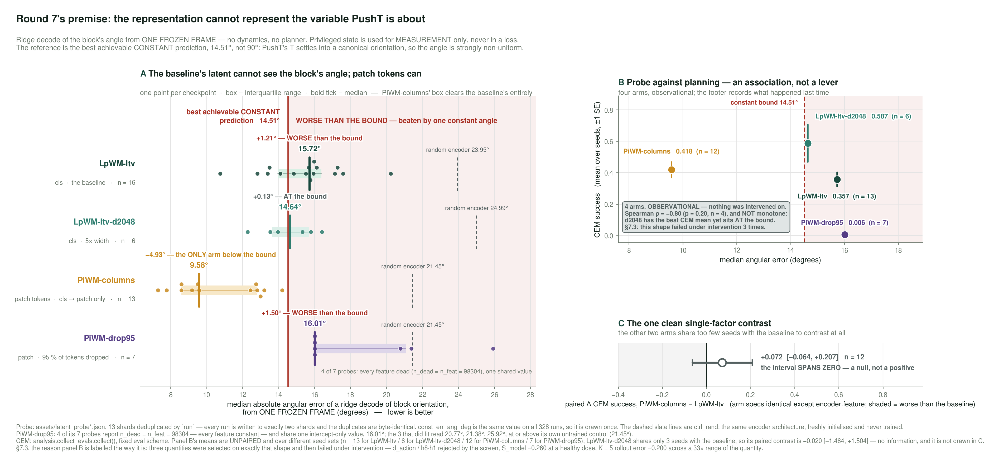
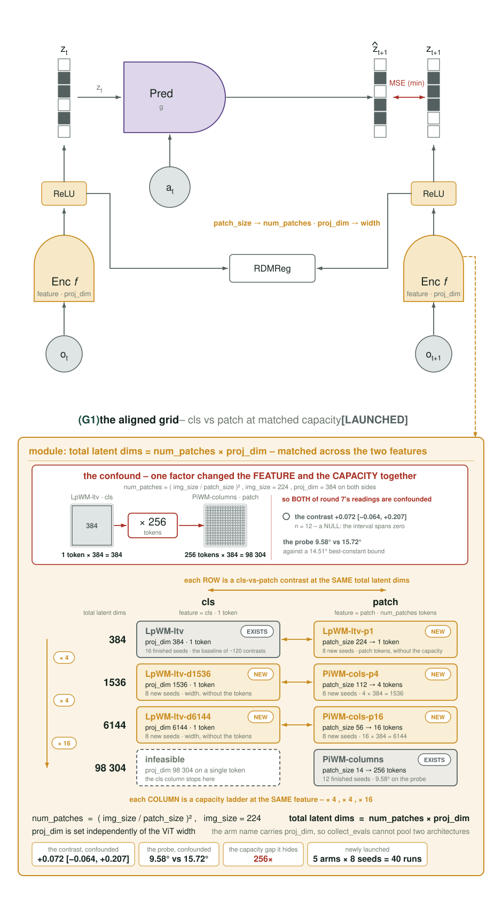
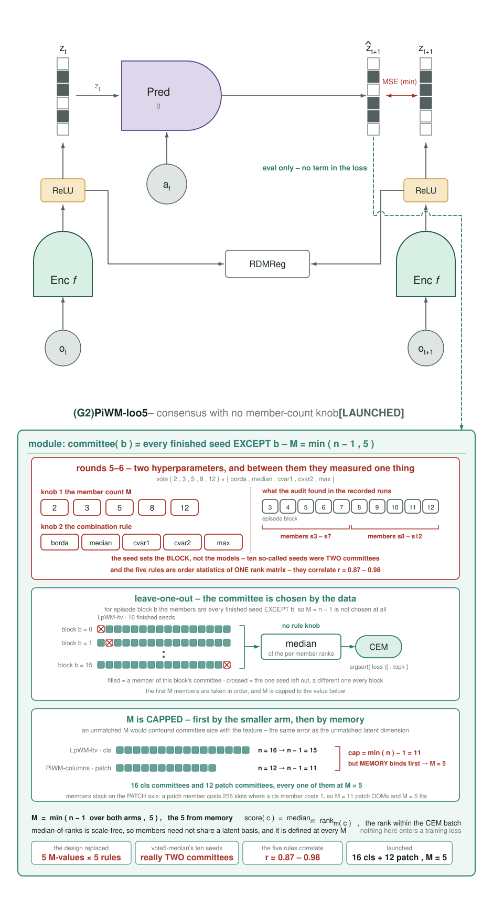
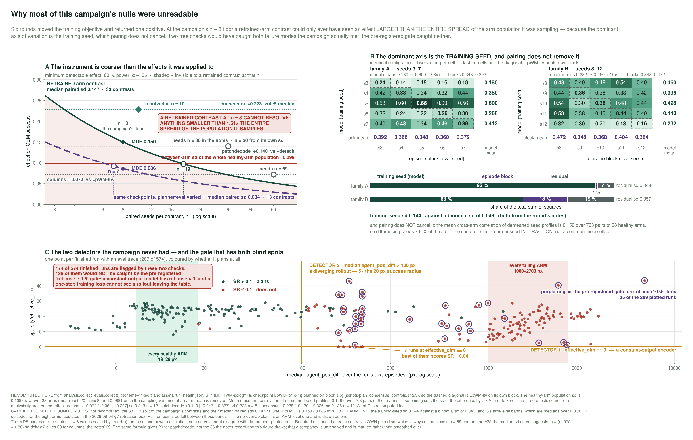
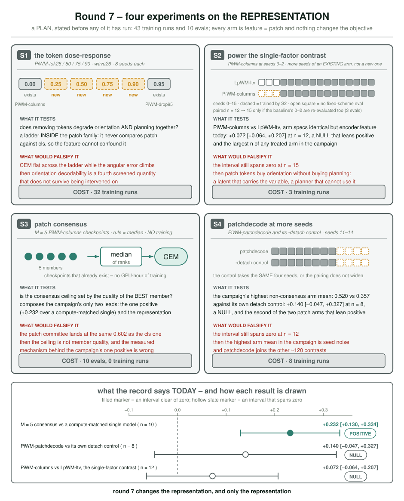
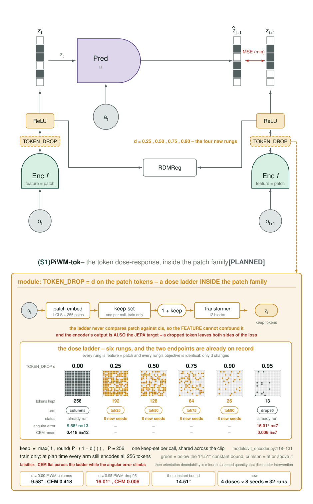
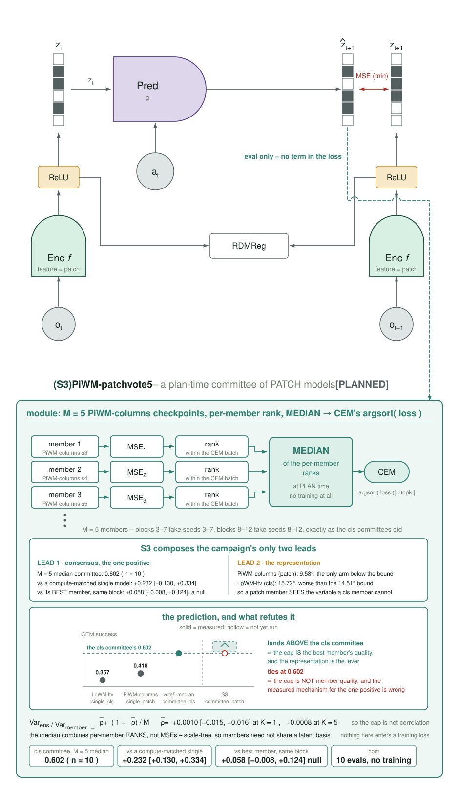

# 2026-09-05 — Round 7: the representation, not the objective

## 0. What changed

Six rounds and roughly 120 paired contrasts have now been run. Every one of them changed the
**training objective**, the **planner**, or the **predictor** on top of a representation that was
never varied: `feature=cls`, a **single 384-dimensional token for the whole image**.

They produced exactly one positive, and it is not a world-model result — plan-time consensus
beats a compute-matched single model by **+0.232 [+0.130, +0.334]** (`2026-09-03` §16.9), which
says something about ensembling and nothing about the objective, the latent or the rollout.

Round 7 changes the representation and nothing else.

The reason is a measurement that needed no dynamics, no contrast and no new GPU-hours, because
the probe had already been run and its answer was sitting in `assets/latent_probe_columns*.json`
unread.

**Two corrections to this diary's own numbers are in §7**, both found by recomputing every quoted
figure from the archive while rebuilding the figures: `patchdecode` needs **n = 20**, not the n = 36
I cancelled it over, and the `agent_pos_diff` divergence detector is **94.5 % accurate**, not the
clean separator the eight tabulated arms suggested. The second one changes how the detector may be
used — flag, not gate.

---

## 1. The measurement that redirects the campaign



Ridge-decode the block's pose from a **single frozen frame**. No predictor, no rollout, no
planner — just: is the information *there*? The number reported is median absolute angular error
in degrees, and the reference that matters is **not 90°**. PushT's T-shaped block settles into a
canonical orientation, so the angle is strongly non-uniform and the best achievable **constant**
prediction already scores **14.51°**. That is the bound a representation has to beat to be
carrying any orientation information at all.

| arm | representation | n | median angular error | vs the 14.51° bound |
|---|---|---|---|---|
| **`PiWM-columns`** | **patch tokens** | 13 | **9.58°** | **−4.9°, the only arm below it** |
| `LpWM-ltv-d2048` | cls, 5× width | 6 | 14.64° | +0.1°, *at* the bound |
| **`LpWM-ltv`** *(the baseline)* | cls | 16 | **15.72°** | **+1.2°, worse than the bound** |
| `PiWM-drop95` | patch, 95 % dropped | 7 | 16.01° | +1.5°, worse than the bound |

**The baseline's latent carries no usable orientation information.** At 15.72° you would do
better predicting the block's canonical angle every single time. PushT is a task about *aligning
a T-shaped block*. The representation that every one of ~120 contrasts was built on cannot see
the variable the task is about.

**Width is not the constraint.** `d2048` is five times wider and lands exactly on the bound.

> ⚠ **The probe is capacity-confounded — see §2c.** `PiWM-columns` carries **98 304** latent
> dimensions against `LpWM-ltv`'s **384**, a 256× gap, because a patch arm carries
> `num_patches × proj_dim`. A larger representation decoding the angle better is not evidence
> that *tokens* are what carry it. The claim below is what the probe appeared to show; §2c's
> dimension-matched grid is what will actually test it, and until those 40 runs land this
> section states a hypothesis, not a result.

**Tokens are.** `PiWM-columns` is a "single-factor" change *in the config* — its arm spec is byte-identical
to the baseline (`ARMS[PiWM-columns]="ltv 1.0 5e-4"`), with only `encoder.feature: cls → patch`
differing — and it is the one arm in the archive that beats the bound.

**And the dose-response was meant to say it is the tokens, not the word "patch"** — `PiWM-drop95`
is also patch-feature but discards 95 % of its tokens and falls back to 16.01°. That argument is
now doubly weak: `drop95` keeps the same 98 304-dim latent (dropping is stochastic, at training
time only), so it does **not** vary capacity either, and 4 of its 7 seeds are in total
representational collapse.

### Why this explains the shape of the whole record

If the representation is missing the task's controlled variable, then:

- **No loss defined on that latent can recover it.** Improving prediction of an orientation-blind
  code is exactly the null result six rounds kept producing.
- **Latent accuracy should not predict planning**, and it does not: across a **33× range** of
  5-step rollout error, planning does not follow, and it is not even monotone (`2026-09-04` §7.3).
- **Screened targets should fail under intervention**, and all three did — `S_model` at −0.260
  after passing the screen, and K=5 rollout error at −0.200 with the intervention already sitting
  in the archive (§7.2, §7.3).
- **Ensembling should help a little and cap out**, and it does: members' errors are independent
  and average at the 1/√M rate, but the committee only ties a genuinely strong member
  (`2026-09-03` §16.9).

This is the first hypothesis in the campaign that accounts for the *pattern* of results rather
than one result.

---

## 2. What the CEM evidence does and does not say

I want to be precise here, because §7.3 is a fresh lesson about believing observational patterns.

| arm | feature | CEM mean | vs baseline |
|---|---|---|---|
| `PiWM-patchdecode` | patch | **0.520** | highest non-consensus arm mean in the campaign |
| `PiWM-columns` | patch | 0.418 | **+0.072 [−0.064, +0.207]**, n=12 — a *null* |
| `LpWM-ltv` | cls | 0.357 | — |
| `PiWM-drop95` | patch, 95 % dropped | 0.006 | destroyed |

**The single-factor contrast is a positive-leaning null**, not a positive. It is the largest n of
any treated arm in the campaign and its interval still spans zero. That is the honest statement,
and round 7's S2 exists to settle it.

**A test I ran and am deliberately not reporting as evidence.** Ranking patch arms against cls
arms campaign-wide gives p = 0.0065 — and it is worthless, because it compares three patch arms
against forty-six cls arms most of which carry actively harmful objectives. It measures those
objectives, not the feature. Recorded here so nobody re-derives it and believes it.

**The strong claim is the probe**, which is a direct measurement of a frozen representation and
needs no contrast at all.

### The counterexample I have to put on the record

`LpWM-ltv-d2048` sits **at** the orientation bound (14.64°, i.e. orientation-blind) and has the
**highest raw CEM mean in the table, 0.587**. Taken at face value that is a counterexample to
round 7's premise: the best planner cannot see the block's angle.

It does not survive pairing, and the reason is the confound this campaign already fixed once.

| | seeds evaluated | mean |
|---|---|---|
| `LpWM-ltv-d2048` | **0, 1, 2**, 3, 4, 5 | 0.587 |
| `LpWM-ltv` (baseline) | 3 … 15 | 0.357 |

Its three highest scores (0.72, 0.78, 0.68) are on seeds **0–2, which the baseline has no
fixed-instrument evaluation for at all** — so the 0.587 is an *unpaired* mean over a different
seed population. On the three seeds they actually share, the paired contrast is
**+0.020 [−1.464, +1.504]**: an interval three units wide, carrying no information whatsoever
(one of the three d2048 seeds scores 0.00).

So d2048 is **not** a demonstrated counterexample — but it is **not excluded either**, and it is
the single largest threat to the premise. If width really does buy planning without buying
orientation, the representation story is wrong and the campaign should be widening rather than
tokenising. That is cheap to settle — d2048 needs seeds 6–12 to become pairable — and it should
be settled before round 7's result is believed either way.

*(This is also why panel B of the figure above is labelled an association and not a lever:
four arms, ρ = −0.80 at p = 0.20, and **not monotone** precisely because of this row.)*

---

## 2b. REDESIGN (2026-09-05, after the success-rate reanalysis)

The reanalysis in `README` §7 and `2026-09-04` §7.0b changes what round 7 can and cannot ask.
Three numbers govern everything below:

| | |
|---|---|
| MDE of a **retrained** arm at n = 8, 80 % power | **0.150** |
| sd of the entire healthy-arm population | **0.099** |
| the effect S2 exists to resolve (`columns` vs baseline) | **+0.072**, paired sd **0.213** |

**Detecting +0.072 at 80 % power needs n = 69 seeds.** S2 as launched (n = 12 → 15) cannot
answer its own question, and neither can S4 (effect +0.140 → **n = 20** needed, launched at n → 12).
*(Corrected from n = 36 — see §7.1.)*
Adding three or four seeds to a contrast that needs forty more is theatre.

Two escape routes were tested and one is closed:

* **Episode-level pairing does not help.** Cluster-robust SE 0.0589 against seed-level 0.0615 —
  a 4 % gain, because the variance is at the *seed* level, not the episode level. (The *naive*
  episode-level SE is 2.6× too small; using it would manufacture significance.)
* **Committees halve the sd** — 0.071 for committee arms against 0.141 for healthy single arms,
  and 0.071 is exactly the 50-episode binomial floor. Consistent with the measured independence
  of member errors (ρ̄ ≈ 0.001), where averaging M members cuts the model-variance by ~M.

### The largest effect in the campaign is in the metric, not in any arm

`eval_state` scores `‖goal[:4] − cur[:4]‖ < 20 px` — a **joint** norm over the agent *and* block
positions — so it requires the gripper **parked**. The gap between that and the task alone:

| arm | official SR | block-only SR | parking tax |
|---|---|---|---|
| `LpWM-ltv` | 0.357 | 0.580 | **0.223** |
| `PiWM-columns` | 0.418 | 0.630 | 0.212 |
| `PiWM-consist-w0p3` | 0.005 | 0.255 | 0.250 |
| **`PiWM-vote5-borda`** | 0.608 | 0.665 | **0.057** |

**The parking tax is ≈ 0.22 for nearly every arm and 0.057 for the consensus arm.** That is a
0.22-sized effect — **three times** anything the campaign has chased — and it has never been
examined.

> ### ⚠ RETRACTED the same day — the "metric floor" was an artefact of dropping the term that
> ### detects divergence
>
> Block-only re-scoring drops `agent_pos_diff` from the success test. That term is the only one
> catching a **diverging simulation**, and the floor arms are diverging:
>
> | arm | median agent error | > 1000 px | block-only SR | **block-only AND agent < 100 px** |
> |---|---|---|---|---|
> | `LpWM-ltv` | 17.1 px | 11 % | 0.580 | **0.560** |
> | `PiWM-vote5-borda` | 13.3 px | 6 % | 0.665 | **0.645** |
> | `PiWM-patchdecode` | 16.7 px | 7 % | 0.615 | **0.603** |
> | `PiWM-consist-w0p3` | **2689.6 px** | **88 %** | 0.255 | **0.025** |
> | `PiWM-support-w0p3` | **1019.3 px** | 51 % | 0.260 | **0.003** |
> | `PiWM-contact-shuf` | **1290.9 px** | 63 % | 0.287 | **0.060** |
>
> Requiring the gripper merely to be *somewhere sane* — within 100 px, five times the success
> radius — collapses the floor arms from 0.22–0.29 back to **0.003–0.06**, while barely touching
> the healthy arms. A block that lands in tolerance while the end effector is 2700 px away is a
> diverged rollout, not a solved task.
>
> **So the floor arms genuinely fail, the original verdicts were right, and the parking tax is
> ≈ 0.02 for healthy arms rather than 0.22.** I verified the re-scored numbers but not what they
> meant, which is the same error in a new place.
>
> **What survives, and it is worth keeping:** the campaign has no divergence detector, and
> `median agent_pos_diff` is a good one — 13–28 px for every healthy arm against 1000–2700 px for
> every failing one, with no overlap. It is free, it comes from traces already on disk, and
> unlike `rel_mse` it cannot be fooled by a constant-output model.

**Amended below in §7.2.** The "no overlap" holds for the eight arms tabulated in that box, not for
the archive: over all 49 arms with traces the ranges overlap. The detector is 94.5 % accurate at
100 px, which makes it a flag rather than a gate.

 It is also not a representation gap: probing the frozen latent for the agent's position
gives **R² = 0.968**, *better* than the block's 0.919. The information is present, the metric
scores it, and the planner does not use it.

### What changes

**Kept, because their predicted effects are above MDE:** S1 (token ladder, dose-response with
large endpoints) and S5 (the width × LR 2×2; `d2048`'s raw gap is +0.23). S1 must now check
`effective_dim == 0` at every rung — `drop95` is a weak endpoint precisely because 4 of its 7
seeds are in total representational collapse.

**Downgraded, not cancelled:** S2 and S4 finish, but neither is reported as answering its
question. They are recorded as **under-powered by construction** — the honest price of S2 is
**n = 69**, and that should be stated rather than approximated with three seeds.

**Added — P1, REVISED. Its original premise (a 0.22 parking tax) is retracted above; what
replaces it is smaller but real:**

* **P1a.** Report block-only SR beside official SR everywhere. Free; the traces are on disk.
* **P1b.** ~~Add an agent term to the CEM objective to recover the tax.~~ **Dropped.** The tax
  for healthy arms is ≈ 0.02 once divergence is excluded (0.580 → 0.560 for the baseline), not
  0.22, and healthy arms already park on 83–87 % of the episodes where they place the block, at a
  median error of 13–28 px. There is no 0.22 to recover.
* **P1b′ (replacement).** Add **`median agent_pos_diff`** as a standing divergence diagnostic.
  Across the whole archive it is **94.5 % accurate at a 100 px threshold** (273/289 runs), *not*
  the perfect separator the 13–28 / 1000–2700 px figures suggest — those are eight tabulated arms,
  and over all 49 arms with traces the ranges overlap (§7.2). It still costs nothing and — unlike
  `rel_mse ≥ 0.5` — cannot be fooled by a constant-output model. Pair
  it with `effective_dim == 0`; between them they catch both failure modes the campaign has met.
* **P1c.** Why does consensus pay 0.057 where everything else pays 0.22? Committee-vs-member on
  the parking term specifically, using the `PiWM-soloM` matrix already on disk.

**Recorded as a hypothesis, not a finding:** within the baseline arm alone, seeds whose latent
decodes the *agent* better plan better — Spearman **+0.691, p = 0.027**, while *block* decoding
carries the **opposite** sign (−0.462, n.s.). It does **not** survive dropping the one dead seed
(+0.574, p = 0.106), so it is n = 10 leaning on one point. It is listed because P1b tests it by
**intervention**, which is the only thing this campaign has found to settle such a shape — three
observational targets selected this way have already failed under intervention (`2026-09-04`
§7.3).

## 2c. REDESIGN II — the comparison was never dimension-matched

Two faults in round 7's own design, both real, both now fixed.

### The patch/cls comparison confounded the feature with a 256× capacity change

A patch arm carries `num_patches × proj_dim` latent values; a cls arm carries `proj_dim`. At
this campaign's defaults:

| arm | feature | proj_dim | tokens | **total latent dims** |
|---|---|---|---|---|
| `LpWM-ltv` | cls | 384 | 1 | **384** |
| `LpWM-ltv-d2048` | cls | 2048 | 1 | 2048 |
| `PiWM-columns` | patch | 384 | 256 | **98 304** |

**`PiWM-columns` vs `LpWM-ltv` is a 256× capacity change wearing the label of a feature change.**
So is the orientation probe: of *course* a 98 304-dimensional representation decodes the block's
angle better than a 384-dimensional one. `LpWM-ltv-d2048` — the only width control the campaign
ever ran — is 5.3×, nowhere near enough to control it.



The fix is a grid matched on **total latent dimension**. `num_patches = (img_size/patch_size)²`
and `img_size` is 224, so `patch_size` is the token knob (14 → 256, 56 → 16, 112 → 4, 224 → 1),
and `encoder.proj_dim` is settable independently of the ViT width:

| total dims | cls | patch |
|---|---|---|
| **384** | `LpWM-ltv` *(exists)* | **`LpWM-ltv-p1`** — `patch_size 224`, 1 token |
| **1536** | **`LpWM-ltv-d1536`** | **`PiWM-cols-p4`** — `patch_size 112`, 4 tokens |
| **6144** | **`LpWM-ltv-d6144`** | **`PiWM-cols-p16`** — `patch_size 56`, 16 tokens |
| 98 304 | infeasible | `PiWM-columns` *(exists)* |

Each **row** is a cls-vs-patch contrast at fixed capacity; each **column** is a capacity ladder
at fixed feature. Nothing in rounds 1–7 could separate those two. **40 runs launched.**

*(The arm names carry `PROJ_D` deliberately: reusing `LpWM-ltv` at a different `proj_dim` would
file it under the baseline's key in `collect_evals` and silently pool two architectures.)*

### Consensus had two hyperparameters and needs none



Rounds 5–6 swept `vote{2,3,5,8,12} × {borda, median, cvar1, cvar2, max}`. The audit (§16.9)
showed the member set was a **step function of the episode block**, so the ten "seeds" of
`vote5-median` were really **two committees**, and the five rules correlate **r = 0.87–0.98**.
Two knobs, one measurement.

`scripts/plan_vote_loo.sh` removes both. For episode block *b* the committee is every finished
seed **except** *b*, so **M = n − 1 is set by the data**, and the rule is fixed to
median-of-ranks — scale-free, defined at every M, and the best-powered rule in the sweep.

**M must also be matched across the arms compared** — an unmatched M would confound committee
size with the feature, the same error as the unmatched latent dimension.

*In practice M is capped by the machine, not by the data — and by **two** separate walls.*

**Wall 1, memory, at M = 11.** `planning/ensemble.py` stacks members along the **patch axis**, so a
patch member costs `num_patches` slots where a cls member costs 1. At M = 11 that is
**11 × 256 = 2816** stacked slots against 11, and every M = 11 patch committee died with a genuine
`torch.cuda.OutOfMemoryError` (`F.gelu`, allocating 100 MiB) while every cls committee ran. This is
what fixes M = 5: it is the largest patch committee that fits in memory.

**Wall 2, walltime, at M = 5.** Fitting is not the same as finishing. Measured single-model eval
cost is **cls 40 min, patch 64 min**, and a committee costs `base + (M−1) × incr` with the increment
scaling like the base (cls 32.5 min → patch ≈ 52). That predicts **cls M=5 = 172 min** (measured
169 ✓) and **patch M=5 = 272 min** — against the **235 min (03:55) cap** of the 4 h GPU partitions.
All 10 patch committees duly **timed out at 03:55:23 having produced nothing.**

`plan_mcurve.sh` already routes M ≥ 6 to a 9:55 backfill script, but *"M ≥ 6" is a cls rule* and
silently mis-routes patch. `plan_vote_loo.sh` now routes on the **predicted cost** instead, which
gets both features right, and the patch committees are rerunning on the long window.

So **both sides run at M = 5** — the cls side capped *down* from its feasible 11 to match, because
keeping the larger feasible M on one side only is exactly the confound this design removes.
**16 cls and 12 patch committees launched at M = 5.**

*(The asymmetry is real and not merely a resource limit: stacking on the patch axis makes a patch
committee 256× more expensive in that dimension than a cls one, which is what produces both walls.
Any future committee work on patch representations needs either a member axis separate from the
patch axis, or chunked scoring.)*

**Correction.** An earlier version of this section attributed the whole problem to memory and called
M = 5 "the largest that fits", which read as though M = 5 patch was running. It was not — it fit and
then ran out of clock. The M = 5 choice is unchanged (wall 1 is real and binds at M = 11), but the
reason M = 5 had produced no data was wall 2, and a missing sbatch route rather than a hard limit.
Worth recording because a TIMEOUT and an OOM look identical downstream: both leave `n = 0` with
checkpoints on disk, which is the same "absent reads as no-data" failure `resolve_arm` was written
for.

### Cancelled as confounded or under-powered

* **The `TOKEN_DROP` ladder (32 runs).** It varies the token count at **fixed** capacity, so it
  cannot separate tokens from capacity — the question the grid above exists to answer.
* **S2 and S4's extra seeds (11 runs).** They need n = 69 and **n = 20** (corrected from 36,
  §7.1); they were launched at n = 15 and n = 12.

## 2d. The two detectors the campaign never had



`analysis/run_health.py`. Six rounds ran on one gate, `err/rel_mse ≥ 0.5`, which misses both
failure modes actually encountered:

* **`sparsity/effective_dim == 0`** — total representational collapse. A constant-output model
  has `rel_mse ≈ 0`, so the gate scores it *healthy*. `PiWM-drop95` and `PiWM-incr-eps0p001`
  have their **highest-scoring** seeds in this state, which inverts their ranking.
* **`median agent_pos_diff > 100 px`** — a diverged rollout. Nothing in the training logs sees
  it: the model can be a fine 1-step predictor and still drive the simulation off the table.
  On the eight arms tabulated in the 2026-09-04 §7 box, healthy sits at **13–28 px** and failing
  at **1000–2700 px**. **That is not archive-wide** — over all 49 arms with traces the ranges
  overlap, and the threshold is a good classifier rather than a clean separator: **273/289 runs
  correct, with 14 healthy runs above 100 px** (§7.2). Use it to flag, not to gate.

**Of the runs these two flag, 139 would not be caught by `rel_mse ≥ 0.5`.** Both are free — one
reads a wandb summary, the other reads traces already on disk.

## 3. The four experiments



*The figure shows **S1–S4** and reads "43 training runs". **S5 is not in it**: it was added after
the figure was built, when the probe panel surfaced the `d2048` counterexample and chasing that
turned up a 2×2 designed weeks ago and never run. The full round is 59 training runs and 10 evals.
Recorded rather than quietly regenerated, because the figure is a dated statement of what the plan
was when it was drawn.*

Every arm is `feature=patch`. **Nothing in round 7 changes the objective** — that is the point.

### S1 · the token dose-response — ~~32 runs~~ **CANCELLED (see §2c)**

> **Cancelled 2026-09-05, before any seed finished.** `TOKEN_DROP` varies the token count at
> **fixed** capacity — every rung keeps the same 98 304-dim latent — so the ladder cannot
> separate "tokens carry orientation" from "more latent is better", which is the whole question.
> Its capacity is spent on §2c's dimension-matched grid instead. The figure below describes the
> cancelled design and is kept only as the record of what was tried.

### S1 (superseded) · the token dose-response



`TOKEN_DROP ∈ {0.25, 0.50, 0.75, 0.90}`, eight seeds each. The endpoints already exist
(`0.0` = `PiWM-columns`, `0.95` = `PiWM-drop95`), so this buys the interior of a six-point curve.

**This is the cleanest causal design available here, because it never compares patch against
cls.** A patch-vs-cls contrast confounds the feature with everything else that differs; a ladder
*inside* the patch family cannot. If angular error and CEM success degrade together as tokens are
removed, then tokens → orientation → planning is causal rather than correlational.

*Falsifier:* CEM flat across the ladder while angular error climbs. That would say orientation
decodability is yet another screened quantity that does not survive intervention — the fourth —
and would close the representation direction as firmly as §7.2 closed R6.

### S2 · power the single-factor contrast — ~~3 runs~~ **CANCELLED (see §2b)**

> Detecting +0.072 at 80 % power needs **n = 69**. Three seeds do not approach that, and the
> contrast is capacity-confounded regardless (§2c). Superseded by the aligned grid.

`PiWM-columns` at seeds 0–2. The contrast is +0.072 [−0.064, +0.207] at n=12; `columns` holds
seeds 3–15 and the baseline holds 0–15, so these are the cheapest three points that widen the
pairing.

*A trap worth recording:* wave12's `PiWM-columns` has **no `ARM_FEAT` entry** and defaults to
`cls`. Launching it plainly would have filed cls-feature runs under the patch arm's name and
silently mixed two architectures under one key. It is launched with `FEATURE=patch`.

### S3 · patch consensus — 10 evals, no training



An M=5 committee whose members are `PiWM-columns` checkpoints, same block→family rule and same
rule (`median`) as the cls committees, so it is committee-against-committee on the same episode
blocks.

This composes the campaign's only two leads, and it is a **directional prediction with a
falsifier**. §16.9 measured that what caps consensus is the quality of the *best member*, not
correlation between members. If that is right, a committee whose members can see the controlled
variable should sit above one that cannot.

*Falsifier:* the patch committee lands at the same ~0.60 as the cls committee. Then the ceiling
is not member quality and §16.9's mechanism story is wrong.

### S5 · the width × learning-rate 2×2, finally completed — 16 runs

The counterexample above turns on one question: **does width buy planning without buying
orientation?** `scripts/run_campaign.sh:190-211` already knew the answer was unmeasured, and
said why — muP sets `used_lr = base_lr × base_width / fan_in` with `base_width` pinned at 384,
so every predictor matrix at D = 2048 gets

    D=384  ->  5e-4 × 384/384  = 5.000e-4
    D=2048 ->  5e-4 × 384/2048 = 9.375e-5      (5.3× lower)

**So "width helps" is confounded with a 5.3× learning-rate reduction**, and a too-high LR would
also explain the baseline's catastrophic-zero seeds (`LpWM-ltv` spans 0.00–0.66 over 13 seeds).

`wave6` and `wave7` were written to complete that 2×2 — D = 384 at d2048's rate, and D = 2048 at
the baseline's rate — with the comment *"Zero code change: mup_lr is the 3rd ARMS field."*
**Neither was ever trained.** Both cells have zero run directories.

| | lr 5.0e-4 | lr 9.4e-5 |
|---|---|---|
| **D = 384** | 0.357 (n=13) — the baseline | **never run** → `wave6` |
| **D = 2048** | **never run** → `wave7` | 0.587 (n=6) — d2048 |

Only the diagonal exists, which is exactly the configuration that cannot separate the two
factors. Sixteen runs complete it.

*Falsifier for the premise:* if `LpWM-ltv-lr9e5` (D = 384 at the low rate) reaches d2048's ~0.59,
then the "width helps" result was always a learning-rate result, d2048 stops being a
counterexample, and round 7's premise is untouched. If instead `d2048-hilr` holds ~0.59 at the
baseline's rate, then width genuinely buys planning **while leaving the latent orientation-blind**
— and the representation story is wrong.

### S4 · patchdecode at more seeds — ~~8 runs~~ **CANCELLED (see §2b)**

> Detecting +0.140 needs **n = 20** *(corrected from 36, §7.1)*; four extra seeds reach n = 12.
> `patchdecode` remains the
> campaign's highest non-consensus arm mean (0.520) and is worth answering — at its real price,
> not at a tenth of it.

`PiWM-patchdecode` **and its `-detach` control** at seeds 11–14. The control needs the same seeds
or the pairing does not widen. patchdecode carries the campaign's highest non-consensus arm mean
(0.520 against 0.357) and is +0.140 [−0.047, +0.327] against its own control at n=8.

---

## 4. What would falsify round 7's premise

Stated before the results, as the campaign's rule requires:

1. **S1 flat.** CEM does not move across the token ladder while angular error does. The premise
   dies; orientation decodability joins `d_action`, `h8/h1`, `S_model` and K=5 rollout error as a
   screened quantity that fails under intervention.
2. **S2 settles at a null.** The single-factor patch-vs-cls contrast stays inside zero at n≥15.
   Then patch tokens buy orientation without buying planning, which would be the most interesting
   negative result the campaign has produced — a representation demonstrably carrying the task
   variable, and a planner that still cannot use it.
3. **S3 ties.** The patch committee matches the cls committee at ~0.60, refuting §16.9's
   best-member ceiling.

Any of the three is a real answer. Round 7 is designed so that a null is informative, which is
more than can be said for several earlier rounds.

---

## 5. Round 6, closed

Full results in `2026-09-04` §7.0. Eleven contrasts reached the n=8 floor: **six negative, five
null, zero positive.** The best available outcome was *does no harm*, and only R3 (action-space
SAM) achieved it. Two proposals were closed by their own hypothesis rather than by a baseline
comparison — R6's screened objective at −0.260 (§7.2) and R2's planner-distribution claim at
**+0.010 [−0.014, +0.034]** (§7.0). R1's K=8 arms are the one thing still training.

---

## 6. Status

| | |
|---|---|
| S1 token dose-response | 32 runs launched (`wave26`) |
| S2 columns seeds 0–2 | 3 runs launched |
| S3 patch committee | 10 evals launched, no training |
| S4 patchdecode + control | 8 runs launched |
| S5 width × LR 2×2 completion | 16 runs launched |
| Round 6 outstanding | R1's K=8 arms only |

Regenerate this entry's figures:

```
python analysis/round7_figs.py --out diary/assets/2026-09-05
python analysis/round7_arch_figs.py --out diary/assets/2026-09-05
```

## 7. Two numbers in this diary do not survive recomputation

Both were found while rebuilding the round-7 figures, by recomputing every quoted number from the
archive instead of copying it forward. Both are errors in my own text, and both are recorded here
rather than silently edited, because the point of §2b is that a number nobody re-derives is a number
nobody has checked.

### 7.1 `patchdecode` needs n = 20, not n = 36

The required-n figures in §2b come from the two-sided normal approximation at 80 % power,
`n = ((z₀.₉₇₅ + z₀.₈₀) · sd / δ)²`, applied to each contrast's **own** paired sd.

| contrast | δ | paired sd | n | recomputed n_req | diary said |
|---|---|---|---|---|---|
| `columns` vs baseline | +0.0717 | 0.2131 | 12 | **69.4** | 69 ✓ |
| `patchdecode` vs `-detach` | +0.1400 | 0.2235 | 8 | **20.0** | 36 ✗ |

`columns` reproduces exactly, so the formula and the pipeline are right; only the `patchdecode`
figure is wrong. It is not a mis-attributed contrast either — the two other pairings give 14.6
(`patchdecode` vs `LpWM-ltv`) and 3938 (`-detach` vs `LpWM-ltv`), and reproducing 36 at δ = +0.140
would need a paired sd of 0.2998, which no pairing has.

**This runs in `patchdecode`'s favour and the conclusion still holds.** S4 was cancelled for being
under-powered at n → 12; the real requirement is 20, not 36, so the shortfall is 8 seeds rather than
24. Worth stating plainly: I cancelled it citing a price two-thirds higher than the true one.

### 7.2 The px separation is an eight-arm claim, not an archive-wide one

The 2026-09-04 §7 retraction box says `median agent_pos_diff` gives *"13–28 px for every healthy arm
against 1000–2700 px for every failing one, with no overlap."* That is true of the **eight arms it
tabulates**. It is not true of the archive:

| | n | px range |
|---|---|---|
| per run, SR > 0.1 | 142 | 5.8 – 1204.5 |
| per run, SR ≤ 0.1 | 147 | 27.9 – 6902.7 |
| per arm, healthy | 27 | 7.5 – 1138.3 |
| per arm, failing | 22 | 122.0 – 2966.7 |

The ranges overlap at both levels. The worst healthy arm is `PiWM-support-w0p1` at **1138 px** and
the best failing arm is `PiWM-actinfo` at **122 px**.

**The detector is still good — it is just not perfect.** At the 100 px threshold it gets
**273 of 289 runs right (94.5 %)**: 145/147 failing runs caught, 128/142 healthy runs cleared, with
**14 healthy runs above 100 px** and 2 failing runs below it.

That distinction decides how it may be used. "No overlap" would license a **hard gate**; 94.5 %
does not — gating on it would discard 14 healthy runs, about a tenth of the healthy population. So
`agent_pos_diff > 100 px` stays a **flag**, reported beside SR, and never a kill condition. §2d and the P1b′ entry in §1 are amended accordingly.

This is the same failure as the `d_action` units error and the `h8/h1` collapse detector: a
diagnostic that looked clean on the handful of arms I inspected, promoted to a rule before it was
measured on the rest.
