# Round 8 — the temporal axis, which seven rounds never varied

> **Read `README.md` first** if you have not. It defines every metric used here and how a contrast
> in this project is read. `docs/measurement-protocol.md` is binding for everything below.

## 0. What changed

Round 7 closed three things and opened one.

**Closed.** The action-inertness kernel is **refuted interventionally** — `PiWM-jump2` reaches
**1.8×** the baseline's `d_action/‖z‖` and gains **nothing** (−0.035 on shared seeds), and among
healthy arms the metric does not predict success (ρ = +0.316, **p = 0.142**, n = 23). **Compounding
predicts nothing** (`h8/h1` arm-demeaned ρ = **−0.001**). **One-step latent prediction is the only
axis that survives arm-demeaning** (ρ = **−0.680**, 174 runs, 19 arms).

**Opened.** The campaign has **no temporal model**, and every previous proposal disguised its
one-step loss as "the temporal half".

| fact | source |
|---|---|
| the encoder encodes every frame **independently** — *"no temporal structure whatsoever"* | `visual_world_model.py:1280` |
| every predictor mode is **FIR**, `Σ_{k=0}^{H−1} A_k z_{t−k} + B a_t`; **no recurrent or state-space predictor exists** | `infojepa_modules.py` mode assert |
| `num_hist` = 3 in **843 of 875** archived configs — and **843/843 before this round**, the only exceptions being round 8's own ladder; `frameskip` = 5 in **all 875** | run configs |
| `detach_target: False`, so the target back-propagates into itself — **this was never a JEPA**; **no EMA teacher exists** | `visual_world_model.py:36, 1154, 1522, 606` |
| `block_causal` off everywhere; `PiWM-blockcausal` scored **0.00, 0.00, 0.00** at n = 3 | archive |
| the predictor is **811,840 params at P = 1 *and* at P = 256** — one operator broadcast over all tokens | measured |

## 1. The factorial, and why the ablations exist

**ST** arms move a spatial and a temporal mechanism together; **S** and **T** arms are the
single-factor ablations that say which half did the work. Without them a winning ST arm is
uninterpretable — which is exactly how `PiWM-patchdecode` won **+0.085** in round 5 and left no
mechanism behind for two rounds.

## 2. The first sixteen arms

The temporal gap this round exists to close, and the factorial that makes a winning ST arm
interpretable rather than merely lucky:

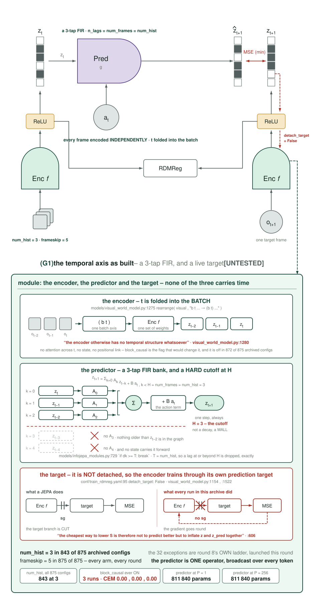

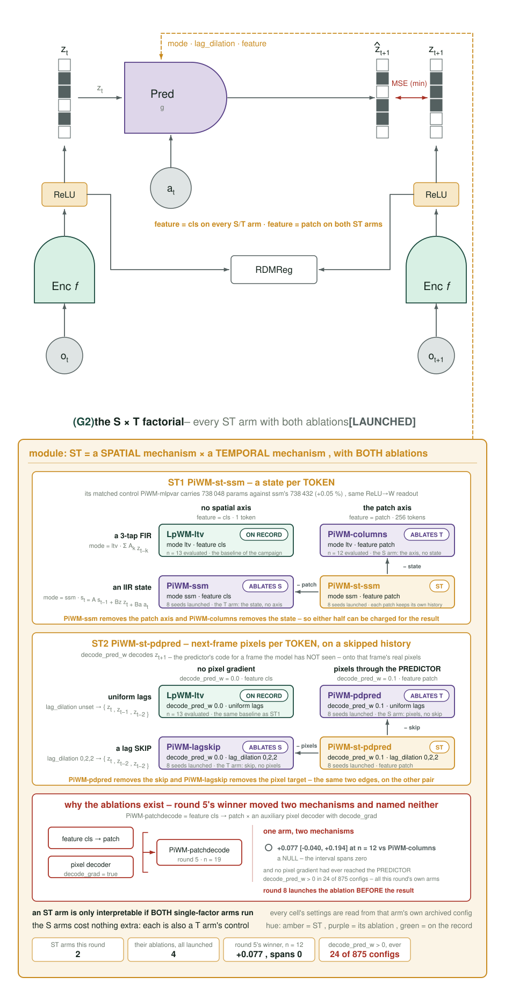

### T — temporal
| arm | mechanism | control |
|---|---|---|
| `hist1/2/5/8` | the **`num_hist` ladder** — `n_lags = num_hist`, so this is the FIR **order** of the dynamics. `H=1` reduces *exactly* to `additive`, so `hist1` doubles as a plumbing test. Distinct from `jump{K}`, which changed the *target horizon* and failed at every K. | `LpWM-ltv`, free |
| `detach` | `detach_target=true` — the stop-gradient a JEPA requires. **Zero new code**, never once contrasted in ~160 runs. | `LpWM-ltv`, free |
| `ema99` / `ema999` | **EMA teacher** — a target that moves *slowly* rather than not at all. Frozen deepcopy, updated after the optimizer step, excluded from every optimizer, and **registered in `_keys_to_save`** — without that it resets to the student at each 4 h window boundary. | `detach` + `LpWM-ltv` |
| `ssm` | the first predictor here carrying a **state**: `s_t = A s_{t−1} + Bz z_t + Ba a_t`, `z_{t+1} = W ReLU(C s_t)`. The IIR generalisation of `var`, whose own docstring calls itself *"state-augmentation"*. | **`mlpvar`** — 738,048 params against ssm's 738,432 (**0.05 %**), same ReLU→W readout |
| `lagmask25/50` | **lag masking** — zero one lag per sample. Structurally free: `_trunk` already drops unavailable lags and `A_k·0 = 0` exactly. Lag 0 is never masked. | mask-oldest, magnitude-matched |
| `lagskip` | read `{z_t, z_{t−2}, z_{t−2}}` — drop the adjacent frame. | `LpWM-ltv`, free |

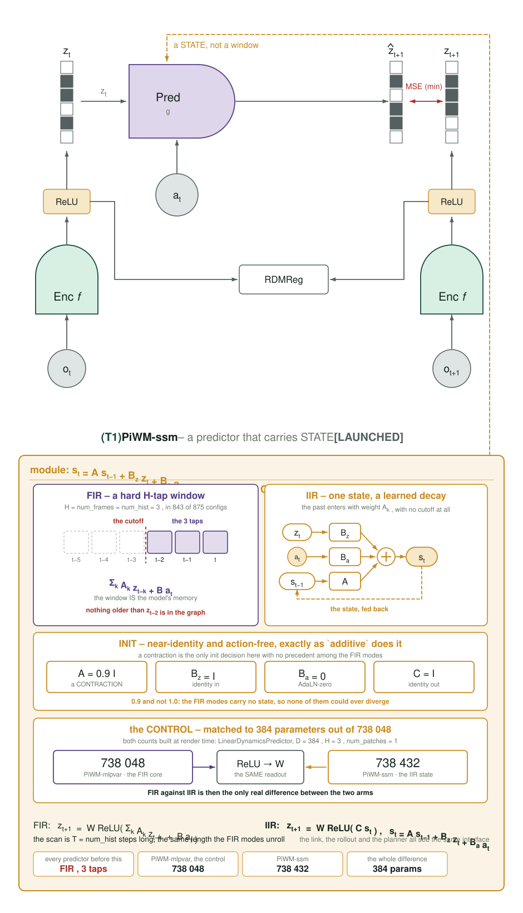

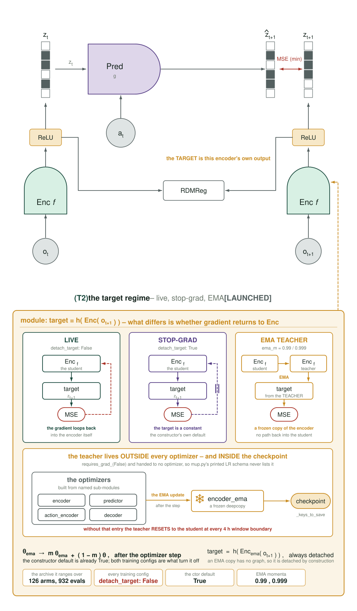

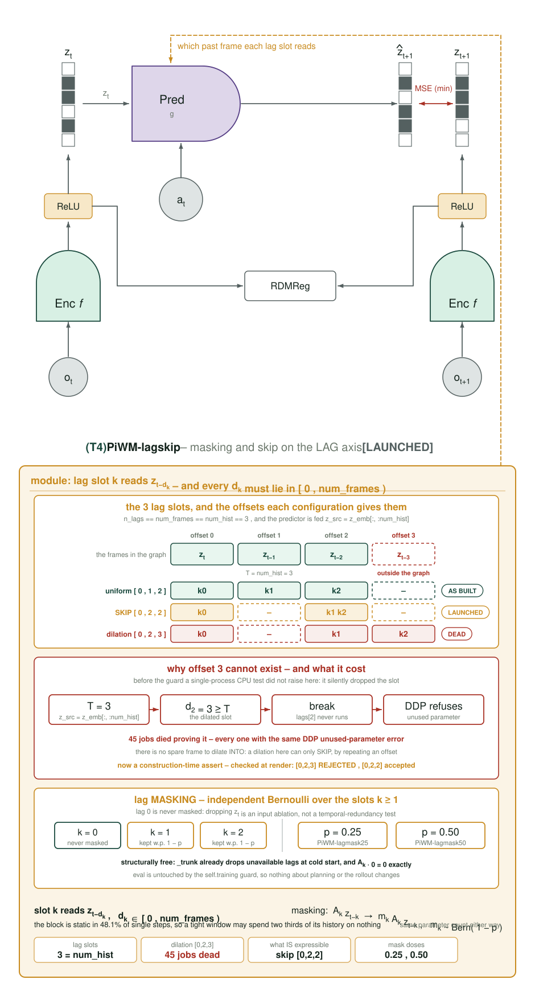

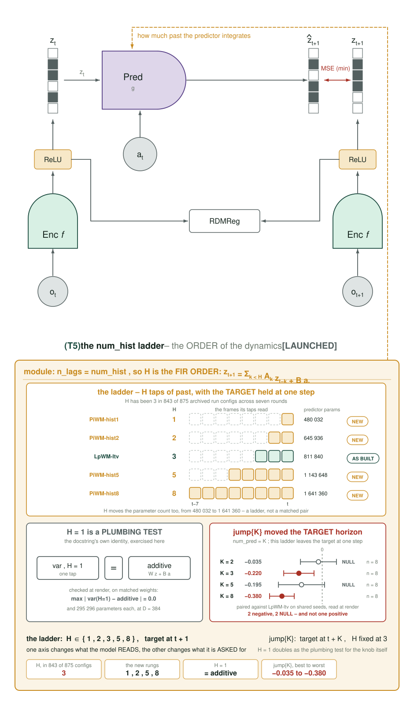

### S — spatial
| arm | mechanism | control |
|---|---|---|
| `pdpred` / `pdpred-w003` | **pixel gradient through the PREDICTOR.** `_forward_adaln` is the path every run takes and the only other code decoding `z_pred` is unreachable **and** `.detach()`ed — so in ~120 contrasts no pixel gradient had ever reached the predictor. Verified: `decode_pred_loss` alone reaches **11 of 17** predictor params including `lags.0/1/2`. | **`patchdecode`**, already evaluated on seeds 3–10, free and exact |

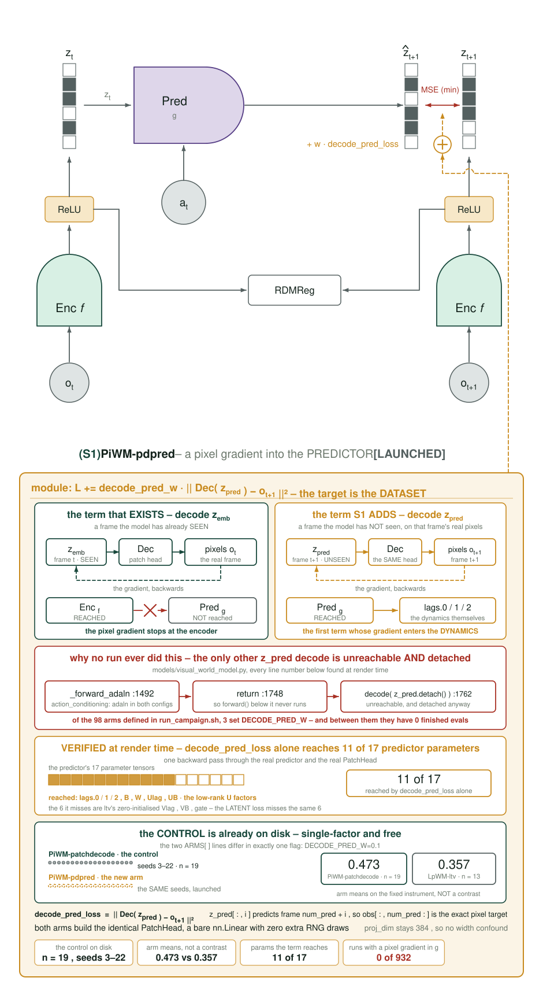

### ST — joint
| arm | spatial × temporal | ablated by |
|---|---|---|
| `st-ssm` | the state carried **per token** — each patch keeps its own history, against a predictor that is currently one operator broadcast over all 256 | `ssm` (no spatial axis), `PiWM-columns` (no state) |
| `st-pdpred` | per-token next-frame pixels **+ lag skip** | `pdpred`, `lagskip` |

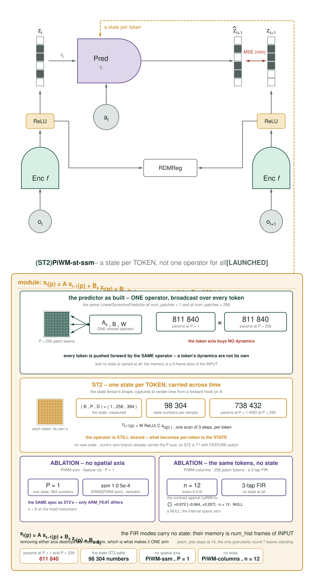

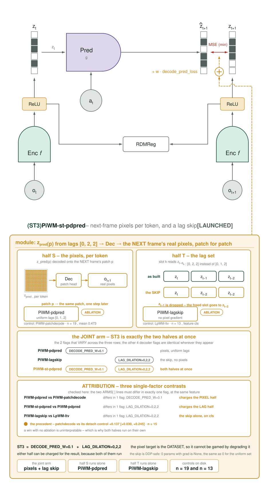

## 3. Two design faults found by building, not by thinking

**Dilation is not expressible here.** `PiWM-lagdil` at offsets `[0,2,3]` lost **all 45 jobs** to a DDP
unused-parameter error. `n_lags == num_frames == num_hist`, and the predictor is fed
`z_src = z_emb[:, :num_hist]`, so **T = 3 exactly** — an offset of 3 leaves `lags[2]` outside the
graph. *There is no spare frame to dilate into.* A single-process CPU test cannot see this: it
silently drops the slot. Now a **construction-time assert**, and the arm is a skip instead.

**A `train.py` edit took down every arm.** The EMA registration read `self.model` at line 546; the
model is built at 927. Because each chained window re-runs `train.py` from the working tree, a broken
`__init__` is not confined to new launches. Recovered by `--dependency=afterany`. Correct placement
came from asking the **AST** where the assignment ends, not from eyeballing it.

**And repairing that created duplicate chains.** The in-flight guard is *point-in-time*: re-running
the launcher while an old chain drains gives different answers minute to minute. Seeds ended up with
8–9 queued windows. The rule is now in the code: **cancel all, wait for zero, launch once.**

## 4. The six methods wave29 could not carry

Fifteen arms launched first. These six did not, and this section is each of them: what it is,
how it is built, what would falsify it. **All six are now implemented and launched at 8 seeds.**

The M2 gate originally held S2, ST4 and ST5 back — the argument being that 12 GPU-h on
existing checkpoints should decide whether ~500 more were worth spending. That gate was
**overridden deliberately**: a proposal with no number is not a comparison, and round 8's
purpose is to measure every method rather than argue about three of them. The gate's logic
still stands as economics; it was simply not what this round was for.

Figures: `analysis/round8_new_figs.py` → `diary/assets/2026-09-06/`, audit-clean (0 overlaps,
0 off-canvas, 0 frame crossings), every archive number read at render time.

### 4.1 T3 · `PiWM-tjepa` — predict the WINDOW, not the frame

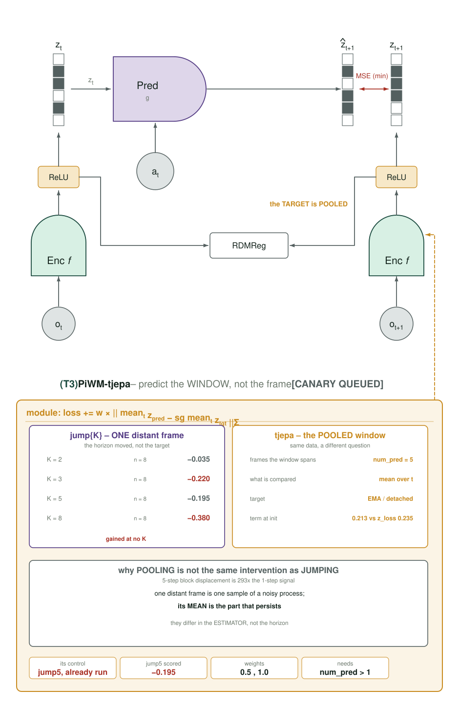

**The kernel it attacks.** T6/`jump{K}` moved the *target horizon* and lost at every K
(−0.035, −0.220, −0.195, −0.413). But a single distant frame is **one sample of a noisy
process**. Its *mean over a window* is the part that persists — and the campaign's own
pre-launch measurement puts 5-step block displacement at **293×** the single-step signal.
`jump{K}` and `tjepa` differ in the **estimator**, not the horizon.

**Implementation.** `models/visual_world_model.py`, ctor kwarg `tjepa_w=0.0`. `num_pred=K`
already yields K future frames (that is all `jump{K}` ever was), so no data-pipeline change is
needed. After the per-frame term, both `z_pred` and `target` — each `(b, num_hist, p, d)` —
are pooled over the **time** axis and compared:

```python
n_t   = min(z_pred.shape[1], target.shape[1])
s_pred = z_pred[:, :n_t].mean(dim=1)
s_fut  = target[:, :n_t].mean(dim=1).detach()
loss   = loss + self.tjepa_w * F.mse_loss(s_pred, s_fut)
```

Gated on `> 0`, so the default path is **bit-identical**. `target` is already EMA-or-detached
upstream, so no gradient path changes. This **adds** a term rather than replacing the
per-frame one, which makes the arm honestly *"one-step + summary"* rather than a pure summary
objective — stated because the distinction changes what a win would mean.

**Control.** `PiWM-jump5`, **already run** at −0.195: identical data, identical horizon, a
different estimator. **Falsifier:** if pooling does not beat `jump5`, the window carries
nothing the frame did not.

### 4.2 ST1 · `PiWM-st-tube` — one mask, contiguous in SPACE and TIME ✦ flagship

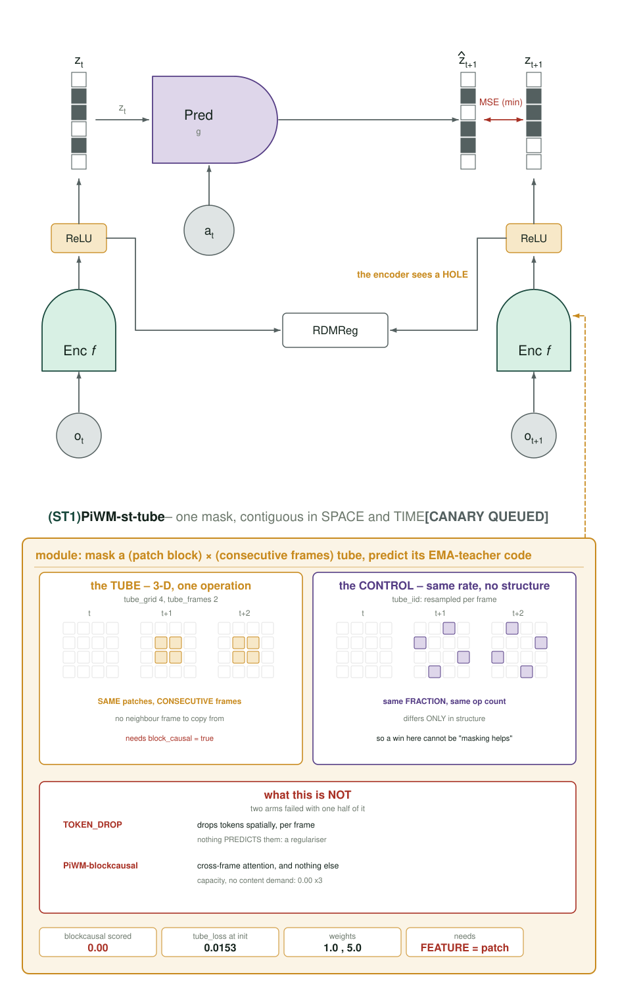

**The kernel it attacks.** Two arms already failed by supplying *one half* of this mechanism.
`TOKEN_DROP` drops tokens spatially, independently per frame, and **nothing predicts them** —
a regulariser, not an objective. `PiWM-blockcausal` turned on cross-frame attention with **no
objective demanding it be used** and scored **0.00 three times**. A tube is the missing
content demand for both axes at once: the mask is 3-D, so space and time are the *same*
operation rather than two terms bolted together.

**Implementation.** The tube is chosen in **patch** coordinates and blanked in **pixel**
coordinates, so the masked patch indices are exactly the block's — no approximate
pixel→token mapping, which is what lets the loss score precisely the tokens that were hidden.
`_tube()` returns `(masked_visual, patch_index, t0, dt)`; the student encodes the masked clip,
the EMA teacher (T2 rung 2) encodes the unmasked one, and the loss is taken **only at the
masked positions**, frame by frame. `block_causal=true` is required rather than decorative:
without cross-frame attention the hidden patches cannot be filled from neighbouring frames and
the tube degenerates into per-frame inpainting.

Masking in pixel space rather than inside the encoder is deliberate — it keeps the mechanism
out of the DDP-wrapped module, where per-forward state (`self._last_mask`) would have to be
read back through `.module` and would break silently under real DDP.

**Control — the reason the arm is interpretable.** `tube_iid=true`: identical masked
*fraction*, identical op count, identical RNG draw, resampled **independently per frame**. It
differs from the treatment in spatio-temporal **structure alone**, so a win cannot be
"masking helps" — only "a *tube* helps".
**Falsifier:** `st-tube` ≤ `st-tube-iid` ⇒ the structure is worth nothing and only the
regularisation was.

### 4.3 S3 · `PiWM-white-zt` — raise the rank the code USES

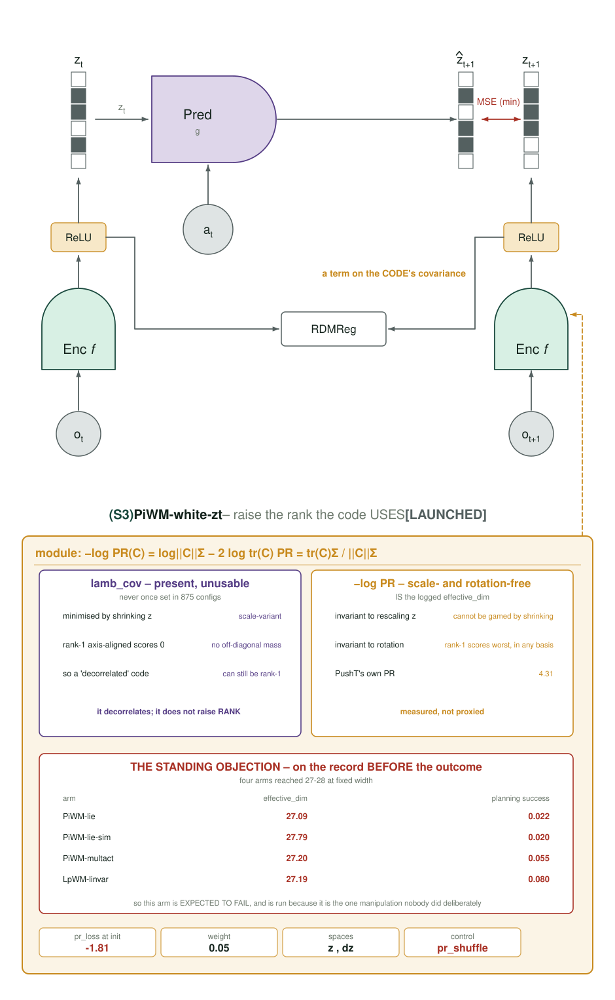

**The kernel it attacks.** The code's used rank is ~25 of 384. The term that already exists
for this, `lamb_cov`, is unusable and has **never once been set in 875 configs**: it is
minimised by shrinking `z`, and it scores a rank-1 *axis-aligned* code as perfect, because
such a code has no off-diagonal mass. It decorrelates; it does not raise rank.

**Implementation.** `_pr_loss(x)` computes `−log PR = log‖C‖²_F − 2 log tr(C)` using **the
same formula as `train.py:participation_ratio`** — so the optimised quantity *is* the logged
`sparsity/effective_dim`, not a proxy for it. Scale- **and** rotation-invariant, so neither
degeneracy exists. `pr_space` selects the code (`z`), its time-difference (`dz`) or both; `dz`
matters because a code can be high-rank across the dataset while every step of a trajectory
lies in one direction.

**Control.** `pr_shuffle=true` permutes each dimension's samples before the covariance:
same magnitude, same op count, same gradient path, same RNG draw, destroying only
cross-dimension alignment.

**On the record, before the result — this arm is expected to fail.** Four arms already reached
`effective_dim` 27–28 at fixed width (`lie` 27.09, `lie-sim` 27.79, `multact` 27.20, `linvar`
27.19) and planned at **0.022 / 0.020 / 0.055 / 0.080**, four of the worst numbers in the
campaign. `docs/measurement-protocol.md §4.1` records `effective_dim` as passing stages 2–3 of
the screen and **failing stage 4 on evidence already in hand**. It is run because it is the one
manipulation nobody has done deliberately, and because the **manipulation check** — does
`effective_dim` actually move? — must be read *before* the outcome: a term that cannot move its
own target is reported **inert**, not null.

### 4.4 S2 · `PiWM-wscore` — the plan-time metric

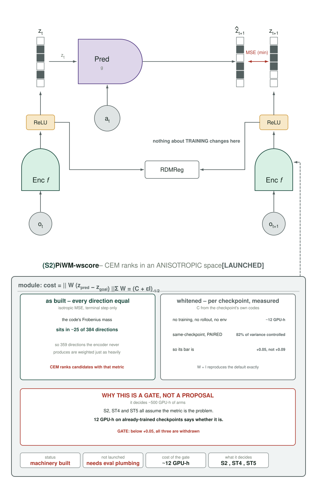

`planning/objectives.py` ranks CEM candidates by an isotropic MSE over all 384 latent dims, on
the terminal step only. The code's Frobenius mass sits in ~25 of them, so 359 directions the
encoder never produces are weighted exactly as heavily as the ones carrying the task.
`W = (C + εI)^(−1/2)` per checkpoint, measured on frames already on disk.

**Why it is a gate, not a proposal.** It runs on **already-trained** checkpoints, so the
contrast is same-checkpoint paired: the 82 % training-seed variance is fully controlled and its
bar is **+0.05** rather than +0.09. Twelve GPU-h decides whether ~500 more are worth spending.
**Verified:** `W = I` reproduces the default path exactly; whitening lifts PR 20.40 → 383.52 on
a synthetic code with the measured anisotropy. **Launched** at 8 seeds — which required
plumbing that did not exist: `plan.sh` had no way to pass hydra overrides at all, so no
objective change could reach the planner. That absence, not the science, is why M2 sat
unlaunched for two rounds.

### 4.5 ST4 · `PiWM-st-metric` — one weight over DIRECTION and HORIZON

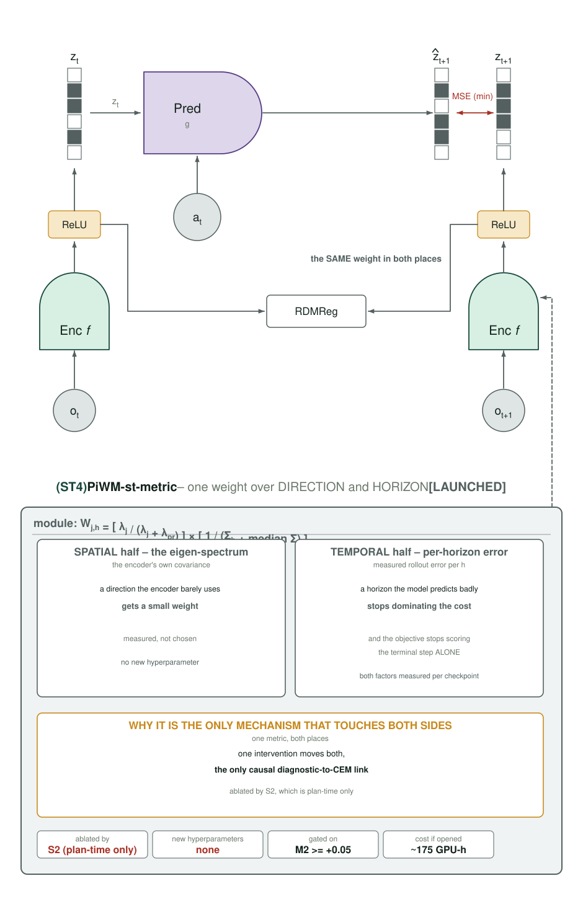

`W_{j,h} = [λ_j/(λ_j+λ_pr)] · [1/(Σ_h + median Σ)]`, applied to the residual in **both** the
training loss and the CEM objective. Spatial from the encoder's own eigen-spectrum, temporal
from the checkpoint's measured per-horizon rollout error — **both measured per checkpoint, so
there is no new hyperparameter.** The training loss and the CEM objective are the *same*
isotropic MSE in the *same* anisotropic space, so one intervention moves both: the only
mechanism found that connects a training diagnostic to the planner **causally** rather than
correlationally. Ablated by S2, which is plan-time only.

### 4.6 ST5 · `PiWM-st-goal` — a goal pooled over SPACE, scored over TIME

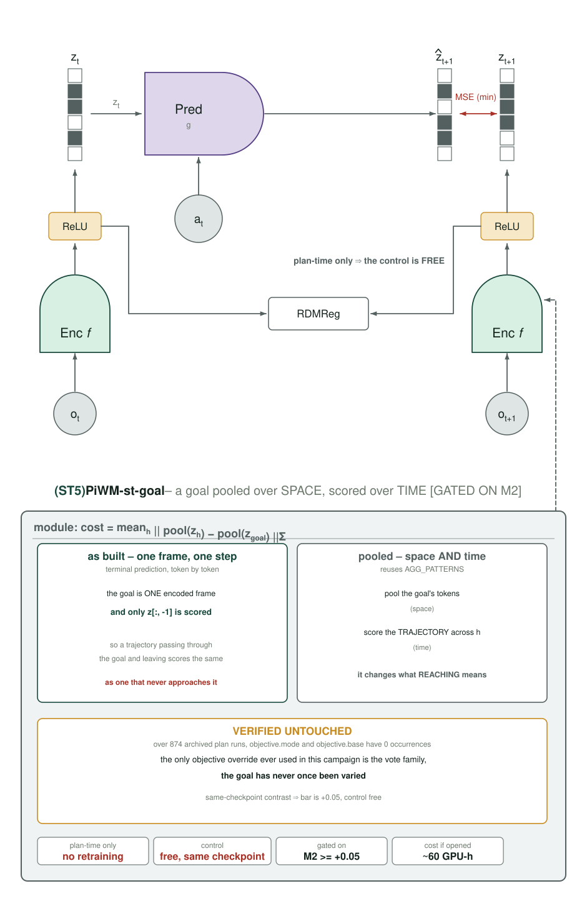

Today the goal is one encoded frame, scored token-by-token on the terminal prediction alone —
so a trajectory that passes *through* the goal and leaves scores the same as one that never
approaches it. Pooling the goal's tokens (space) and scoring the trajectory across `h` (time)
changes what "reaching" means on both axes in one edit, reusing `AGG_PATTERNS`.
**Verified untouched:** over **874 archived plan runs**, `objective.mode` and `objective.base`
have **0 occurrences**; the only objective override ever used is the vote family. Plan-time only ⇒ same-checkpoint control, free, bar +0.05.

## 5. What was verified, and what was not

Honest separation, because these are not the same claim.

| check | result |
|---|---|
| **bit-identical when every new knob is 0** | **yes** — `loss_trace` identical to 10 decimal places |
| each term moves the loss when enabled | yes — `pr_loss`, `tjepa_loss`, `tube_loss` all logged and active |
| each control differs from its treatment | yes — `pr_shuffle` ≠ `pr_w`, `tube_iid` ≠ `tube`, `dz` ≠ `z` |
| ST1 fails loudly at `feature=cls` | yes — asserts rather than broadcasting over a single token |
| new kwargs mirrored in `tests/lpwm_build.py` | yes — the NEW HEAD CHECKLIST item `path_int` skipped |
| **GPU path (DDP, bf16, real data)** | **verified** — all 8 canaries COMPLETED, after the fixes in §5.1 |
| full suite | **658 passed, 1 skipped** against the final code |
| plan-time variants get their own arm name | **verified** — `plan_outputs/*_PiWM-wscore_*` and `*_PiWM-st-goal_*` exist, so neither overwrites the `LpWM-ltv` eval it is scored against |

The weights are **measured, not chosen**, from one calibration on an *untrained* model:
`z_loss` 0.235, `pr_loss` −1.811, `tjepa_loss` 0.213, `tube_loss` 0.0153. These are **value**
parities at init, not gradient parities, and an untrained model is not a trained one — which is
why every arm carries a dose cell rather than resting on a single number.

**One reading hazard, recorded now rather than discovered later:** `pr_w` *lowers* the reported
total loss (0.285 → 0.195 at w=0.05), because `−log PR` is negative whenever PR > 1. The
gradient direction is correct — minimising `−log PR` maximises PR — but **total loss stops
being comparable across arms** for the `white-*` family.

### 5.1 Four faults the GPU found that CPU testing could not

Every one of these passed bit-identity, passed the suite, and still failed on a node. They
are recorded because the pattern — *CPU-green code that dies on real hardware* — is the one
this campaign keeps paying for.

**ST1 ran out of memory.** The canaries died at 10:43 with `tube_loss` already logged at
0.166, so the mechanism was correct and only its footprint was not. Two causes, one of them
purely my error: the tube block **recomputed the EMA teacher's encoding that was already
computed upstream for the target**, making four encoder passes per step at 256 patch tokens ×
3 frames × batch 64. The other is inherent — the masked student forward stores activations
for backprop. Fixed by reusing the teacher's code and adding `tube_sub=16`, which subsamples
**only the tube term**: shrinking the global batch would have confounded `st-tube` against
every other patch arm, whereas this leaves `z_loss` and `reg_loss` identical to them, makes
only the tube estimate noisier, and has the control draw the same slice.

**A job exited 0 having done nothing.** `wscore_weights.py` called `load_model(run, "latest")`,
a signature that has not existed for some time. Its own `except Exception → SKIP` — written so
one broken checkpoint could not stop a sweep — reported the `TypeError` as a skipped run, and
the job **succeeded with zero matrices written**. That defeated the `--dependency=afterok`
guard entirely and let eight evals through to fail on the missing files. *A tolerant handler
that converts a broken call into a clean exit is worse than a crash.* The script now exits
non-zero when it writes nothing.

**Two path/dtype faults.** `runs/probe_cache.pt` stores frames as fp16 while a restored model
keeps fp32 weights; and `wmat_path` was relative, while hydra chdirs into the run directory
before the objective is built, so it resolved under `plan_outputs/` and was not found.

**What the guards were worth.** `afterok` is why the first S2 failure produced *no data* rather
than eight plausible wrong numbers: without a matrix the objective would have silently fallen
back to the unwhitened path, and the arm would have been an undetectable duplicate of its own
control. `afterany` would have hidden that completely.

## 6. Cost

16 arms × 8 seeds ≈ **930 GPU-h**, most controls already on disk. Round 8's new gate
`wave30` adds 8 arms; `columns` was extended from 12 to 16 seeds so the dimension-matched
`patchdecode` contrast is not capped at 12 while its treated arm runs to 20.

## 7. Status

Launched and self-running: autopilot over all 16 arms, a failure monitor that flags `TIMEOUT` only on
a **last** window or a non-windowed eval (a non-final window timeout is the normal path —
**517 w1 timeouts against 542 w3 completions** in this archive), and gated launchers that fire only
on a green suite (**658 passed**).

**Not launched, and it is the strongest lead in the archive:** wide-training stability. See
[2026-09-05 §9.7](2026-09-05.md) — among runs that train, width gives **0.357 → 0.493 → 0.647**, but
**2 of 8 seeds at 6,144 collapse**, and `d2048-hilr` at the base learning rate is **5/5 collapsed**.
The constraint is optimisation, and the knobs are config, not code.
