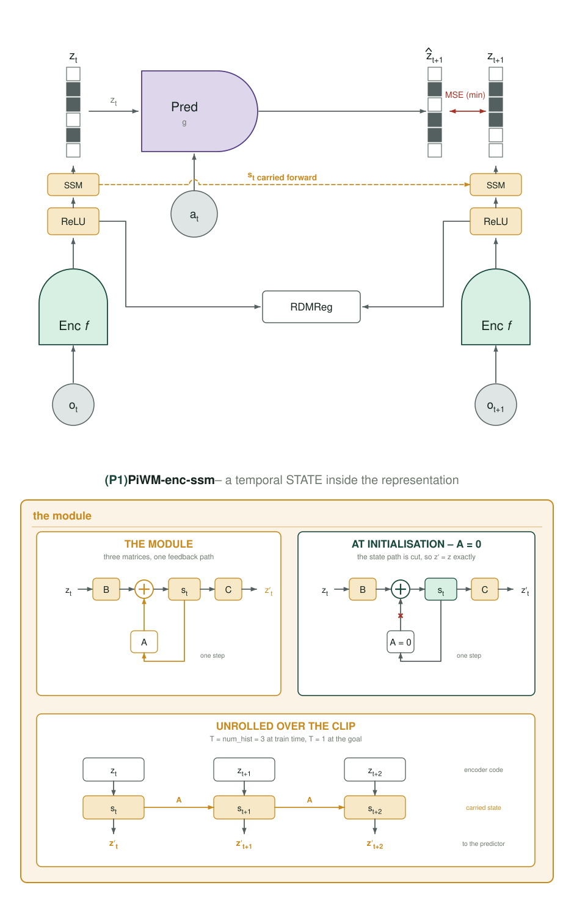
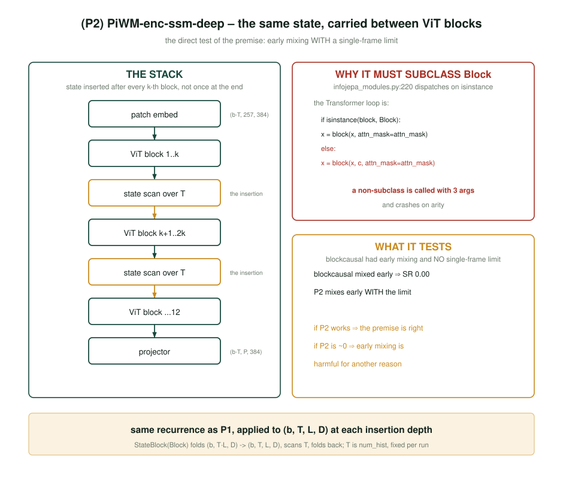
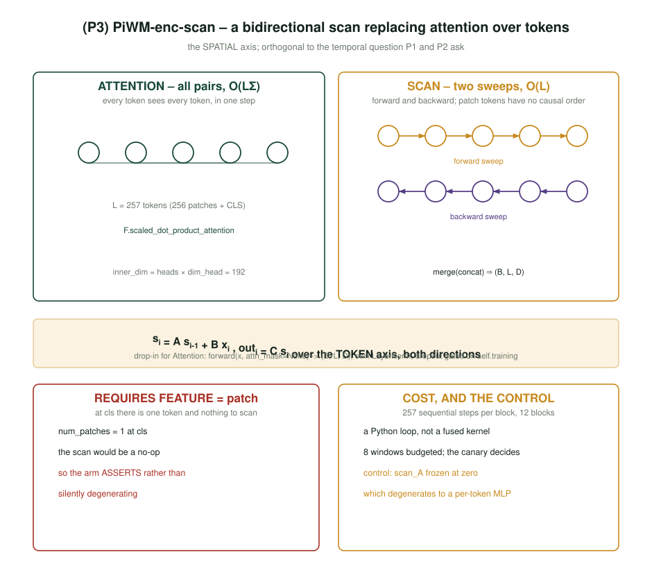
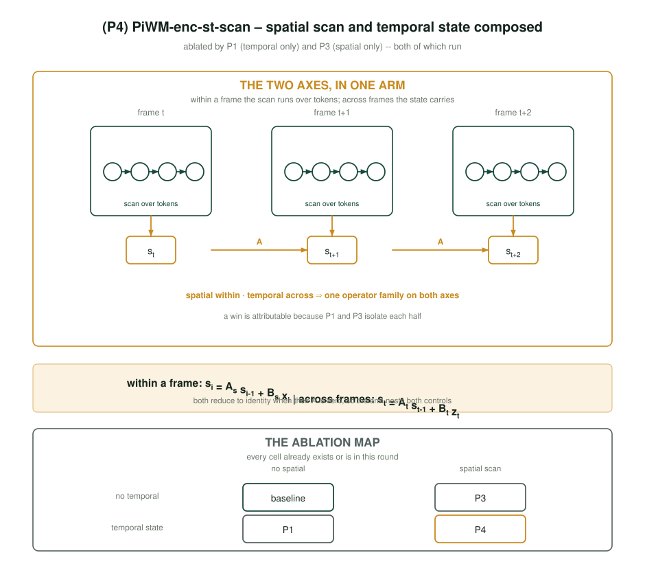
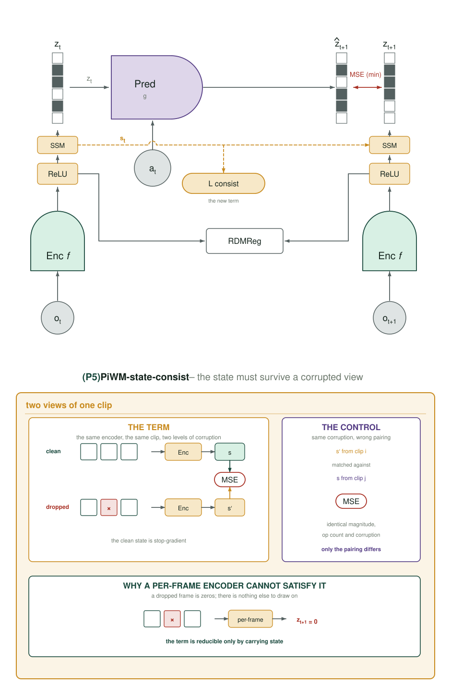
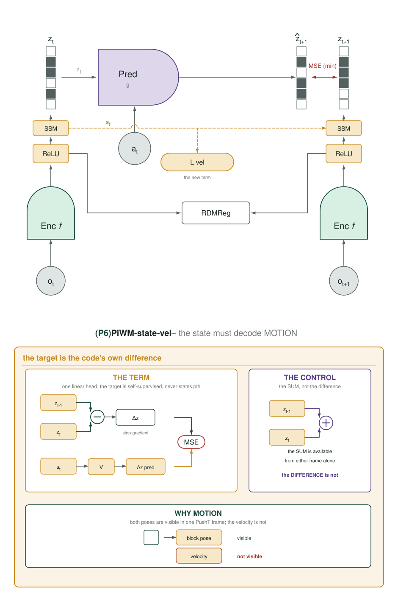
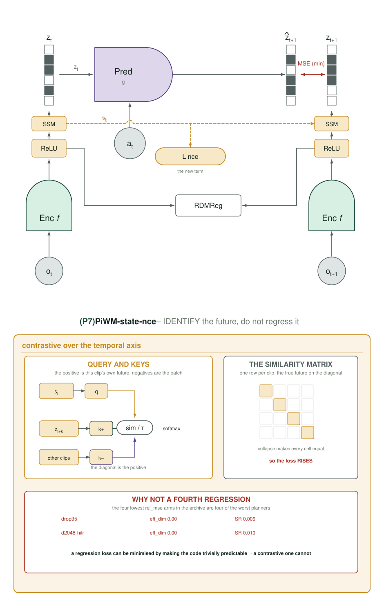

# Round 9 — a state-space encoder, and the target drift that decides it

> **Read `README.md` first.** `docs/measurement-protocol.md` is binding except where this
> document explicitly overrides it, and every override is named in §6.

## 0. The premise: one archived arm was filed under the wrong lesson

`PiWM-blockcausal` is recorded in `2026-09-06 §0` as *"`block_causal` off everywhere;
`PiWM-blockcausal` scored 0.00, 0.00, 0.00 at n = 3"*, and every round-8 proposal treated that
as **"encoder-side temporal structure fails."**

It is not what happened.

| | `effective_dim` | `rel_mse` | planning SR |
|---|---|---|---|
| `PiWM-blockcausal` | 25.0 – 26.5 (**healthy**) | **0.0012 – 0.0044** | **0.00 ×3** |
| `LpWM-ltv` baseline | 25.9 | 0.0098 | 0.357 |

The arm did not collapse. Its code stayed full-rank and it fit one-step prediction **2–8×
better than the baseline** while planning at exactly zero.

**And it is not simply "low error is bad."** Ranking all 96 arms that have both numbers, the
five lowest `rel_mse` are the five worst planners — but four of them are explained by a dead
code, and one is not:

| arm | `rel_mse` | `effective_dim` | `block_causal` | SR |
|---|---|---|---|---|
| `PiWM-drop95` | 0.00000 | **0.00** | false | 0.006 |
| `LpWM-ltv-d2048-hilr` | 0.00000 | **0.00** | false | 0.010 |
| `PiWM-white-dz` | 0.00082 | 14.31 | false | 0.010 |
| `PiWM-white-zt` | 0.00110 | 12.33 | false | 0.013 |
| **`PiWM-blockcausal`** | 0.00155 | **25.04** | **true** | **0.000** |
| `LpWM-ltv` | 0.00919 | 24.10 | false | 0.357 |

A constant code is trivially predictable, so `drop95` and `d2048-hilr` reach zero error by
being rank-0, and the `white-*` pair by halving their rank. **`blockcausal` is the only arm in
the archive with near-perfect fit, a fully healthy full-rank code — 25.04, *above* the
baseline's 24.10 — and exactly zero success.** Pooled across arms, lower error does predict
higher success (ρ = **−0.641**, p < 1e-4), which makes `blockcausal` an outlier against the
archive's own trend rather than an instance of it.

That is a **dissociation**, and it has a mechanical cause. An earlier draft of this section
named the wrong one, so both are recorded here — the retraction matters more than the claim.

### 0.1 What the first draft said, and why it was wrong

The draft argued: training encodes clips of `T = 3`, `plan.py:230-232` gives the goal a time
axis of **one**, and under `block_causal` every frame attends to earlier frames — so `z_goal`
is *"an object the model never produced during training."*

**Measured on the checkpoint that produced the 0.00s, that is false.** Under
`_block_causal_mask` a frame-0 token may attend only to frame-0 tokens, at every layer, so
`forward_temporal(x, T)[:, 0]` is the same computation as `forward(x_0)`. It is not
approximately equal — it is the same expression. On 32 real pushT frameskip-5 windows through
`PiWM-blockcausal_pd384_bf16_s4`:

| | relative gap `‖clip[:,t] − solo[:,t]‖ / ‖solo[:,t]‖` |
|---|---|
| **t = 0 (the goal's position)** | **0.000001** |
| t = 1 | 0.922 |
| t = 2 | 0.950 |
| t = 3 | 1.010 |

The goal was never the broken object. It was exactly the code the model produces for a single
frame, which is what the planner needs.

### 0.2 What actually broke: the targets

`z_tgt = z_emb[:, num_pred:]` — frames 1, 2, 3 — are the codes the predictor is trained to
emit. Those sit ~1.0 relative units from their own single-frame codes, and in absolute terms
the drift is **larger than one real transition**:

| distance, linked space, same 32 windows | mean L2 |
|---|---|
| clip-vs-solo at t ≥ 1 (**the training target's drift**) | **65.4** |
| between CONSECUTIVE frames (one real transition) | 56.7 |
| between UNRELATED clips | 77.8 |

So the predictor learned to emit **history-conditioned** codes, and CEM scores it against a
**history-free** goal. The cost is dominated by a systematic offset that no action sequence can
remove — the rollout is being asked to travel to a region the goal encoding never occupies.
Success 0.00 is the correct outcome of a well-fit model whose training target and evaluation
target are different objects. Both readings agree the arm was mis-filed; they disagree about
which end broke, and the measurement settles it.

### 0.3 What round 9 therefore has to do

**A well-defined single-frame limit is necessary but NOT sufficient — `block_causal` already
had one.** The quantity that decides a stateful encoder is how far its own `t ≥ 1` codes drift
from their single-frame limit. So:

1. The state enters as a **zero-initialised residual**, `out_t = z_t + C s_t` with `C = 0`.
   The drift is then a *learned, measured* quantity rather than a fixed property of the
   architecture: it starts at exactly zero and grows only if the loss pays for it.
2. That drift is a **first-class instrument**, `enc_state_gap`, emitted every step by every
   stateful arm and **read before the success rate** (§6). It is the same number measured
   above, and it costs one extra `C(Bz z)` on a tensor already in hand.
3. Because the state computes nothing extra at plan time (§0.4), the objectives P5–P7 carry
   more of the round's weight than the placements P1–P4 do.

### 0.4 The encoder state is a training-time scaffold

`plan.py:230-232` expands **both** `obs_0` and `obs_g` to a time axis of exactly one, and
`planning/cem.py:77` encodes the goal from that; every later latent comes from the
**predictor**. So at plan time the encoder is called twice, each on a single frame, and the
recurrence has nothing to recur over.

**Whatever P1–P4 buy, they buy by shaping the shared per-frame weights**, not by computing
anything extra during planning. This is not a defect to be fixed — it is the honest scope of
the intervention, and it is the strongest argument for §2A: if the state exists only at
training time, the only way it can pay is by forcing the per-frame map to encode more.

## 1. What the state is *for*

PushT and Wall are both **nearly fully observed** — block, agent, wall and door are all visible
in a single frame. The textbook justification for a temporal encoder (build a belief state for
a POMDP) therefore has almost nothing to work on, and asserting it would repeat the `d_action`
and `effective_dim` mistake: a mechanism the environment cannot exercise.

So round 9 makes the condition it needs, and tests two claims:

**Claim A — denoising.** The state integrates the encoder's own per-frame noise. Predicts a
small uniform gain, present at every corruption level including zero.

**Claim B — belief state.** The state infers what the current frame does not show. Untestable
in either environment as shipped, so it has to be *manufactured*: P5 corrupts a second view of
the clip and asks the state to survive it, and P6 asks the state to decode the one quantity a
single frame provably lacks — motion.

**In this launch the two are separated by P5/P6 rather than by a dose ladder.** A ladder over
`sinv_p` is the sharper instrument and is still the right follow-up, but at n = 3 (§6) a
three-rung slope is not resolvable, and the corruption had to move into the model before a
ladder was even implementable (§3). What this launch can say is narrower and honest: whether
*any* objective on the state moves the success rate, and whether each objective moves **its own
target** — which §2A.4 requires to be read first, and which is measurable at n = 3 because it
is a training curve rather than a 3-sample mean.

## 2. Where the state lives — four placements

**All four are BUILT.** `models/enc_state.py` holds the two operators; the encoder gains five
ctor kwargs; `models/mup.py` re-applies the deliberate init. Every claim below is asserted in
`tests/test_arms.py` (`r9/*`), not merely intended.

### 2.0 The contract, and the two traps that nearly broke it

The diary's first draft asked for `A = 0, Bz = C = I`, arguing that reproduces today's
encoder. It does — but only at init, and only for that one triple. The **residual with a
zero-initialised readout** is strictly stronger and splits into two separately checkable
claims:

```python
s_t = A s_{t-1} + Bz x_t          # models/enc_state.py::TemporalState
out_t = x_t + C s_t               # RESIDUAL, C = 0 at init
```

| claim | what it buys | test |
|---|---|---|
| **`C = 0`** | `out == x` **bitwise** (adding an exact zero is exact in IEEE), so the arm is bit-identical to the baseline at step 0 | measured: baseline / P1 / P1-frozen / P2 all give loss **0.2784** on the build fixture |
| **`A = 0`** (frozen control) | `out_t` is a **per-frame** function of `x_t` for **every** t, at every point in training — not only at init | `test_r9_frozen_A_is_per_frame_for_every_t_not_only_at_init` |

The second is what makes the frozen arm a *control* after eight hours of gradient steps
rather than a control at step 0 only.

**Trap 1 — `mup_init_` destroys the init.** `models/mup.py:146-154` re-initialises every
`nn.Linear` to `N(0, 1/√fan_in)` and `train.py` calls it on the encoder, so a `C = 0` written
in the constructor does not survive construction. Fixed by a re-apply branch in the same loop
that already serves `ConditionalBlock` and `LinearDynamicsPredictor`; the printed schema now
carries `state.C.weight  deliberate  zeros`. **Verification runs after `mup_init_`, not after
`__init__` — they are different moments and only the first ships.**

**Trap 2 — and this one was invisible until it was measured.** Fixing trap 1 was *not*
enough. `mup_init_` draws from the **global** RNG stream, so its generic pass consumed three
384×384 normal draws for `A`, `Bz`, `C` before overwriting them — shifting every parameter
initialised after. `PiWM-enc-ssm` came out at step-0 loss **0.2276** against the baseline's
**0.2784**: the arm would have differed from its control by the state *and* by the entire
tail of the init, which is more than one factor. Deliberately-initialised modules are now
skipped in the generic pass, and the arm sits exactly on 0.2784. Only the **new** module type
is skipped — `ConditionalBlock` and `LinearDynamicsPredictor` also draw-then-overwrite, but
every checkpoint and fixture in the archive was produced that way.

**A consequence of the zero-init, recorded rather than discovered later:** since `out = x + C s`
and `C = 0`, we have `dL/ds = Cᵀ dL/dout = 0`, so at step 0 **only `C` takes gradient**; `A`
and `Bz` begin moving once `C` leaves zero. That is the AdaLN-zero behaviour this repo already
relies on, and it is why the state cannot perturb the encoder before the loss asks it to.

Naming: `A / Bz / C` under `state.*` and `scan_*` avoid every substring in `mup.py`'s
`_INPUT_WEIGHTS` (`:55-64`) and `_EMB_KEYS` (`:34`), both of which match on `in`, not `==`.

### 2.1 P1 · `PiWM-enc-ssm` — a temporal state after the per-frame encoder



The recurrence is the predictor's own `ssm` trunk (`infojepa_modules.py:695-708`) **minus the
action term**, including its zero cold start — which that code documents as *"A · 0 = 0
exactly, so no lag is silently invented."* One deliberate divergence: the predictor inits
`A = 0.9·I` (a contraction) and so does this, but the **readout** is zero rather than identity,
for the bit-identity reason above.

`ViTEncoder.forward` is split so the single-frame limit is free to every existing caller:

```python
def forward(self, x):                    # models/vit_encoder.py
    z = self._forward_frames(x)          # today's body, verbatim
    if self.state is not None and self.enc_ssm_depth is None:
        z = self.state.solo(z)           # == forward_state(x, T=1); A(0) = 0 exactly
    return z
```

That matters practically: `analysis/latent_probe.py`, `analysis/wscore_weights.py`,
`analysis/probe_cache.py` and `train_energy.py` all call `forward()` and now get the right
object with **no mirror obligations**. `VWorldModel._encode_visual` gains one branch beside
the `block_causal` one, with the same DDP-unwrap rationale.

**Control `PiWM-enc-ssm-frozen`** — `A = 0`, `requires_grad_(False)`. Identical parameters,
op count and RNG draw; the single factor is whether information can cross a frame boundary.

### 2.2 P2 · `PiWM-enc-ssm-deep` — the same state between ViT blocks



The draft proposed passing `block_class`. **That is wrong**: `block_class`
(`infojepa_modules.py:183`) constructs *every one* of the `depth` layers from the same class,
so a stateful `block_class` makes all twelve stateful — a different method, twelve times more
expensive. The draft's second claim, that `T` can be passed at construction because it is
`num_hist`, is wrong twice: the encoder's `T` is `num_hist + num_pred` = **4** at train time
and **1** at plan time.

Both are solved by a hook rather than a class. `Transformer.forward` gains
`mid_hook`/`mid_at`, defaulting to `None`, so no branch is taken and no RNG is drawn for any
existing caller; the encoder closes over the live `T`:

```python
def _hook(h):
    h, self._last_state = self.state(h, state_T)     # T is in scope, per call
    return h
x = self.transformer(x, mid_hook=_hook, mid_at=self.enc_ssm_depth)
```

**This is the placement most likely to fail, and that is why it is here.** It is
architecturally closest to `blockcausal`. §0 now says the goal was never the problem, so if P2
also plans at ~0 while `enc_state_gap` is large, the target-drift diagnosis is confirmed
directly.

**P2 ships with `enc_state_rms` but not `enc_state_gap`** — its state lives inside the stack
in `dim` space, so recovering its single-frame limit means re-running the blocks above it once
per frame. Stated rather than hidden; P2's gap is read offline.

### 2.3 P3 · `PiWM-enc-scan` — a bidirectional scan over tokens



`ScanBlock(Block)` replaces only `self.attn`, so norms, MLP and residuals are untouched and
the parameter delta is exactly attention→scan. It calls `nn.Module.__init__` directly rather
than `super().__init__()`: `Block`'s constructor would allocate an `Attention` we discard,
which both wastes the parameters and — because it draws from the global stream — shifts every
later draw.

**Two corrections to the draft.** (a) It claimed the arm requires `FEATURE=patch` because
"at `cls` `num_patches` is 1 and there is nothing to scan." False: `feature` selects the
*output* token (`vit_encoder.py:167`), and the transformer runs over all 257 tokens either
way. (b) It claimed the scan cannot be parameter-matched to attention. Measured at D = 384,
heads = 3, dim_head = 64: **296,832 against 296,064** — the 768 difference is exactly the two
decay vectors.

**The cost, which is the real risk, and how it is avoided.** A dense transition forces a
257-step Python loop per block × 12 blocks ≈ 3,000 sequential autograd steps per forward. Both
closed forms fail: materialising the per-channel kernel `K_ij = a^{i−j}` costs `b·D·L²` ≈
6.5e12 FLOPs, roughly 20× attention's ≈3.2e11; and the cumulative-sum-with-division form needs
`a^{-n}`, which overflows exactly where `a^n` underflows. So **`a` is diagonal** (a length-D
vector, S4D/Mamba style) and the scan is **chunked**: chunk 32, intra-chunk by a materialised
(32, 32, D) kernel, and only ⌈257/32⌉ = **9** sequential steps across chunks. The kernel is
built by `cumprod`, so it is sign-correct for negative `a` and every entry has |K| ≤ 1 — there
is no division anywhere.

`a = tanh(scan_a)` with `scan_a = 0` gives **a = 0 exactly**, so the frozen control is a
per-token MLP and the treatment starts there. Measured: P3 and P3-frozen both give 0.2813 at
step 0, and diverge only as `scan_a` trains. The contrast is therefore **token mixing**, not
"scan vs attention" — that one is confounded by attention's `to_out` fan-in of 192, which
draws 2× `base_lr` under muP.

### 2.4 P4 · `PiWM-enc-st-scan` — the two composed



`ENC_SCAN=true ENC_SSM=true`; no new code. Its control freezes **both**, so it nests P1's and
P3's controls, and a win is attributable to the composition rather than to either half.

## 2A. What the state is *made* to do — three objectives

**P1–P4 change architecture and nothing else.** The state is built, then trained only by the
objective that already exists: a one-step latent MSE plus RDMReg. **Nothing in the loss
requires the state to carry anything.** That is precisely the failure mode this archive has
recorded twice:

| arm | what it added | what demanded it be used | result |
|---|---|---|---|
| `PiWM-blockcausal` | cross-frame attention | nothing | **0.00 ×3** |
| `TOKEN_DROP` | tokens dropped per frame | nothing predicts them | a regulariser, not an objective |

§0.4 sharpens this: the encoder state computes **nothing extra at plan time**, so the only way
it can pay is by forcing the shared per-frame weights to encode more. P5–P7 supply that
demand. All three are **images and proprio only** — `states.pth` enters none of them — and all
are inert at weight 0.

They are deliberately *different kinds* of objective — a consistency loss, a regression loss
and a contrastive loss — so that if all three fail, "give the state a job" is refuted broadly
rather than for one choice of job.

### 2A.0 One decision that removed most of the plumbing

**All three act on `z_emb`, not on `s`.** `forward_state` returns `x + C s`, so the model never
separately sees `s` on the planner's path, and exposing it would mean either a tuple return
through `_encode_visual`'s three call sites or stashing state on the module — fragile under
DDP. But `u_emb` is the raw encoder output and `z_emb = self._link(u_emb)`, so under P1
`z_emb[:, t]` **is** a linear readout of `s_t`. A linear head composed with `C` is still a
linear head: every claim survives verbatim, and nothing new crosses into `planning/cem.py`.

It also **strengthens** the three. Defined on `z_emb`, each is well-formed with or without a
state, so each gets a no-state control for free — on the stock per-frame encoder P5 is
unsatisfiable by construction and P6 has no motion to decode.

### 2A.0b Weights are measured, not chosen

Calibrated on **32 real pushT frameskip-5 windows** through an untrained model — not on
`tests/lpwm_build`'s synthetic batch, whose iid-noise frames make a *temporal difference*
meaningless. Measured at init:

| | value at init | z_loss | parity weight | shipped |
|---|---|---|---|---|
| `sinv_loss` | 0.1035 | 0.2231 | 2.16 | **`SINV_W=2.0`** |
| `vel_loss` | 1.0000 | 0.2231 | 0.223 | **`VEL_W=0.25`** |
| `nce_loss` | 1.6094 ( = log 5) | 0.2231 | 0.139 | **`NCE_W=0.15`** |

All three are scale-free by construction, which is why they land near 1 and why one dose grid
covers them.

### 2A.1 P5 · `PiWM-state-sinv` — the state must survive a corrupted view



**The key is `sinv_w`, not `consist_w`.** `consist_w` is already taken
(`conf/train_rdmreg.yaml:193`) by R2's rollout self-consistency term; reusing it would have
silently added this loss to that one. `sconsist_w` and `state_consist_w` were rejected too —
both *contain* `consist_w` as a substring and would poison every future grep and sed on the R2
family.

Encode the clip twice, once clean and once frame-dropped, through the **same** encoder; the
corrupted state must match the clean one (stop-gradient). A per-frame encoder cannot satisfy
it — a dropped frame is grey and there is nothing else to draw on — so the term is reducible
only by carrying state.

```python
_vd, _ = self._frame_drop(obs["visual"][:_nb], self.sinv_p)
_, s_drop = self._encode_variant(_vd, want_state=True)     # 2nd STUDENT pass
sinv_loss = ((s_drop[:, 1:] - s_ref[:, 1:]).pow(2).mean()
             / s_ref[:, 1:].pow(2).mean().clamp_min(1e-8))  # SCALE-FREE
```

The denominator is not cosmetic: without it the term is minimised by **shrinking the state**,
which is a collapse rather than an invariance.

**The corruption applies only to P5's second view — never to the clip the main loss encodes**,
and that is a correction to §3 (below). At `num_hist=3, num_pred=1` the inputs are frames 0–2
and the *targets* are frames 1–3, so every droppable frame is also a target: a corruption on
the main path would train the model to predict the code of a grey image, and the arm would die
for a reason unrelated to the state. Frame 0 is never dropped — it is `z_src[:, 0]` and the
planner's `obs_0`.

**Control `PiWM-state-sinv-shuf`** pairs against a different clip in the batch — same
corruption, same op count, only the pairing wrong. Implemented as `roll(1)`, **not** a random
permutation: a permutation has fixed points, and every clip it maps to itself is a treatment
pair sitting inside the control. Roll also draws no RNG, so it cannot shift the global stream.

**Read with the outcome:** cross-clip matching is minimised by a *constant* state, so this
control carries a collapse pressure the treatment does not. `sinv_state_std` is emitted for
exactly this reason; if it collapses relative to the treatment, the arm is not a control.

**Cost.** A second **student** encode with activations — the thing that OOMed the ST1 canaries.
`SINV_SUB=16` subsamples this term's batch only, mirroring `tube_sub`, so `z_loss` and
`reg_loss` stay comparable to every other arm and the control draws the same slice.

### 2A.2 P6 · `PiWM-state-vel` — the state must decode what one frame cannot show



A single PushT frame shows both poses; the one quantity provably absent from it is **motion**.
So require the code's own inter-frame difference to be linearly decodable. The target is
detached — an undetached difference is minimised by a constant code, which is exactly the
pathology of the archive's four lowest-`rel_mse` arms.

**The draft called this "the cleanest control in the round." Measured, it was the dirtiest.**
On the same 32 real windows through an untrained model:

```
E[dz²]  = 0.000013        E[(z_t + z_{t-1})²] = 0.823011        ratio = 2e-5
```

At a common `vel_w` the **control** would have carried **~65,000×** the treatment's dose, so
`vel` vs `sum` would have compared two doses, not two contents. Both targets are now divided
by their own second moment, so both terms are exactly **1.0000 at init** (verified on pushT
*and* wall) and the contrast is content alone.

The head is **zero-initialised** — the AdaLN-zero / LTV-`U=0` convention this repo uses
throughout. Two reasons: a default-init head maps a large input to a small target and starts
the term at ~113, swamping `z_loss = 0.223`; and zero-init makes `vel_rel` exactly 1.0 at init,
so the manipulation check reads directly — **1.0 means "no better than predicting zero"**,
i.e. the code carries no motion and the arm is inert whatever its success rate says.

**Control `PiWM-state-sum`:** identical head, identical shapes, identical normalisation, target
`z_t + z_{t−1}`. The sum is recoverable from either frame alone; the difference is not.

### 2A.3 P7 · `PiWM-state-nce` — identify the future, do not regress it



**Why this is not a fourth regression.** §0's table is the argument: a regression loss can be
minimised by making the code trivially predictable — `drop95` and `d2048-hilr` reached zero
error at `effective_dim` **0.00** and planned at 0.006 / 0.010. A contrastive loss cannot be
lowered that way: if the code collapses, the negatives become indistinguishable from the
positive and the loss goes **up**. It is the only objective in this round that is structurally
collapse-resistant, which is exactly the pathology §0 is about.

**Reuses V2's machinery rather than duplicating it.** `_action_infonce` itself cannot be reused
— its negatives re-run the *predictor* with permuted actions, a different axis — but three
things are taken verbatim: `_action_negatives` (given a strictly additive `k=None` parameter,
so V2 stays bit-identical); the scale-free temperature `tau = E.detach().mean().clamp_min(1e-8)`,
whose docstring records that **the term is inert without it**; and the
`stack → −E/τ → flatten → cross_entropy(·, zeros)` idiom.

**Control `PiWM-state-nce-shuf`** draws the positive from a wrong in-clip offset, preserving
the contrastive form and destroying only the temporal alignment. It rolls by a **non-zero**
offset so the "wrong" positive is never accidentally the right one.

Measured at init: `nce_loss = 1.6094 = log 5` exactly, i.e. chance with 4 negatives, and
`nce_acc ≈ 0.23` against chance 0.20.

### 2A.4 What the three share

Each carries a **manipulation check read before the outcome**:

| term | its own target | inert when |
|---|---|---|
| P5 | `sinv_loss` falls, `sinv_state_std` holds | the term cannot move its own distance |
| P6 | `vel_rel` < 1 | `vel_rel ≈ 1.0` — no better than predicting zero |
| P7 | `nce_acc` > chance = 1/(K+1) = 0.2 | at chance |

**A term that cannot move its own target is reported inert, not null.** This is a round-9 rule,
stated fresh — `docs/measurement-protocol.md §4.1` establishes the *converse* (that a
manipulation *achieved* is not an outcome: four arms reached `effective_dim` 27+ and planned at
0.02–0.08), and an earlier draft of this section mis-cited it as though it said both.

All three attach to **P1's state** and refuse to build without one: `sinv_w`/`vel_w`/`nce_w`
with no `enc_ssm` raises at construction rather than reporting a number for an arm that is its
own control. `sinv_w > 0` with `sinv_p = 0` raises for the same reason — the two views would be
identical and the term identically zero.

## 3. The observability ladder — where it actually lives

The draft put the corruption in `datasets/img_transforms.py`. **That is wrong three times
over**, and it is worth recording because each defect is silent:

1. `default_transform` returns a **stateless** `torchvision.Compose` with no train/eval flag,
   and `pusht_dset.py:149,156` hand **the same instance** to the train *and* val datasets. A
   stochastic transform there corrupts validation too, making `val_z_loss` non-comparable
   across the whole archive.
2. It runs inside 16 dataloader workers, so its RNG is the worker seed stream — irreproducible
   and unreachable from `tests/lpwm_build.py`, which builds the model with a synthetic batch
   and never touches the dataset. The draft's snippet even used `self.training` in a file that
   has no `self`.
3. At `num_hist=3, num_pred=1` the inputs are frames 0–2 and the **targets are frames 1–3**, so
   every droppable frame is also a prediction target. At p = 0.35 a third of the supervision
   would become "predict the code of a grey image" and the arm would die for a reason having
   nothing to do with the state.

So the corruption lives **in the model**, following `_tube` (`visual_world_model.py:1467`),
gated on `self.training` — a guard the tube itself omits, so the deviation is deliberate — and
it is applied **only to P5's second view**, never to the clip the main loss encodes. Defect 3
therefore cannot occur at all.

```python
def _frame_drop(self, visual, p):
    kept = torch.ones(b, t, dtype=torch.bool, device=visual.device)
    if not self.training or p <= 0.0:
        return visual, kept          # no RNG drawn: p = 0 is bit-identical
    m = torch.rand(b, t, generator=self._sinv_generator(visual.device), ...) < p
    m[:, 0] = False                  # never the anchor: z_src[:,0] and the planner's obs_0
    v = visual.clone(); v[m] = 0.0   # 0.0 after Normalize([.5],[.5]) is MID-GREY, not black
```

A **private generator**, for the reason R2's is private: RDMReg draws its target from the
global stream later in the same forward, so a term sampling from it would move every
subsequent draw and the arm would differ from its control by more than one factor.

**One corruption, two consumers.** P5's second view and any future ladder rung are the same
function — which is the one-definition-two-consumers rule the repo already applies to
`_encode_visual` and `soft_jaccard`.

**The ladder itself is not in this launch.** With one dose cell per arm (§5), P5 runs at
`sinv_p = 0.35` because it is undefined at 0, and the ladder's rungs are a separate question
that only becomes worth asking if an objective moves the success rate at all.

## 4. Two environments

Every conclusion this campaign has drawn is a **single-environment** result — **882 of 882**
archived configs used `pusht`. `conf/env/wall.yaml`, `datasets/wall_dset.py`,
`env/wall/wall_env_wrapper.py` and `conf/plan_wall.yaml` all exist and all import cleanly, and
the 55 GB dataset is on disk. It has never been run.

Wall is 1,920 episodes × 50 steps, 2-D dot, 2-D actions, with `door_locations` and
`wall_locations` varying per episode — so it also supplies a **compositional generalisation**
axis the wrapper already exposes (`exclude_door_train`, `only_door_val`).

`states.pth` is present in the wall dataset. **The standing rule holds: images and proprio
only. `states.pth` may be read for measurement and diagnostics and must never enter a training
loss.** `tests/test_arms.py::test_t4_no_privileged_state_can_reach_either_head` parses the loss
functions' ASTs for the banned identifiers and passes.

**Bring-up, done.** "Imports cleanly" is not "trains and evals", so three things were fixed and
then verified:

| | |
|---|---|
| `scripts/plan_slurm.sbatch` hardcoded `plan_lewm.yaml` | now a `PLAN_CFG` passthrough, default unchanged |
| `run_campaign.sh` hardcoded `pusht` in `submit_arm` | `ARM_ENV` per arm; run names carry `_wall` so nothing pools with its pushT namesake |
| `SUBMITTED` deduped on `arm_seed` | now keyed on `arm@env_seed`, or every wall run would have been skipped as an already-handled shared control |

Verified end to end: **53,568 train / 5,952 val slices**, clip length 4 as expected,
`proprio` 2-dim (pushT's is 4), action 10-dim, and baseline / P1 / P6 all forward+backward
with `vel_rel = 1.0000`. A dry run confirms wall arms select `plan_wall.yaml` and pushT arms
still select `plan_lewm.yaml` — the first version of that check silently printed the pushT
planner for every wall arm.

## 5. The grid — one simultaneous submission

**Fifteen arms, two environments, three seeds, submitted together.** Not staged: training and
evaluation go in as one batch, with each arm's eval chained to its final training window.

| | |
|---|---|
| treatments | P1 `enc-ssm`, P2 `enc-deep`, P3 `enc-scan`, P4 `enc-st-scan`, P5 `state-sinv`, P6 `state-vel`, P7 `state-nce` |
| controls | one per treatment, in the **same** submission (`-frozen` for P1–P4, `-shuf` / `-sum` for P5–P7) |
| baseline | `LpWM-ltv` — already at seeds 3–5 on pushT, run fresh on **wall** |
| envs | `pusht`, `wall` |
| seeds | **3** (3, 4, 5 — chosen because the pushT baseline already has them, so pairing is exact and free) |
| dose | one calibrated cell per arm (§2A.0b); P5 at `sinv_p = 0.35` |

`14 arms × 3 seeds` on pushT + `15 arms × 3 seeds` on wall = **87 runs**, ≈800 GPU-h.

**Why the controls are in the submission rather than held back.** Every claim in §2/§2A is
*defined* against its control — `enc-ssm` vs `enc-ssm-frozen`, not vs the baseline — and at
n = 3 a control is the only thing separating an effect from seed noise.

**Why the baseline runs on wall.** 882 of 882 archived configs were pushT. There is no wall
number in existence, so a wall arm without a wall baseline is uninterpretable.

**Evaluation is submitted with training.** `submit_until_done.sh` now chains the eval to the
last window with `--dependency=afterany`. `afterany`, not `afterok`, and the reason is in that
file's own header: the last window can write `DONE` and still exit `TIMEOUT`, and `afterok`
would strand that eval forever. It is safe because `plan_slurm.sbatch` refuses to evaluate a
run whose `DONE` is absent — it exits 1 rather than reporting a success rate for a half-trained
model.

## 6. Measurement — one metric, and where this overrides the protocol

**The only metric that decides anything is CEM planning success rate**, paired on shared seeds,
fixed evaluation scheme, `goal_H = 5`, `max_iter = 10`, 50 episodes — each arm against **its
own control** and against the baseline **in its own environment**, never a registered mean and
never pushT's baseline for a wall arm.

No diagnostic is a target. `rel_mse`, `effective_dim` and the probes are recorded for mechanism
only and cannot promote or demote an arm — `blockcausal` is the reason: it had the archive's
best `rel_mse` and the archive's worst success.

**Two things are read BEFORE the success rate**, and they are the round's only pre-outcome
gates:

1. **`enc_state_gap`** (§0.3), on every stateful arm. Large means the arm's own `t ≥ 1` codes
   have drifted from their single-frame limit — a `blockcausal` repeat, and its CEM number is
   not evidence about the state. Exactly zero means the state is inert and the arm is its own
   control. `blockcausal` measured ≈1.0 here; a healthy arm should sit well below.
2. **Each objective's manipulation check** (§2A.4). A term that cannot move its own target is
   reported **inert**, not null.

**Override, stated explicitly.** `docs/measurement-protocol.md §1` sets a minimum of n = 8, and
n = 20 for effects below +0.10. Round 9 runs **n = 3** by instruction. The consequence is
arithmetic, not opinion — at the healthy-arm paired sd of **0.169**, the campaign's own MDE
formula (`0.473/√n`, the one that reproduces the documented 0.167 at n = 8) gives:

| n | MDE (normal approx) |
|---|---|
| 20 | 0.106 |
| 8 | 0.167 |
| 5 | 0.212 |
| **3** | **0.273** |

and the exact small-sample t-based figure at df = 2 is worse still, ≈0.5. The baseline is
0.357, so a detectable effect at n = 3 is roughly a **doubling** of success. Round 8's largest
positive was +0.083, and it went to +0.000 at n = 8.

**So this round is a SCREEN, and should be reported as one.** It can rank arms and kill
catastrophic ones; it cannot resolve a real +0.05 effect, and no arm should be called a win on
these numbers alone. The one genuine mitigation is to read each arm **pooled over all its
cells** — every shared (seed × env) pair — rather than per cell, which is what the monitor in
§8 does.

## 7. Figures

Each placement figure is embedded beside its method above. Every one keeps the **house LpWM
schematic** (`arch_figs.base`) as its spine — the same `Enc f` / `ReLU` / `Pred g` / `RDMReg` /
MSE diagram every round-5..8 figure uses — and draws the proposed module **into the pipeline**
rather than describing it underneath. Beneath each sits a callout of **block diagrams**: the
module's own dataflow, the same dataflow with its state path cut, and the operator expanded.

The blocks occupy space `base()` already leaves free, because its docstring says it "may be
re-COLOURED but not re-LAID-OUT": the code stack bottom is y = 352 and the link top is y = 420,
so P1's module sits in that 68 px column, and its state connector runs at y = 382 — 10 px above
the action circle — crossing exactly one wire, the action feed at x = 318, which it **hops**.
P2's state crosses lower, at y = 676, clear of `RDMReg` (ends 608) and both observation arrows.

**P5–P7 share one schematic on purpose.** All three attach to P1, so the architecture is
identical across them and only the objective differs; drawing them on the same spine, with the
loss node hanging off the state line at (466, 462), is what makes that visible at a glance.
Their callouts carry the term, its control, and the argument for the term — for P6 that the sum
is available from one frame while the difference is not; for P7 that the archive's four
lowest-`rel_mse` arms are four of its worst planners.

### 7.1 The audit that makes "no overlap" checkable

`analysis/fig_audit.py` is new. The previous `round8_t_figs.audit()` measured only `<text>`, so
it was blind to 1,632 rects, 489 paths and 75 circles — every "nothing overlaps" claim in
rounds 6–8 rested on it. `audit_all` adds text×shape, shape×shape and off-canvas for drawn
marks, and distinguishes **containment** (a panel holding a frame — normal, and what makes a
naive pairwise check useless here) from **partial overlap**.

Defects it caught while these were built, none of which the old check could see: a footer strip
overflowing its panel, an `✗` stamped inside the `A = 0` box instead of on the wire it strikes,
two captions sitting inside `RDMReg`, and axis labels landing on a frame's tokens. It also
caught **a bug in itself**: parsing `d=` as flat x,y pairs reads an arc's
`A rx ry rot large-arc sweep x y` flag triple as a coordinate, and every dome here is an arc,
so three phantom off-canvas marks appeared per figure until the parser became command-aware.

**And one class it structurally cannot catch**, found only by reading the renders back: the
attention fan-in in P3 was seven segments drawn at a single `y`, so they overlaid into one flat
line — geometrically valid, visually empty. Both checks are required.

## 8. What was built, and where it lives

All seven are implemented and everything below is verified, not intended.

| # | arm | code |
|---|---|---|
| P1 | `PiWM-enc-ssm` | `models/enc_state.py::TemporalState`, `vit_encoder.forward_state` |
| P2 | `PiWM-enc-deep` | the same module via `Transformer.forward(mid_hook=, mid_at=)` |
| P3 | `PiWM-enc-scan` | `models/enc_state.py::ScanMixer` / `ScanBlock` |
| P4 | `PiWM-enc-st-scan` | both flags; no new code |
| P5 | `PiWM-state-sinv` | `sinv_w`, `_frame_drop`, `_encode_variant` |
| P6 | `PiWM-state-vel` | `vel_w`, zero-init `state_heads["vel"]` |
| P7 | `PiWM-state-nce` | `nce_w`, `state_heads["nce_q"/"nce_k"]`, `_action_negatives(k=)` |

Supporting changes: the `mup.py` re-apply branch **and** its RNG skip (§2.0); `_encode_variant`
factored out of the two copy-pasted encode preambles and routed through by the EMA and tube
paths; `ARM_ENV` plus env-tagged run names and `PLAN_CFG` so wall can be launched and evaluated
at all; eval chained to the last training window in `submit_until_done.sh`.

**Verified before launch**

| check | result |
|---|---|
| bit-identity at step 0 (baseline / P1 / P1-frozen / P2) | all **0.2784** |
| `C = 0` after `mup_init_`, not merely after `__init__` | asserted |
| single-frame limit `forward_state(x,1) == forward(x)` | exact |
| `A = 0` ⇒ per-frame for **every** t, not only at init | asserted |
| no new `loss_components` key at defaults | asserted |
| `vel_rel = 1.0000` at init (pushT **and** wall) | measured |
| `nce_loss = log 5` at init | measured |
| V2's `act_info` unchanged by the new `k` parameter | asserted |
| state terms refuse to build without a state | asserted |
| wall: dataset loads, shapes agree, fwd+bwd runs | 53,568 train slices |

**Order of the launch itself:** one simultaneous submission (§5). The staged order the draft
proposed is superseded — the arms are all built, all canaried by the build fixture, and the
user's instruction is to submit them together.

## 9. What would falsify the round

* **P1 ≈ its frozen control** ⇒ crossing a frame boundary buys nothing here.
* **P2 ≈ 0.00 like `blockcausal`, with a large `enc_state_gap`** ⇒ §0.2's target-drift
  diagnosis is confirmed directly: early mixing pulls the training targets away from the
  single-frame code the planner compares against.
* **P2 ≈ 0.00 with `enc_state_gap` ≈ 0** ⇒ the diagnosis is wrong and early mixing is
  harmful for some third reason.
* **P4 ≤ max(P1, P3)** ⇒ the two axes do not compose, and the ST framing dies.
* **P5 ≈ its shuffled control** ⇒ the consistency term is an extra forward pass, nothing more.
* **P6 ≈ `state-sum`** ⇒ the state is not encoding motion, and Claim A's mechanism is wrong
  even if the arm scores.
* **P7 ≈ `nce-shuf`** ⇒ the state is not identifying its own future.
* **All of P5–P7 flat** ⇒ the strongest negative available here: the state cannot be made
  useful by any of a consistency, a regression or a contrastive objective, and "add temporal
  capacity to the representation" is closed for this architecture rather than for one term.
