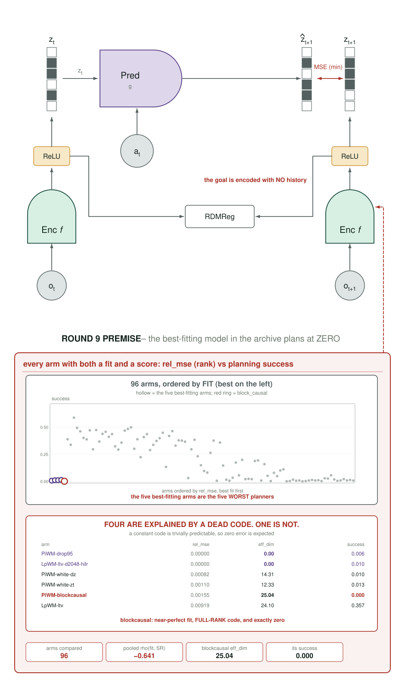
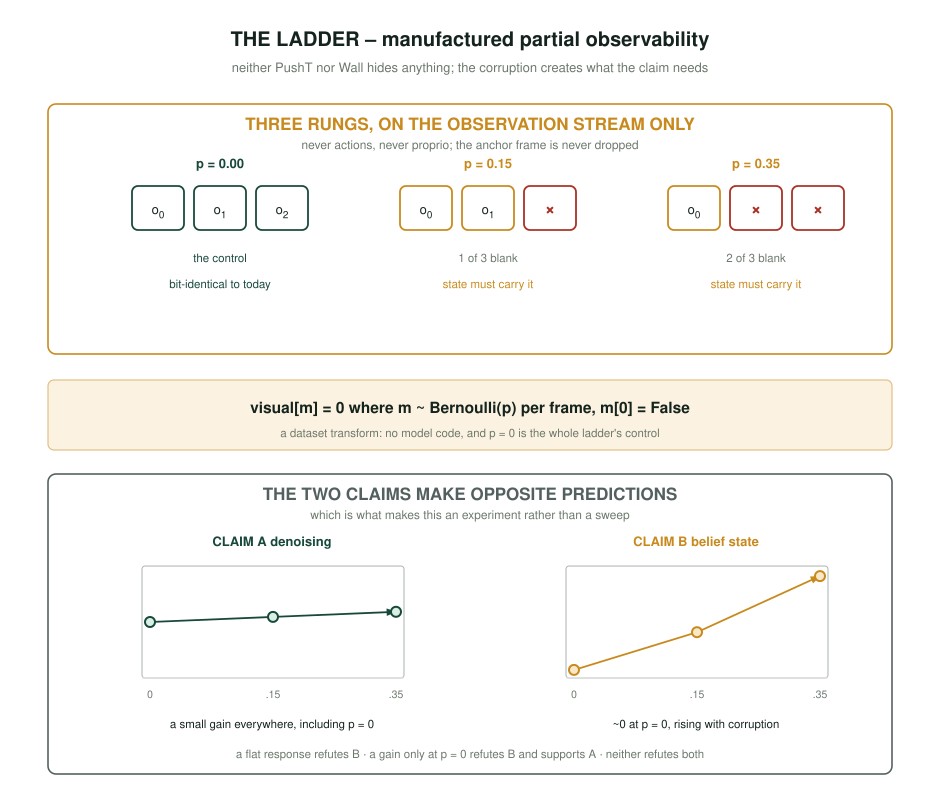

# Round 9 — a state-space encoder, and the single-frame limit that decides it

> **Read `README.md` first.** `docs/measurement-protocol.md` is binding except where this
> document explicitly overrides it, and every override is named in §6.

## 0. The premise: one archived arm was filed under the wrong lesson

`PiWM-blockcausal` is recorded in `2026-09-06 §0` as *"`block_causal` off everywhere;
`PiWM-blockcausal` scored 0.00, 0.00, 0.00 at n = 3"*, and every round-8 proposal treated that
as **"encoder-side temporal structure fails."**

It is not what happened.

| | `effective_dim` | `rel_mse` | planning SR |
|---|---|---|---|
| `PiWM-blockcausal` | 25.0 – 26.5 (**healthy**) | **0.0012 – 0.0044** | **0.00 ×3** |
| `LpWM-ltv` baseline | 25.9 | 0.0098 | 0.357 |

The arm did not collapse. Its code stayed full-rank and it fit one-step prediction **2–8×
better than the baseline** while planning at exactly zero.

**And it is not simply "low error is bad."** Ranking all 96 arms that have both numbers, the
five lowest `rel_mse` are the five worst planners — but four of them are explained by a dead
code, and one is not:

| arm | `rel_mse` | `effective_dim` | `block_causal` | SR |
|---|---|---|---|---|
| `PiWM-drop95` | 0.00000 | **0.00** | false | 0.006 |
| `LpWM-ltv-d2048-hilr` | 0.00000 | **0.00** | false | 0.010 |
| `PiWM-white-dz` | 0.00082 | 14.31 | false | 0.010 |
| `PiWM-white-zt` | 0.00110 | 12.33 | false | 0.013 |
| **`PiWM-blockcausal`** | 0.00155 | **25.04** | **true** | **0.000** |
| `LpWM-ltv` | 0.00919 | 24.10 | false | 0.357 |

A constant code is trivially predictable, so `drop95` and `d2048-hilr` reach zero error by
being rank-0, and the `white-*` pair by halving their rank. **`blockcausal` is the only arm in
the archive with near-perfect fit, a fully healthy full-rank code — 25.04, *above* the
baseline's 24.10 — and exactly zero success.** Pooled across arms, lower error does predict
higher success (ρ = **−0.641**, p < 1e-4), which makes `blockcausal` an outlier against the
archive's own trend rather than an instance of it.

That is a **dissociation**, and it has a mechanical cause:

```
planning/cem.py:77   z_obs_g = self.wm.encode_obs_linked(trans_obs_g)
plan.py:233          obs_g[k] = np.expand_dims(obs_g[k], axis=1)     # time axis = 1
```

**Training encodes clips of T = 3. The goal is encoded as a clip of T = 1.** With
`block_causal`, every frame attends to earlier frames, so `z_goal` — computed with nothing to
attend to — is an object the model never produced during training. The planner then minimises
distance to a point outside its own code distribution. Success 0.00 is the correct outcome of
a well-fit model with a broken target.

**The lesson round 9 is built on:** *any stateful encoder must have a well-defined
single-frame limit, because the goal always is one.* This is why an SSM is the right operator
and attention was the wrong one — an SSM with `s₀ = 0` reduces exactly to a per-frame function,
and attention over a length-1 sequence simply is a different function.

## 1. What the state is *for*

PushT and Wall are both **nearly fully observed** — block, agent, wall and door are all visible
in a single frame. The textbook justification for a temporal encoder (build a belief state for
a POMDP) therefore has almost nothing to work on, and asserting it would repeat the `d_action`
and `effective_dim` mistake: a mechanism the environment cannot exercise.

So round 9 makes the condition it needs, and tests two claims:

**Claim A — denoising.** The SSM integrates the encoder's own per-frame noise. Predicts a small
uniform gain, present at every corruption level including zero.

**Claim B — belief state.** The SSM infers what the current frame does not show. Untestable in
either environment as shipped, so round 9 **manufactures partial observability** with a frame
dropout ladder and tests the *dose-response*: the gain must grow with corruption, and be ~0 at
p = 0.

These make opposite predictions at p = 0, which is what makes the ladder an experiment rather
than a sweep. A flat response refutes B. A response present only at p = 0 refutes B and
supports A. No response anywhere refutes both, cleanly.

## 2. The four placements

All four share one contract, and it is non-negotiable: **`A = 0` must reproduce the current
per-frame encoder exactly**, verified by `loss_trace` bit-identity, so every arm has a
zero-parameter-difference control and a defined `z_goal`.

### 2.1 P1 · `PiWM-enc-ssm` — a temporal SSM head over the frozen per-frame path

The shallowest placement and the one closest to the only mechanism in this campaign with a
positive lean (`ssm` in the predictor, +0.066 vs a parameter-matched control, `mse_t1` −17 %).

**Implementation.** New module in `models/vit_encoder.py`, constructed only when `enc_ssm=True`:

```python
self.enc_A  = nn.Linear(proj_dim, proj_dim, bias=False)   # init: zeros  -> exact reduction
self.enc_Bz = nn.Linear(proj_dim, proj_dim, bias=False)   # init: eye
self.enc_C  = nn.Linear(proj_dim, proj_dim, bias=False)   # init: eye
```

and a new `forward_state(x, T)` that runs *after* the existing per-frame `forward()`:

```python
z = self.forward(x)                       # (b*T, P, D)  -- untouched, per-frame
z = rearrange(z, "(b t) p d -> b t p d", t=T)
s = z.new_zeros(z.shape[0], z.shape[2], z.shape[3])
out = []
for t in range(T):                        # T = num_hist = 3 at train, 1 at goal time
    s = self.enc_A(s) + self.enc_Bz(z[:, t])
    out.append(self.enc_C(s))
return rearrange(torch.stack(out, 1), "b t p d -> (b t) p d")
```

`encode_obs` dispatches to `forward_state` when the flag is on, exactly as it already
dispatches to `forward_temporal` for `block_causal`.

**Why the init matters.** `enc_A = 0`, `enc_Bz = enc_C = I` gives `z̃_t = z_t` for every t
*and* for T = 1. So at initialisation the arm is the baseline, and the goal encoding is the
baseline's goal encoding. This is the property `blockcausal` lacked.

**Control — `PiWM-enc-ssm-frozen`.** `enc_A` allocated, initialised to zero, and
`requires_grad_(False)`. Identical parameter count, identical op count, identical RNG draw; the
*only* difference is whether state can flow. A win over this control cannot be "more
parameters" or "an extra linear layer" — only "carrying state".

### 2.2 P2 · `PiWM-enc-ssm-deep` — state carried between ViT blocks

The same recurrence, applied after every `k`-th transformer block rather than once at the end,
so information mixes across frames *inside* the representation.

**Implementation.** `Transformer.forward` gains an optional `state_every` and a per-insertion
`(A, Bz, C)` triple; the clip is reshaped to `(b, T, L, D)` at each insertion point, scanned
over `T`, and reshaped back.

**This is the placement most likely to fail, and it is included because it is the direct test
of the round-8 misreading.** It is architecturally closest to `blockcausal` — early mixing —
but with the exact single-frame limit `blockcausal` lacked. If P2 succeeds where `blockcausal`
scored 0.00, the goal-encoding diagnosis in §0 is confirmed. If P2 also scores ~0, then early
mixing is harmful for a reason beyond the goal contract, and P1 is the only viable depth.

### 2.3 P3 · `PiWM-enc-scan` — a spatial scan replacing attention

Orthogonal to the temporal question: replaces the ViT's self-attention over 256 patch tokens
with a **bidirectional linear scan** over the token sequence (Vision-Mamba's operator, without
input-dependent gating).

**Implementation, and this is the largest build in the round.** A new `ScanBlock` in
`models/infojepa_modules.py`:

```python
def _scan(self, x, A, B, C):              # x: (N, L, D) over the TOKEN axis
    s = x.new_zeros(x.shape[0], x.shape[2]); out = []
    for i in range(x.shape[1]):
        s = A(s) + B(x[:, i]); out.append(C(s))
    return torch.stack(out, 1)

fwd = self._scan(x, self.A_f, self.B_f, self.C_f)
bwd = self._scan(x.flip(1), self.A_b, self.B_b, self.C_b).flip(1)
return self.merge(torch.cat([fwd, bwd], -1))
```

Bidirectional because patch tokens have no causal order — a unidirectional scan would impose a
raster-order prior the image does not have. **Requires `FEATURE=patch`**: at `cls` there is one
token and nothing to scan, and the arm must assert rather than silently no-op.

**Honest note on cost:** a 256-step Python loop per block is slow. The round budgets 8 windows
for P3/P4 and the canary decides whether that is enough before the wave launches.

### 2.4 P4 · `PiWM-enc-st-scan` — bidirectional spatial + causal temporal

P3's spatial scan **and** P1's temporal state, in one arm. Ablated by P1 (temporal only) and P3
(spatial only), both of which run, so a win here is attributable rather than mysterious. This
is the only placement that changes both axes, and it exists only because its two single-factor
ablations are in the same round.

## 3. The observability ladder

A dataset-level corruption applied to the **observation stream only** — never to actions,
never to proprio, and never to the reward or state:

```python
# datasets/img_transforms.py -- applied AFTER the existing transform
if frame_drop > 0 and self.training:
    m = torch.rand(T) < frame_drop        # one draw per frame, per clip
    m[0] = False                          # never drop the anchor frame
    visual[m] = 0.0
```

Three rungs: **p ∈ {0.0, 0.15, 0.35}**. `p = 0` is bit-identical to today and is the control
for the whole ladder.

**Why frame dropout and not occlusion.** A dropped frame creates an inference problem a
stateful encoder can actually solve (carry the last state forward) and a per-frame encoder
provably cannot (it sees zeros). An occluder is confounded with `TOKEN_DROP`, which the archive
already shows is a regulariser rather than an objective.

**Why the anchor frame is never dropped.** `z_src = z_emb[:, :num_hist]` and the planner's
`obs_0`; dropping frame 0 would corrupt the planner's entry point rather than its history.

## 4. Two environments

Every conclusion this campaign has drawn is a **single-environment** result — **882 of 882**
archived configs used `pusht`. `conf/env/wall.yaml`, `datasets/wall_dset.py`,
`env/wall/wall_env_wrapper.py` and `conf/plan_wall.yaml` all exist and all import cleanly, and
the 55 GB dataset is on disk. It has never been run.

Wall is 1,920 episodes × 50 steps, 2-D dot, 2-D actions, with `door_locations` and
`wall_locations` varying per episode — so it also supplies a **compositional generalisation**
axis the wrapper already exposes (`exclude_door_train`, `only_door_val`).

`states.pth` is present in the wall dataset. **The standing rule holds: images and proprio
only. `states.pth` may be read for measurement and diagnostics and must never enter a training
loss.**

## 5. The grid

| factor | levels |
|---|---|
| placement | P1, P2, P3, P4 |
| arm per placement | treatment + frozen-`A` control |
| ladder | p = 0.0, 0.15, 0.35 |
| environment | pusht, wall |
| seeds | **5** |

`4 × 2 × 3 × 2 × 5 = 240` runs, plus an unmodified baseline at each (rung × env) —
`3 × 2 × 5 = 30` — for **270 training runs**. At ~8 GPU-h training and ~1 GPU-h eval that is
roughly **2,400 GPU-h**, about 2.6× round 8.

## 6. Measurement — one metric, and where this overrides the protocol

**The only metric that decides anything is CEM planning success rate against the baseline**,
paired on shared seeds, fixed evaluation scheme, `goal_H = 5`, `max_iter = 10`, 50 episodes.
No diagnostic is a target. `rel_mse`, `effective_dim` and the probes are recorded for mechanism
only and cannot promote or demote an arm — `blockcausal` is the reason: it had the archive's
best `rel_mse` and the archive's worst success.

**Override, stated explicitly:** `docs/measurement-protocol.md §1` sets a minimum of **n = 8**
and **n = 20** for effects below +0.10. Round 9 runs **n = 5** by instruction. The consequence
is arithmetic, not opinion: at the healthy-arm paired sd of 0.169, the MDE at n = 5 is
**≈ 0.21** — larger than *every* effect round 8 produced, positive or negative, except the four
catastrophic ones. Two specific risks follow:

1. **Anything real but modest is invisible.** `ssm`'s +0.066 would not be detectable at n = 5.
2. **Anything that looks large is probably not.** `st-ssm` read +0.083 at n = 6 and **+0.000**
   at n = 8; at n = 5 it would have been reported as a win.

The mitigation that costs nothing: **the ladder is a within-arm dose-response**, and a monotone
trend across three rungs is far more informative at n = 5 than any single rung's contrast. Read
the slope, not the cell.

## 7. Figures







`analysis/round9_arch_figs.py` → `diary/assets/2026-09-07/`, one per method, built from
**drawn evidence** rather than equations in boxes — the ST4 figure is the template: measured
spectra as bar plots, per-seed deltas as dot rows on a zero line, effects as interval marks
against the decision bar. Every number read at render time; `audit()` must report zero
overlaps, zero off-canvas, zero frame crossings; each figure rasterised and read back.

Planned: `arch-p1-enc-ssm.svg`, `arch-p2-deep.svg`, `arch-p3-scan.svg`, `arch-p4-st-scan.svg`,
`arch-ladder.svg` (the corruption dose and what each placement can recover), and
`arch-blockcausal-postmortem.svg` (the §0 dissociation — best fit, zero success — which is the
figure that justifies the whole round).

## 8. Order of work

1. `arch-blockcausal-postmortem.svg` first — if the §0 diagnosis does not survive being drawn
   from the archive at render time, the round's premise is wrong and nothing else should run.
2. The frame-dropout transform + bit-identity at p = 0.
3. P1 + its frozen control, canary, then the pusht ladder.
4. Wall end-to-end on the baseline alone — **it has never run**; prove the env before spending
   a factorial on it.
5. P2, then P3, then P4 — in that order, because P2 is the cheap test of the §0 diagnosis and
   P3 is the expensive build.

## 9. What would falsify the round

* **P1 flat across all three rungs** ⇒ both claims dead; state buys nothing here.
* **P2 ≈ 0.00 like `blockcausal`** ⇒ the goal-contract diagnosis in §0 is wrong, and early
  mixing is harmful for a different reason.
* **Gain at p = 0 but not rising with p** ⇒ Claim B (belief state) refuted, Claim A supported.
* **P4 ≤ max(P1, P3)** ⇒ the two axes do not compose, and the ST framing dies.
